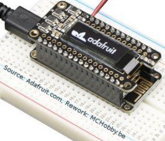

# Utilisation d'écran OLED ssd1603 et ESP8266 MicroPython

MicroPython permet d'utiliser très facilement un écran OLED I2C basé sur le contrôleur ssd1306.

Ce GitHub couvre plusieurs modèles de cartes sous MicroPython: 
* [Feather ESP8266](https://shop.mchobby.be/product.php?id_product=846) + [OLED FeatherWing](https://shop.mchobby.be/product.php?id_product=879)

## Produit
* Shop: [OLED 128x32 FeatherWing](https://shop.mchobby.be/feather/879-feather-ecran-oled-3232100008793-adafruit.html)
* Shop: [Feather ESP8266](https://shop.mchobby.be/feather/846-feather-huzzah-avec-esp8266-3232100008465-adafruit.html) utilisé dans cet exemple.
* Wiki: https://wiki.mchobby.be/index.php?title=MicroPython-Accueil#ESP8266_en_MicroPython

# Bibliothèque 
La bibliothèque sd1306.py` est un pilote SSD1306 I2C et SPI (MicroPyhton GitHub) pour écran OLED ssd1306. Cette bibliothèque doit être copiée sur la carte PyBoard.

* [Télécharger la bibliothèque ssd1306](https://raw.githubusercontent.com/micropython/micropython/master/drivers/display/ssd1306.py)

# Brancher 
## OLED Featherwing
Le FeatherWing OLED s'insère simplement sur la carte Feather (ex: Feather ESP8266) et propose une résolution de 128 x 32 pixels. 



Le bus I2C (SDA, SCL) utilise respectivement les broches 4 et 5 (avec des pull-up de 2.2K).

La carte propose par ailleurs 3 boutons __A, B, C__ branchés respectivement sur les broches __0, 16, 2__ du Feather. 

# Code de test
Dans tous les cas de figure, l'écran OLED sera créé sous la référence __lcd__ .
## Créer LCD
### pour FeatherWing OLED

 

```
# Utilisation de la bibliothèque ssd1306 avec Feather ESP8266 
# sous MicroPython
#
# Shop: https://shop.mchobby.be/feather/879-feather-ecran-oled-3232100008793-adafruit.html
# Wiki: https://wiki.mchobby.be/index.php?title=FEATHER-MICROPYTHON-OLED

from machine import Pin, I2C
i2c = I2C( sda=Pin(4), scl=Pin(5) )
import ssd1306
lcd = ssd1306.SSD1306_I2C( 128, 32, i2c )
```

## Tester la bibliothèque
Dans les exemples ci-dessous, voici les paramètres que vous retrouverez dans les différents appels de fonction: 


* __x__ : position du point par rapport au côté gauche de l'écran.
* __y__ : position du point par rapport au dessus de l'écran.
* __w__ : largeur (du mot Width).
* __h__ : hauteur (du mot Height).
* __c__ : __couleur (1=point allumé, 0=point éteint)__

```
# -- Rempli l'écran en blanc --
lcd.fill(1) 
lcd.show()  # Afficher!

# Remplis un rectangle en noir
# fill_rect( x, y, w, h, c ) 
lcd.fill_rect( 10,10, 20, 4, 0 )
lcd.show()  # Afficher!

# -- Dessine un pixel en noir --
lcd.fill(0) # Rempli l'écran en noir
# pixel( x, y, c ) 
lcd.rect( 3, 4, 1 ) 
lcd.show()  # Afficher!

# -- Dessine un rectangle en blanc --
lcd.fill(0) # Rempli l'écran en noir
# rect( x, y, w, h, c ) 
lcd.rect( 3, 3, 128-2*3, 32-2*3, 1 ) 
lcd.show()  # Afficher!

# -- Ligne Horizontale et Verticale --
lcd.fill(0) # Rempli l'écran en noir
# Dessine des lignes en blanc.
# Ligne horizontale hline( x,y, w, c )
#   donc fournir la largeur.
# Ligne verticale vline( x,y, h, c )
#   donc fournir la hauteur.
lcd.hline( 0, 18, 128, 1 )
lcd.vline( 64, 0, 32, 1 )
lcd.show()  # Afficher!

# -- Lignes diverses --
lcd.fill(0) # Rempli l'écran en noir
# Dessine des lignes en blanc.
# line(x1,y1,x2,y2,c)
lcd.line(0,0,128,32,1)
lcd.line(0,32,128,0,1)
lcd.show()  # Afficher!

# -- Afficher texte --
lcd.fill(0) # Rempli l'écran en noir
# Dessine du texte en blanc.
#   text( str, x,y, c )
lcd.text("Bonjour!", 0,0, 1 )
lcd.show()  # Afficher!

# -- Défilement --
# Mise en place en dessinant une croix noir sur fond blanc. 
lcd.fill(1) # Rempli l'écran en blanc
lcd.line(0,0,128,32,0) # noir
lcd.line(0,32,128,0,0) # blanc
lcd.show()  # Afficher!
# Scroll Horizontal de 15 pixels vers la gauche. 
lcd.scroll( -15, 0 )
lcd.show()
# Puis Scroll Vertical de 8 pixels vers le bas. 
lcd.scroll( 0, 8 )
lcd.show()

```

## Icône
Il est assez facile de créer et afficher une icône.

L'icône est définie avec un 1 pour un point allumé et un 0 pour un point éteint: 
```
HEART_ICON = [
  [0,0,0,0,0,0,0,0,0,0,0],
  [0,0,1,1,1,0,1,1,1,0,0],
  [0,1,1,0,1,1,1,1,1,1,0],
  [0,1,0,1,1,1,1,1,1,1,0],
  [0,1,1,1,1,1,1,1,1,1,0],
  [0,0,1,1,1,1,1,1,1,0,0],
  [0,0,0,1,1,1,1,1,0,0,0],
  [0,0,0,0,1,1,1,0,0,0,0],
  [0,0,0,0,0,1,0,0,0,0,0],
  [0,0,0,0,0,0,0,0,0,0,0] ]
```
La fonction `draw_icon()` permet de dupliquer le contenu d'un "pseudo tableau" (l'icône) sur l'écran aux coordonnées x,y. 

```
def draw_icon( lcd, from_x, from_y, icon ):
    for y, row in enumerate( icon ):
        for x, color in enumerate( row ):
            if color==None:
                continue
            lcd.pixel( from_x+x, 
                       from_y+y,
                       color )
```


Voir aussi le script [icon.py](icon.py) qui contient un exemple d'utilisation d'icônes deux couleurs (noir/blanc) ainsi qu'un exemple 2 couleurs + Canal Alpha.


# Source et ressources
* [Voir le Wiki MC Hobby](https://wiki.mchobby.be/index.php?title=FEATHER-MICROPYTHON-OLED)
