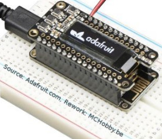
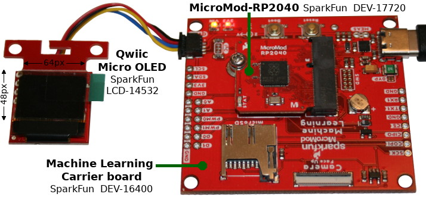
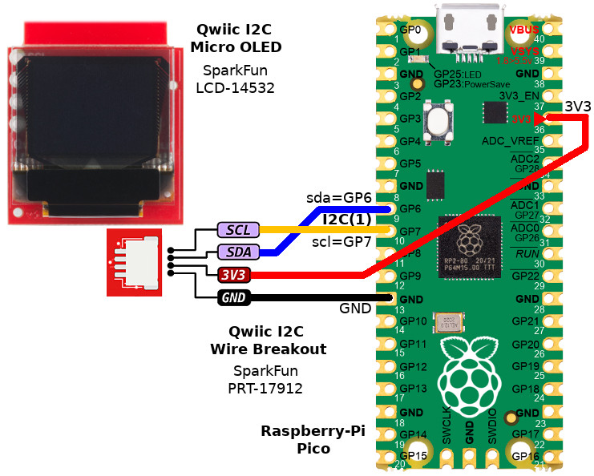
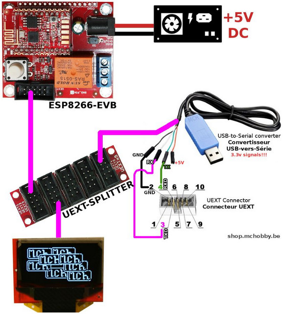
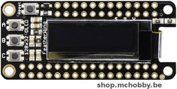
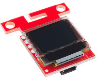
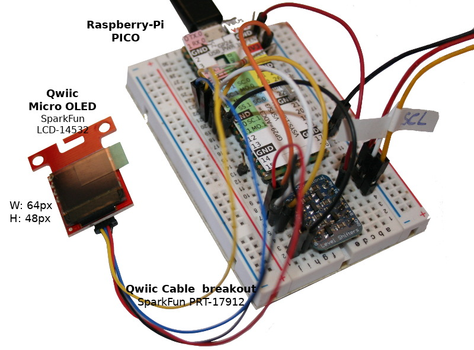
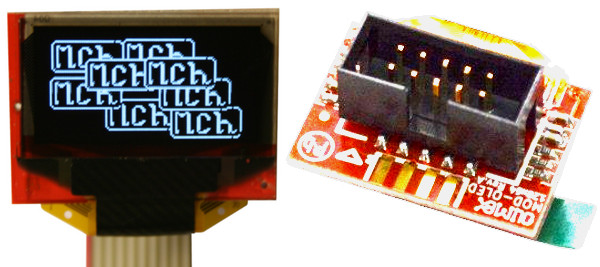
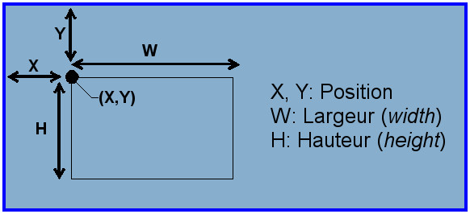
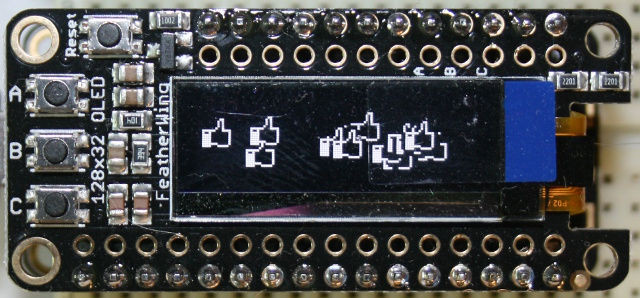

[Ce fichier existe également en FRANCAIS](readme.md)

# Using a SSD1306 OLED display with MicroPython

MicroPython does allow to easily use a I2C OLED displed using a ssd1306 driver.

__Remarks:__
* This repository concerns several SSD1306 OLED displays and several MicroPython board.
* More information about [OLEDs screen are available on this MC Hobby's Wiki](https://wiki.mchobby.be/index.php?title=MicroPython-Accueil#ESP8266_en_MicroPython) (_French_)

# Library

The `sd1306.py` library from MicroPyhton GitHub provides an SSD1306 OLED driver for I2C & SPI harware buse.

That library must be copied to MicroPython board before runing the MicroPython example scipt.

* [Download the ssd1306 library](https://raw.githubusercontent.com/micropython/micropython/master/drivers/display/ssd1306.py)

# Wiring

## OLED on PyBoard

Note: not done yet!

## OLED Featherwing with ESP8266 microcontroler
The OLED FeatherWing (Adafruit 2900) does fit on a Feather board (eg: Feather ESP8266) and offers a resolution of 128 x 32 pixels.

The MicroPython.org SSD1306 driver does work out-of-the box with that OLED.



The I2C bus uses the SDA & SCL pins do uses the GPIO 4 & 5 (with 2.2K pull-up resistors).

The OLED board do also fits 3 buttons named __A, B, C__ and wired to the pins __0, 16, 2__ on the Feather.

## Qwiic OLED with MicroMod-RP2040 microcontroler

The [Qwiic Micro Oled](https://www.sparkfun.com/products/14532) display from SparkFun (LCD-14532) fits a Qwiic connector (I2C bus + 3.3V power) easing the wiring to a Qwiic aware development board.

The display offers a 64px * 48px pixels resolution over the I2C bus. It is located at 0x3D address (can ve modified to 0x3C).

The following example show the OLED scren wired to a [MicroMod-RP2040](https://www.sparkfun.com/products/17720) (SparkFun, DEV-17720) + [Learning Machine Carrier Board](DEV-16400) (SparkFun, DEV-16400) .



The I2C bus used on the MicroMod-RP2040 is located on the pins GP4 (sda) and GP5 (scl).

## Qwiic OLED on Raspberry-Pi Pico

The [Qwiic Micro Oled](https://www.sparkfun.com/products/14532) display from SparkFun (LCD-14532) is fitted with a Qwiic connector (shpping I2C bus + 3.3V power supply) will ease wiring between the display and the host board.

The display offers a resolution of 64px * 48px with 0x3D default I2C address (modifiable to 0x3C).

In this current setup, I used my Grove + Qwiic testing [Raspberry-Pi Pico](https://shop.mchobby.be/fr/pico-rp2040/2036-pico-header-rp2040-microcontroleur-2-coeurs-raspberry-pi-3232100020368.html). Tips & tricks: the Pico owns an [paper overlay displaying pico function](https://github.com/mchobby/pyboard-driver/tree/master/Pico).

The qwiic connexion is made with a [Qwiic breakout connecteur](https://www.sparkfun.com/products/14425) (SparkFun, PRT-17912).



## UEXT OLED on Olimex ESP8266-EVB

[Olimex Ltd](https://www.olimex.com/) manufactures ESP based evalutation boards (as well as ohter microcontroler). The Olimex's [OLED UEXT device](https://www.olimex.com/Products/Modules/LCD/MOD-OLED-128x64/open-source-hardware) have a 128x64 pixels resolution.

The great things about Olimex product is their [UEXT connectivity](https://en.wikipedia.org/wiki/UEXT) shipping alimentation, an I2C bus, a SPI bus and an UART.

The following setup do use an [ESP8266-EVB](https://www.olimex.com/Products/IoT/ESP8266/ESP8266-EVB/open-source-hardware) from Olimex and [UEXT-OLED](https://www.olimex.com/Products/Modules/LCD/MOD-OLED-128x64/open-source-hardware).



See also the [MicroPython Mod OLED tutorial](https://wiki.mchobby.be/index.php?title=MICROPYTHON-MOD-OLED) on the MCHobby Wiki (_French_).

# Create an instance of OLED
In every usecase, the OLED display instance will be stored into the `lcd` object reference.

Choose the code version corresponding to your hardware configuration.

## OLED to PyBoard
It is very important to understand that SSD1306 MicroPython driver is written against the `machine.I2C` class (not the `Pyb.I2C` class) .

``` python
from machine import I2C
import ssd1306
i2c = I2C(2)
lcd = ssd1306.SSD1306_I2C( 128, 64, i2c )
```
The remain of the demo code stays the same.

__Note:__ If you do reach stability issue on older MicroPython version, please read the following topic: https://forum.micropython.org/viewtopic.php?f=6&t=4663

``` python
# Equivalent to I2C(2)
pscl = Pin('Y9', Pin.OUT_PP)
psda = Pin('Y10', Pin.OUT_PP)
i2c = I2C(scl=pscl, sda=psda)
lcd = ssd1306.SSD1306_I2C( 128, 64, i2c )
```
The remain if the demo code stays the same.

## OLED FeatherWing (Adafruit)

Adafruit Industries do manufactures a 128*32 pixels OLED display at the Feather form factor.



``` python
# Using the ssd1306 library with the Feather ESP8266 under MicroPython
from machine import Pin, I2C
import ssd1306
i2c = I2C( sda=Pin(4), scl=Pin(5) )
lcd = ssd1306.SSD1306_I2C( 128, 32, i2c )
```
* [Oled FeatherWing](https://shop.mchobby.be/feather/879-feather-ecran-oled-3232100008793-adafruit.html)
* [Wiki about Oled FeatherWing](https://wiki.mchobby.be/index.php?title=FEATHER-MICROPYTHON-OLED)

## Qwiic Micro OLED + MicroMod-RP2040

Sparkfun manufactures the [64x48 pixels Mini OLED display](https://www.sparkfun.com/products/14532) with a Qwiic connector.



``` python
# Using the ssd1306 library with Micro Oled + MicroMod-RP2040 + Learning Machine Carrier Board de SparkFun
from machine import Pin, I2C
import ssd1306
i2c = I2C( 0, sda=Pin(4), scl=Pin(5) )
lcd = ssd1306.SSD1306_I2C( 64, 48, i2c, addr=0x3D )
```

## Qwiic Micro OLED + Raspberry-Pi Pico

Sparkfun manufactures the [64x48 pixels Mini OLED display](https://www.sparkfun.com/products/14532) with a Qwiic connector.

Thanks to a Qwiic breakout cable, it is also possible to wire the Mini Oled Display to other 3.3V microcontroler like the Raspberry-Pi Pico.



For this example, the [Raspberry-Pi Pico](https://shop.mchobby.be/fr/pico-rp2040/2036-pico-header-rp2040-microcontroleur-2-coeurs-raspberry-pi-3232100020368.html) is wired thanks to the [Qwiic breakout cable](https://www.sparkfun.com/products/14425) (SparkFun, PRT-17912)


``` python
# Raspberry-Pi Pico + Qwiic Micro Oled ( SparkFun, LCD-14532)
i2c = I2C( 1 ) # sda=GP6, scl=GP7
lcd = ssd1306.SSD1306_I2C( 64, 48, i2c, addr=0x3D )
```

## UEXT OLED + Olimex ESP8266-EVB

Olimex Ltd also manufactures [UEXT OLED display](https://www.olimex.com/Products/Modules/LCD/MOD-OLED-128x64/open-source-hardware) fitted with an [UEXT connector](https://en.wikipedia.org/wiki/UEXT) .



``` python
from machine import Pin, I2C
import ssd1306
i2c = I2C( sda=Pin(2), scl=Pin(4) )
lcd = ssd1306.SSD1306_I2C( 128, 64, i2c )
```

# Tester

## Dessiner
In the following examples, the called function parameters are named as follows :


* __x__ : pixel position relative to left screen border.
* __y__ : pixel position relative to top screen border.
* __w__ : Width in pixels.
* __h__ : Height in pixels.
* __c__ : __color (1=White pixel, 0=Dark pixel)__

The following code is also available in the [test.py](examples/test.py) example code.

``` python
# -- Fill screen in white --
lcd.fill(1)
lcd.show()  # update display!

# Fill a back rectangle
# fill_rect( x, y, w, h, c )
lcd.fill_rect( 10,10, 20, 4, 0 )
lcd.show()  # update display!

# -- Draw a pixel in White --
lcd.fill(0) # fill display in black
# pixel( x, y, c )
lcd.pixel( 3, 4, 1 ) # White pixel
lcd.show()  # update display!

# -- Draw a White rectangle --
lcd.fill(0) # Fill the screen in black
# rect( x, y, w, h, c )
lcd.rect( 3, 3, 128-2*3, 32-2*3, 1 )
lcd.show()  # update display!

# -- Horizontal & Vertical lines --
lcd.fill(0) # Fill screen in black
# Dessine des lignes en blanc.
# Horizontal line - hline( x,y, w, c )
#   we do provides width.
# Vertical line - vline( x,y, h, c )
#   we do provide height.
lcd.hline( 0, 18, 128, 1 )
lcd.vline( 64, 0, 32, 1 )
lcd.show()  # update display!

# -- Various lines --
lcd.fill(0) # Fill screen in black
# Draw white lines
# line(x1,y1,x2,y2,c)
lcd.line(0,0,128,32,1)
lcd.line(0,32,128,0,1)
lcd.show()  # update display!

# -- Display text --
lcd.fill(0) # Fill screen in black
# Draw text in white
#   text( str, x,y, c )
lcd.text("Bonjour!", 0,0, 1 )
lcd.show()  # update display!

# -- Scrolling --
# Drawing a black cross on white background
lcd.fill(1) # Fill the screen in white
lcd.line(0,0,128,32,0) # black
lcd.line(0,32,128,0,0) # black
lcd.show()  # update display!
# Horizontal scroll of 15 pixels to the left.
lcd.scroll( -15, 0 )
lcd.show() # update display!
# Now, sroll down (vertical) of 8 pixels.
lcd.scroll( 0, 8 )
lcd.show() # update display

```

## Display Icons

It is quite easy to draw icons.

The icon is defined with 1 and 0 (1 to lit-up the pixel, 0 to make it dark):
```
HEART_ICON = [
  [0,0,0,0,0,0,0,0,0,0,0],
  [0,0,1,1,1,0,1,1,1,0,0],
  [0,1,1,0,1,1,1,1,1,1,0],
  [0,1,0,1,1,1,1,1,1,1,0],
  [0,1,1,1,1,1,1,1,1,1,0],
  [0,0,1,1,1,1,1,1,1,0,0],
  [0,0,0,1,1,1,1,1,0,0,0],
  [0,0,0,0,1,1,1,0,0,0,0],
  [0,0,0,0,0,1,0,0,0,0,0],
  [0,0,0,0,0,0,0,0,0,0,0] ]
```
The `draw_icon()` function do duplicates the icon array onto the OLED display at position x,y.

```
def draw_icon( lcd, from_x, from_y, icon ):
    for y, row in enumerate( icon ):
        for x, color in enumerate( row ):
            if color==None:
                continue
            lcd.pixel( from_x+x,
                       from_y+y,
                       color )
```


See also the [icon.py](examples/icon.py) example scripts using 2 colors icons (white/black) as well as 2 colors + Alpha channel.



## Advanced control
The SSD1306_I2C does have the FrameBuf class as ancestor. So the SSD1306_I2C gets benefits of all the drawing methods.

The SSD1306 base class do also brings additional services functions:
* `lcd.poweron()` & `lcd.poweroff()` to light on & off the display.
* `lcd.contrast(value)` set the display contrast value (between 0 .. 255).
* `lcd.invert(1)` would exchange background and foreground color. `lcd.invert(0)` would restore the initial settings!<br />A great feature to display flashing messages.

# Ressources
* [FEATHER MICROPYTHON OLED](https://wiki.mchobby.be/index.php?title=FEATHER-MICROPYTHON-OLED) (Wiki, MCHobby)
* [How to display images](https://www.twobitarcade.net/article/displaying-images-oled-displays/) (_How to display images_, twobutarcade.net)
* [FreeType generator & MicroPython FontDrawer](https://github.com/mchobby/freetype-generator) (GitHub, MCHobby)

# Shopping list
* Shop: [OLED 128x32 FeatherWing](https://shop.mchobby.be/feather/879-feather-ecran-oled-3232100008793-adafruit.html) @ MC Hobby
* Shop: [Feather ESP8266](https://shop.mchobby.be/feather/846-feather-huzzah-avec-esp8266-3232100008465-adafruit.html) @ MC Hobby<br />utilisé dans cet exemple.
