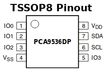
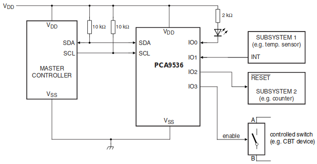

[Ce fichier existe également en FRANCAIS](readme.md)

# PCA9536 - 4 Bit I2C GPIO Expander

PCA9536 is an 8-pin chip (5V tolerant pins) that provides 4 bits of General Purpose parallel Input/Output (GPIO).

The PCA9536 is used as interface on some I2C expansion board so this GitHub section only contains the driver and examples code.

Here below a common usage for the PCA9536.

__The PCA9536 have an very particular feature__ with the internal 100 kΩ pull-up resistor (cannot be disabled!) on input pins.

The power-on reset feature sets the registers to their default values and initializes the device state machine.

Main features:
* [PCA9536 datasheet](https://www.nxp.com/products/analog/interfaces/ic-bus/ic-general-purpose-i-o/4-bit-i2c-bus-and-smbus-i-o-port:PCA9536)
* 4-bit I2C bus GPIO (0 Hz to 400 kHz clock frequency)
* Operating power supply voltage range of 2.3 V to 5.5 V
* 5 V tolerant I/Os
* Polarity Inversion register
* Low standby current
* No glitch on power-up
* Internal power-on reset
* 4 I/O pins which default to 4 inputs with 100 kΩ internal pull-up resistor
* ESD protection exceeds 2000 V
* Latch-up testing is done to JEDEC Standard JESD78 which exceeds 100 mA
