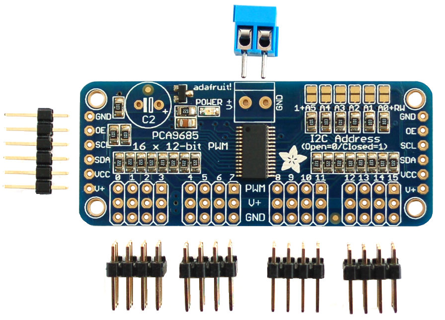
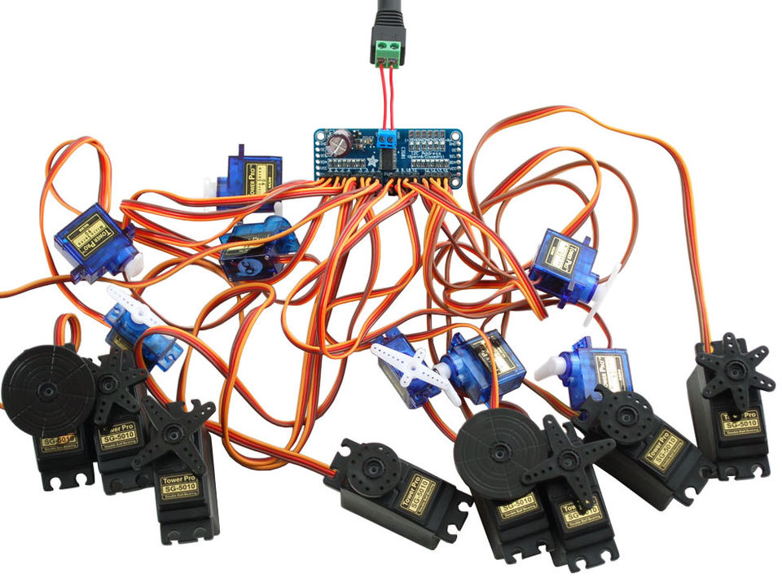
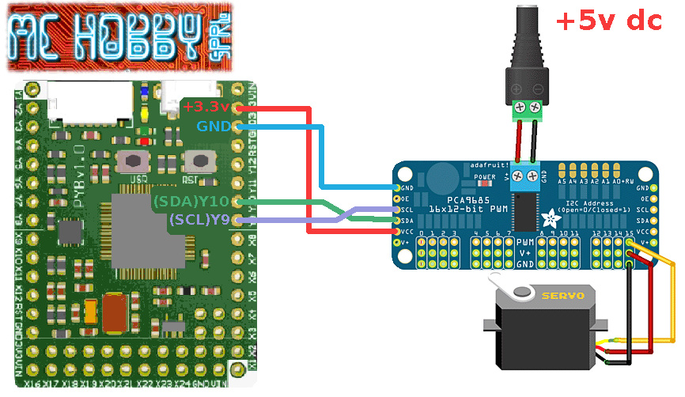

[This file also exists in ENGLISH here](readme_ENG.md)

# Contrôler des LED et servo moteurs avec un controleur PWM autonome

Ce pilote permet de prendre le contrôle d'un contrôleur PWM 16 canaux d'Adafruit (Adafruit ID 815).



Le Breakout Adafruit utilise le chipset PCA9685 et dispose d'une résolution 12 bits (valeurs de 0 à 4095).

__Caractéristiques:__
* 16-Channel 12-bit PWM/Servo Driver - I2C interface - PCA9685
* Contrôleur PWM incluant sa propre horloge et disposant d'une interface I2C. Une fois la commande envoyée, les sorties PWM de ce breakout fonctionnent en totale indépendance. Votre programme peut donc se tourner librement vers l'exécution d'autres tâches!
* Le Breakout board est compatible 5V (5V compliant), ce qui signifie que vous pouvez le contrôler depuis un microcontrôleur 3.3V tout en pilotant des sorties 6V en toute sécurité (C'est bien pratique lorsque l'on veut contrôler des LEDs blanches et bleues 3.4V Forward Voltage depuis un microcontrôleur 3.3V)
* Sélecteur d'adresse à 6 plots (6 cavaliers). Soit jusque 62 breakout board sur le bus I2C = 992 sorties PWM max.
* Fréquence PWM réglable (jusqu'à ~ 1.6 KHz)
* Une résolution 12-bit pour chaque sortie - pour des Servo Moteur, cela signifie une résolution de 4us pour une fréquence de rafraîchissement de 60Hz.
* Sortie configurable en push-pull ou open-drain
* Une broche "OE" (Output Enable) pour désactiver toutes les sorties.



# Bibliothèque

Cette bibliothèque doit être copiée sur la carte MicroPython avant d'utiliser les exemples.

Sur une plateforme connectée:

```
>>> import mip
>>> mip.install("github:mchobby/esp8266-upy/pca9685")
```

Ou via l'utilitaire mpremote :

```
mpremote mip install github:mchobby/esp8266-upy/pca9685
```

# Brancher

# Raccorder le breakout (Pyboard)



| Pyboard  | PWM-Driver  |  Description |
|----------|-------------|--------------|
|  Y10     |  SDA        | I2C(2).SDA   |
|  Y9      |  SCL        | I2C(2).SCL   |
|  3.3V    |  VCC        | Alimentation logique  |
|  GND     | GND         | Masse commune         |

# Tester
Copier les bibliothèques `pca8685.py` et `servoctrl.py` sur la carte MicroPython.

Le fichier `test.py` (listé ci-dessous) peut facilement être chargé dans une session REPL à l'aide de `import test`

```
from time import sleep
from machine import I2C
# Import ServoCtrl, classe pour le controleur PMW
from servoctrl import ServoCtrl

# Initialise le bus I2C(2) on Pyboard Y9,Y10
i2c = I2C( 2 )

# Crée l'objet pour controleur PWM.
# Utilise l'adresse par défaut du controleur 0x40
driver = ServoCtrl( i2c )

# Positionne le servo moteur #15 à un angle de 45 degrés
driver.position( 15, 45 )
sleep(2)

# Positionne le servo moteur #15 à un angle de 180 degrés
driver.position( 15, 180 )
sleep(2)

# Positionne le servo moteur #15 à un angle de 0 degrés
driver.position( 15, 0 )
sleep(2)

# Positionne le servo moteur #15 à un angle de 90 degrés
driver.position( 15, 90 )

print( "That s all folks!")

```

# Ressources

## micropython-pca9685
Former work of Radomir Dopieralski around micropython-pca9685

Support for Adafruit Motor Shield and PWM driver using the the PCA9685 chipset

https://bitbucket.org/thesheep/micropython-pca9685/src/c8dec836f7a4?at=default

## Adafruit 16 Channel Servo Driver with Raspberry Pi

https://learn.adafruit.com/adafruit-16-channel-servo-driver-with-raspberry-pi/overview

# Où acheter

Le Controleur PWM est disponible chez MC Hobby
* PWM-Driver PCA9685 : http://shop.mchobby.be/product.php?id_product=89
* PWM-Driver PCA9685 @ Adafruit :  https://www.adafruit.com/product/815"
* MicroPython Pyboard's :  http://shop.mchobby.be/category.php?id_category=56
