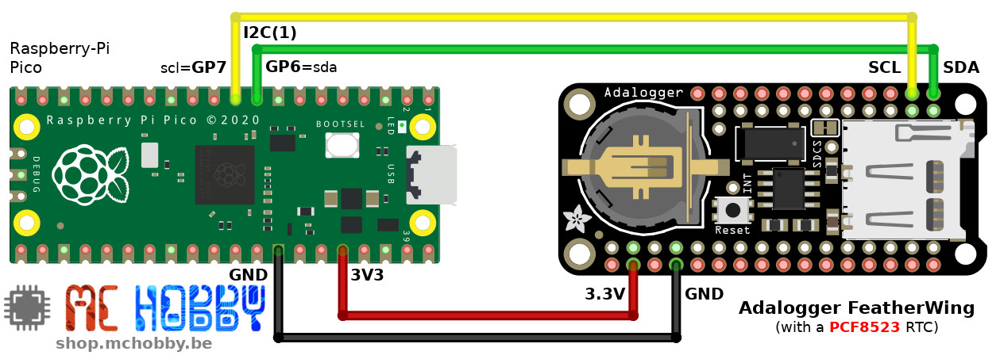

[This file also exists in ENGLISH](readme_ENG.md)

# PCF8523 : Horloge RTC pour MicroPython

Le PCF8523 de NXP est une horloge RTC I2C capable de poursuivre l'écoulement du temps même lorsque qu'elle n'est pas sous-tension. En effet, la pile bouton permet à l'horloge de continuer à fonctionner.

Le PCF8523 est assez populaire et équipe de nombreux produits, la capture ci-dessous reprend la [PiRTC](https://shop.mchobby.be/fr/pi-extensions/1148-pirtc-pcf8523-real-time-clock-for-raspberry-pi-3232100011489-adafruit.html) et l'[Adafruit AdaLogger FeatherWing](https://shop.mchobby.be/fr/feather-adafruit/1056-adalogger-featherwing-rtc-pcf8523-microsd-3232100010567-adafruit.html).


L'horloge PCF8523 dispose aussi de quelques fonctionnalités intéressantes:
* Détection de batterie faible
* Détection de perte d'alimentation (changement de pile)
* __Alarme configurable__
* détection logiciel d'alarme.
* activation d'un signal d'interruption sur alarme.

Le signal d'interruption est particulièrement intéressant car il permet d'activer/réveiller un microcontrôleur à intervalle régulier.

# Brancher

## Avec la PYBStick


## Avec la Raspberry-Pi Pico



# Test

Avant de pouvoir utiliser les scripts d'exemples, il est nécessaire de copier la bibliothèque `pcf8523.py` sur la carte MicroPython.

__A propos des exemples:__

Le sous-répertoire `examples` contient des scripts d'exemples abondamment commentés.

Il est vivement recommandé de les consulter pour avoir une idée des toutes les fonctionnalités disponibles.

## Fixer l'heure

Avant de pouvoir utiliser l'horloge RTC, il est nécessaire d'initialiser l'heure de l'horloge.

Le code suivant est issu de l'exemple [test_setdate.py](examples/test_setdate.py) .

```
from machine import I2C
from pcf8523 import PCF8523
import time

# PYBStick - S3=sda, S5=scl
# Raspberry-Pi Pico - GP6=sda, GP7=scl
i2c = I2C(1)
rtc = PCF8523( i2c )

# Year: 2020, month: 6, day: 22, hour: 0, min: 14, sec: 6, weekday: 0 (sunday), yearday: 174
rtc.datetime = (2020, 6, 22, 0, 14, 6, 0, 174)

# Relire l'heure depuis la RTC
_time = rtc.datetime
print( "Time: %s secs" % _time )
print( "Year: %s, month: %s, day: %s, hour: %s, min: %s, sec: %s, weekday: %s, yearday: %s" % time.localtime(_time) )

# Lundi, mardi, ... dimanche
days = ['monday','tuesday', 'wednesday', 'thursday', 'friday', 'saterday', 'sunday' ]
weekday = time.localtime(_time)[6]
print( 'Day of week: %s' % days[weekday] )
```

## Lire l'heure

Le code suivant permet de lire l'heure stockée dans l'horloge.

Voir le script [test_getdate.py](examples/test_getdate.py) .

```
from machine import I2C
from pcf8523 import PCF8523
import time

# PYBStick - S3=sda, S5=scl
# Raspberry-Pi Pico - GP6=sda, GP7=scl
i2c = I2C(1)
rtc = PCF8523( i2c )

# Le temps est un entier qui contient et incrémente le temps en secondes
_time = rtc.datetime
print( "Time: %s secs" % _time )
# La fonction localtime() transforme le temps sous forme d'un tuple avec
# annee, mois, jour, heure, min, .... )
print( "Year: %s, month: %s, day: %s, hour: %s, min: %s, sec: %s, weekday: %s, yearday: %s" % time.localtime(_time) )

# 0 = Lundi ... 6 = Dimanche
days = ['monday','tuesday', 'wednesday', 'thursday', 'friday', 'saterday', 'sunday' ]
weekday = time.localtime(_time)[6]
print( 'Day of week: %s' % days[weekday] )
```

## Test d'alarme

La RTC dispose d'une fonction permettant d'activer une alarme (registre ou broche d'interruption)
lorsque les conditions d'alarmes sont rencontrées.

La condition d'alarme peut être composer d'un (ou plusieurs) des critères suivants:
* Jour de la semaine (0=lundi, 6=dimanche)
* Jour du mois
* Heure
* Minute

Lorsque plusieurs éléments sont utilisés pour l'alarme, la condition doit être rencontrée pour tous les critères en même temps.

Le script [test_alarm.py](examples/test_alarm.py) repris ci-dessous indique comment activer l'alarme toutes les heures.

Pour ne pas faire trop attendre l'utilisateur, le script déclenche l'alarme une minute après le démarrage du script
```
from machine import I2C
from pcf8523 import PCF8523
import time

# PYBStick - S3=sda, S5=scl
# Raspberry-Pi Pico - GP6=sda, GP7=scl
i2c = I2C(1)
rtc = PCF8523( i2c )

# Obtenir l'heure courante
now = rtc.datetime
print( "now   @ Year: %s, month: %s, day: %s, hour: %s, min: %s, sec: %s, weekday: %s, yearday: %s" % time.localtime(now) )

# Calculer l'alarme 1 minute dans le future
alarm_time = now + 60
alarm_tuple = time.localtime(alarm_time) # année, mois, jour, heure, min, sec, jour_de_le_semaine, jour_de_l_annee
alarm_minutes = alarm_tuple[4]

# Activer l'alarme pour déclenchement toutes les heures et <alarm_min>
rtc.alarm_weekday( enable=False )
rtc.alarm_day    ( enable=False )
rtc.alarm_hour   ( enable=False )
rtc.alarm_min( alarm_minutes, True )

# Relecture de la configuration d'alarme
print( "alarm_wday:", rtc.alarm_weekday() )
print( "alarm_day :", rtc.alarm_day() )
print( "alarm_hour:", rtc.alarm_hour() )
print( "alarm_min :", rtc.alarm_min() )

counter = 0
while True:
	counter += 1
	print('Testing alarm status, pass %i' % counter )
	if rtc.alarm_status:            # Vérifier le statut de l'alarme
		print( "Alarm catched!")      # Alarme capturee
		print( "Tuuut Tuuut Tuuut Tuuut Tuuut Tuuut")
		print( "Reset alarm status ")
		rtc.alarm_status = False      # désactive l'alarme
	time.sleep( 10 )                # attendre 10 secondes
```

Ce qui affiche les messages suivants:

```
MicroPython v1.12-256-geae495a-dirty on 2020-03-18; PYBSTICK26_LITE with STM32F411CE
Type "help()" for more information.
>>>
>>> import test_alarm
now   @ Year: 2020, month: 6, day: 22, hour: 8, min: 10, sec: 11, weekday: 0, yearday: 174
alarm_wday: (2, False)
alarm_day : (13, False)
alarm_hour: (2, False)
alarm_min : (11, True)
Testing alarm status, pass 1
Testing alarm status, pass 2
Testing alarm status, pass 3
Testing alarm status, pass 4
Testing alarm status, pass 5
Testing alarm status, pass 6
Alarm catched!
Tuuut Tuuut Tuuut Tuuut Tuuut Tuuut
Reset alarm status
Testing alarm status, pass 7

...
```

__Remarque:__ il est possible d'activer l'interruption sur alarme avec l'instruction `rtc.alarm_interrupt = True` .

# Où acheter
* [Carte PYBStick](https://shop.mchobby.be/fr/recherche?controller=search&orderby=position&orderway=desc&search_query=pybstick&submit_search=)
* [Carte Raspberry-Pi Pico](https://shop.mchobby.be/fr/157-pico-rp2040)
* [PiRTC (PCF8523)](https://shop.mchobby.be/fr/pi-extensions/1148-pirtc-pcf8523-real-time-clock-for-raspberry-pi-3232100011489-adafruit.html) @ MC Hobby
* [Adafruit AdaLogger FeatherWing (PCF8523)](https://shop.mchobby.be/fr/feather-adafruit/1056-adalogger-featherwing-rtc-pcf8523-microsd-3232100010567-adafruit.html) @ MC Hobby
