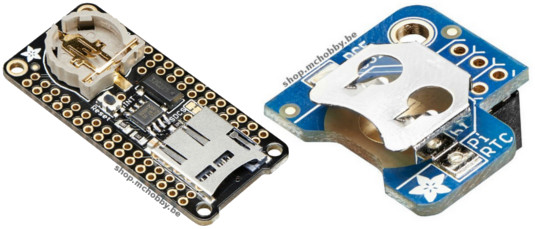
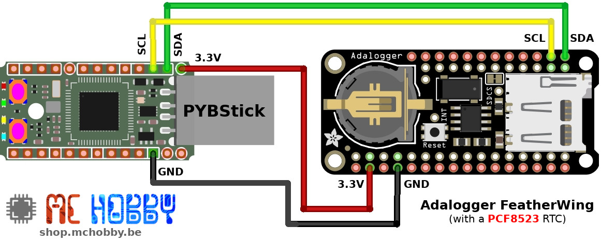

[Ce fichier existe également en FRANCAIS](readme.md)

# PCF8523 : A Real Time Clock (RTC) for MicroPython

__TRADUCTION__

The PCF8523 from NXP is a RTC (Real Time Clock) from NXP running over an I2C bus. This device can follow the time ginning when the project is not powered. Thanks to the coin cell, the clock is still running.

The PCF8523 is quite popular and placed on many products, the following pictures show [PiRTC](https://shop.mchobby.be/fr/pi-extensions/1148-pirtc-pcf8523-real-time-clock-for-raspberry-pi-3232100011489-adafruit.html) and the [Adafruit AdaLogger FeatherWing](https://shop.mchobby.be/fr/feather-adafruit/1056-adalogger-featherwing-rtc-pcf8523-microsd-3232100010567-adafruit.html).



The PCF8523 also offer neat features like:
* Low bat detection
* Power Lost detection (when changing the cell coin)
* __configurable Alarm__
* Software based alarm detection
* Interrupt signal activation on alarm

The interrupt signal is a great feature because it allows to wake-up a microcontroler on alarm

# Wiring

## PYBStick wiring



# Test

Prior to use example script, it will be necessary to copy the `pcf8523.py` livrary to the MicroPython board.

__About examples:__

The `examples` subfolder contains many examples script containg lots of comments

It is strongly recommended to read them tomanage all of the available features.

## Set date and time

The first thing to do with the RTC clock is to set its current date & time.

The following [test_setdate.py](examples/test_setdate.py) example script shows the needed step to do it.

```
from machine import I2C
from pcf8523 import PCF8523
import time

# PYBStick - S3=sda, S5scl
i2c = I2C(1)
rtc = PCF8523( i2c )

# Year: 2020, month: 6, day: 22, hour: 0, min: 14, sec: 6, weekday: 0 (sunday), yearday: 174
rtc.datetime = (2020, 6, 22, 0, 14, 6, 0, 174)

# Reread time from RTC
_time = rtc.datetime
print( "Time: %s secs" % _time )
print( "Year: %s, month: %s, day: %s, hour: %s, min: %s, sec: %s, weekday: %s, yearday: %s" % time.localtime(_time) )

days = ['monday','tuesday', 'wednesday', 'thursday', 'friday', 'saterday', 'sunday' ]
weekday = time.localtime(_time)[6]
print( 'Day of week: %s' % days[weekday] )
```

## Read the time and date

The following example is used to read the clock time and date.

See the [test_getdate.py](examples/test_getdate.py) example.

```
from machine import I2C
from pcf8523 import PCF8523
import time

# PYBStick - S3=sda, S5=scl
i2c = I2C(1)
rtc = PCF8523( i2c )

# Time is an integer that counts and increment seconds
_time = rtc.datetime
print( "Time: %s secs" % _time )
# The localtime() function transform the time data into usable data (a tuple
# with year, month, day, hour, min, .... information)
print( "Year: %s, month: %s, day: %s, hour: %s, min: %s, sec: %s, weekday: %s, yearday: %s" % time.localtime(_time) )

# 0 = Monday
days = ['monday','tuesday', 'wednesday', 'thursday', 'friday', 'saterday', 'sunday' ]
weekday = time.localtime(_time)[6]
print( 'Day of week: %s' % days[weekday] )
```

## Test alarm feature

This RTC does have a great feature to fire an alarm (register or interrupt pin) when alarm condition are reach.

The alarm conditions can be made of one or many of the following criteria:
* Day of the week (0=monday, 6=sunday)
* Day of the month
* Hour of the day
* Minute of the hour

When several conditions are used for the alarm, the target must be reached for the whole conditions to fire the alarm.

The following [test_alarm.py](examples/test_alarm.py) script show how to activate the alarm every hour.

To hurry the test script, the alarm is set one to 1 minute after the script startup.

```
from machine import I2C
from pcf8523 import PCF8523
import time

# PYBStick - S3=sda, S5scl
i2c = I2C(1)
rtc = PCF8523( i2c )

# Get the current time (which store the seconds of the time ginning)
now = rtc.datetime
print( "now   @ Year: %s, month: %s, day: %s, hour: %s, min: %s, sec: %s, weekday: %s, yearday: %s" % time.localtime(now) )

# Calculate Alarm 1 minute in the future
alarm_time = now + 60
alarm_tuple = time.localtime(alarm_time) # Year, month, day, hour, min, sec, weekday, yearday
alarm_minutes = alarm_tuple[4]

# set the alarm for activerate every hour & <alarm_min>
rtc.alarm_weekday( enable=False )
rtc.alarm_day    ( enable=False )
rtc.alarm_hour   ( enable=False )
rtc.alarm_min( alarm_minutes, True )

# Re-read alarm setting
print( "alarm_wday:", rtc.alarm_weekday() )
print( "alarm_day :", rtc.alarm_day() )
print( "alarm_hour:", rtc.alarm_hour() )
print( "alarm_min :", rtc.alarm_min() )

counter = 0
while True:
	counter += 1
	print('Testing alarm status, pass %i' % counter )
	if rtc.alarm_status:
		print( "Alarm catched!")
		print( "Tuuut Tuuut Tuuut Tuuut Tuuut Tuuut")
		print( "Reset alarm status ")
		rtc.alarm_status = False
	time.sleep( 10 )
```

Which shows the following messages:

```
MicroPython v1.12-256-geae495a-dirty on 2020-03-18; PYBSTICK26_LITE with STM32F411CE
Type "help()" for more information.
>>>
>>> import test_alarm
now   @ Year: 2020, month: 6, day: 22, hour: 8, min: 10, sec: 11, weekday: 0, yearday: 174
alarm_wday: (2, False)
alarm_day : (13, False)
alarm_hour: (2, False)
alarm_min : (11, True)
Testing alarm status, pass 1
Testing alarm status, pass 2
Testing alarm status, pass 3
Testing alarm status, pass 4
Testing alarm status, pass 5
Testing alarm status, pass 6
Alarm catched!
Tuuut Tuuut Tuuut Tuuut Tuuut Tuuut
Reset alarm status
Testing alarm status, pass 7

...
```

__Note:__ the interrupt on alarm can be activated with the instruction `rtc.alarm_interrupt = True` .

# Shopping list
* [PYBStick board](https://shop.mchobby.be/fr/recherche?controller=search&orderby=position&orderway=desc&search_query=pybstick&submit_search=) - MicroPython & Arduino board
* [PiRTC (PCF8523)](https://shop.mchobby.be/fr/pi-extensions/1148-pirtc-pcf8523-real-time-clock-for-raspberry-pi-3232100011489-adafruit.html) @ MC Hobby
* [Adafruit AdaLogger FeatherWing (PCF8523)](https://shop.mchobby.be/fr/feather-adafruit/1056-adalogger-featherwing-rtc-pcf8523-microsd-3232100010567-adafruit.html) @ MC Hobby
