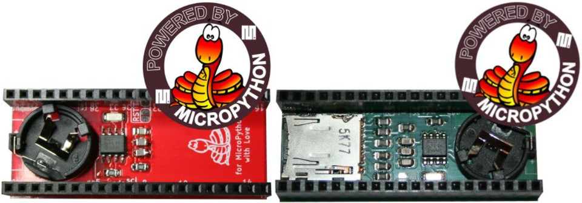
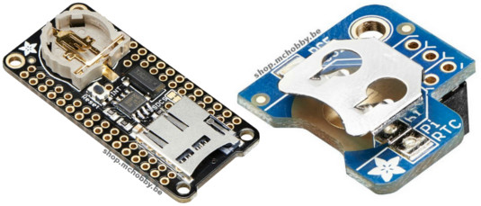
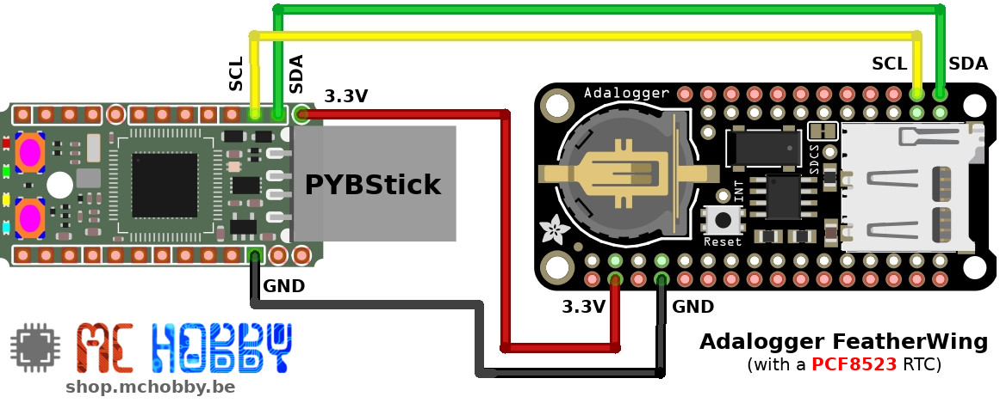
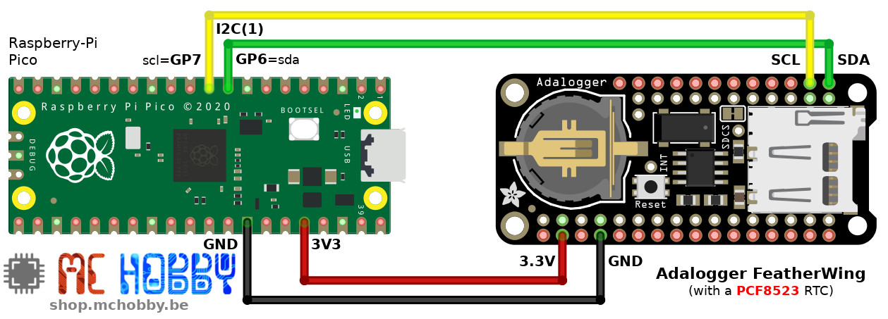
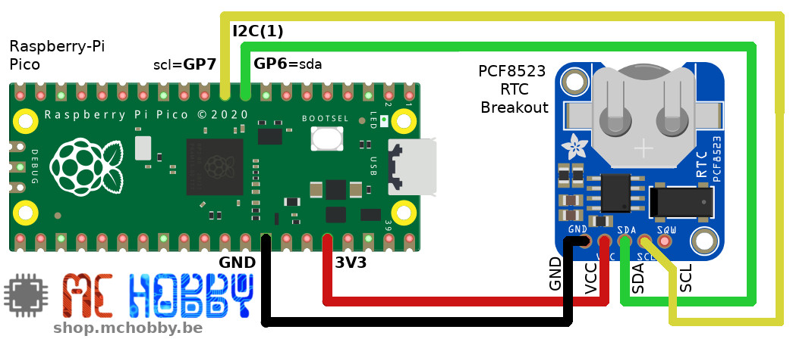

[Ce fichier existe également en FRANCAIS](readme.md)

# PCF8523 : A Real Time Clock (RTC) for MicroPython

The PCF8523 from NXP is a RTC (Real Time Clock) from NXP running over an I2C bus. This device can follow the time ginning when the project is not powered. Thanks to the coin cell, the clock is still running.

The PCF8523 is quite popular and placed on many products, the following pictures show [Pico-Clock-Boot](https://shop.mchobby.be/fr/pico-rp2x/2960-pico-clock-boot-carte-horloge-rtc-pcf8523-pour-raspberry-pico-3232100029606.html) and [Pico-DataLogger-Boot](https://shop.mchobby.be/fr/pico-rp2x/2912-carte-data-logger-pour-raspberry-pi-pico-3232100029125.html) 



as well as [PiRTC](https://shop.mchobby.be/fr/pi-extensions/1148-pirtc-pcf8523-real-time-clock-for-raspberry-pi-3232100011489-adafruit.html) and the [Adafruit AdaLogger FeatherWing](https://shop.mchobby.be/fr/feather-adafruit/1056-adalogger-featherwing-rtc-pcf8523-microsd-3232100010567-adafruit.html).



The PCF8523 also offer neat features like:
* Low bat detection
* Power Lost detection (when changing the cell coin)
* __configurable Alarm__
* Software based alarm detection
* Interrupt signal activation on alarm

The interrupt signal is a great feature because it allows to wake-up a microcontroler on alarm

# Wiring

## PYBStick wiring



## Avec the Raspberry-Pi Pico





# Test

Prior to use example script, it will be necessary to copy the `pcf8523.py` livrary to the MicroPython board.

__About examples:__

The `examples` subfolder contains many examples script containg lots of comments

It is strongly recommended to read them tomanage all of the available features.

## Set date and time

The first thing to do with the RTC clock is to set its current date & time.

The following [test_setdate.py](examples/test_setdate.py) example script shows the needed step to do it.

```
from machine import I2C, Pin
from pcf8523 import PCF8523
import time

DAY_NAMES = ['monday','tuesday', 'wednesday', 'thursday', 'friday', 'saterday', 'sunday' ]

# PYBStick - S3=sda, S5=scl
# Raspberry-Pi Pico - GP6=sda, GP7=scl
i2c = I2C(1, sda=Pin(6), scl=Pin(7))
pcf_rtc = PCF8523( i2c )

# Year: 2020, month: 6, day: 22, hour: 0, min: 14, sec: 6, weekday: 0 (monday), yearday: 174
# yearday can be set to 0 when setting the date... it will be recomputed
pcf_rtc.datetime = (2020, 6, 22, 0, 0, 14, 6, 0)
time.sleep(1)

# Reread as datetime
print( "y/m/d weekday h:m:s.ms =>", pcf_rtc.datetime )

# Reread as timestamp
_time = pcf_rtc.timestamp
print( "Time: %s secs" % _time )
print( "Year: %s, month: %s, day: %s, hour: %s, min: %s, sec: %s, weekday: %s, yearday: %s" % time.localtime(_time) )
weekday = time.localtime(_time)[6]
print( 'Day of week: %s' % DAY_NAMES[weekday] )
```

## Read the time and date

The following example is used to read the clock time and date.

See the [test_getdate.py](examples/test_getdate.py) example.

```
from machine import I2C, Pin
from pcf8523 import PCF8523
import time
DAY_NAMES = ['monday','tuesday', 'wednesday', 'thursday', 'friday', 'saterday', 'sunday' ]

# PYBStick - S3=sda, S5=scl
# Raspberry-Pi Pico - GP6=sda, GP7=scl
i2c = I2C(1, sda=Pin(6), scl=Pin(7))

pcf_rtc = PCF8523( i2c )

_dt = pcf_rtc.datetime
print( "y/m/d weekday h:m:s.ms =>", _dt )
print( "Day of Week:", DAY_NAMES[_dt[3]])

_time = pcf_rtc.timestamp
print( "Time: %s secs" % _time )
print( "Year: %s, month: %s, day: %s, hour: %s, min: %s, sec: %s, weekday: %s, yearday: %s" % time.localtime(_time) )
weekday = time.localtime(_time)[6]
print( 'Day of week: %s' % DAY_NAMES[weekday] )
```

## Test alarm feature

This RTC does have a great feature to fire an alarm (register or interrupt pin) when alarm condition are reach.

The alarm conditions can be made of one or many of the following criteria:
* Day of the week (0=monday, 6=sunday)
* Day of the month
* Hour of the day
* Minute of the hour

When several conditions are used for the alarm, the target must be reached for the whole conditions to fire the alarm.

The following [test_alarm.py](examples/test_alarm.py) script show how to activate the alarm every hour.

To hurry the test script, the alarm is set one to 1 minute after the script startup.

```
from machine import I2C, Pin
from pcf8523 import PCF8523
import time

# PYBStick - S3=sda, S5=scl
# Raspberry-Pi Pico - GP6=sda, GP7=scl
i2c = I2C(1, sda=Pin(6), scl=Pin(7))

rtc = PCF8523( i2c )

# Get the current datetime as timestamp
now = rtc.timestamp
print( "now   @ Year: %s, month: %s, day: %s, hour: %s, min: %s, sec: %s, weekday: %s, yearday: %s" % time.localtime(now) )

# Calculate Alarm 1 minute in the future
alarm_time = now + 60
alarm_tuple = time.localtime(alarm_time) # Year, month, day, hour, min, sec, weekday, yearday
alarm_minutes = alarm_tuple[4]

# set the alarm for activerate every hour & <alarm_min>
rtc.alarm_weekday( enable=False )
rtc.alarm_day    ( enable=False )
rtc.alarm_hour   ( enable=False )
rtc.alarm_min( alarm_minutes, True )

# set the alarm for activerate every day at 6:30
# rtc.alarm_weekday( enable=False )
# rtc.alarm_day    ( enable=False )
# rtc.alarm_hour   (  6, True )
# rtc.alarm_min    ( 30, True )

# set the alarm for activerate every monday at 8:00
# rtc.alarm_weekday(  1, True ) # 0 = Sunday
# rtc.alarm_day    ( enable=False )
# rtc.alarm_hour   (  8, True )
# rtc.alarm_min    (  0, True )

# Re-read alarm setting
print( "alarm_wday:", rtc.alarm_weekday() )
print( "alarm_day :", rtc.alarm_day() )
print( "alarm_hour:", rtc.alarm_hour() )
print( "alarm_min :", rtc.alarm_min() )

# Activate PCF8523 interrupt pin on alarm. Quite handy to wake-up a microcontroler
#  Interrupt pin goes to 3.3V on alarm
#rtc.alarm_interrupt = True

counter = 0
while True:
	counter += 1
	print('Testing alarm status, pass %i' % counter )
	if rtc.alarm_status:
		print( "Alarm catched!")
		print( "Tuuut Tuuut Tuuut Tuuut Tuuut Tuuut")
		print( "Reset alarm status ")
		rtc.alarm_status = False
		break
	time.sleep( 10 )


print( "That s all Folks!" )
```

Which shows the following messages:

```
$ mpremote run examples/test_alarm.py 
now   @ Year: 2026, month: 7, day: 30, hour: 1, min: 29, sec: 42, weekday: 3, yearday: 211
alarm_wday: (0, False)
alarm_day : (0, False)
alarm_hour: (0, False)
alarm_min : (30, True)
Testing alarm status, pass 1
Testing alarm status, pass 2
Testing alarm status, pass 3
Alarm catched!
Tuuut Tuuut Tuuut Tuuut Tuuut Tuuut
Reset alarm status 
That s all Folks!
```

__Note:__ the interrupt on alarm can be activated with the instruction `rtc.alarm_interrupt = True` .

# Shopping list
* [Pico-Clock-Boot](https://shop.mchobby.be/fr/pico-rp2x/2960-pico-clock-boot-carte-horloge-rtc-pcf8523-pour-raspberry-pico-3232100029606.html) for Raspberry-Pi Pico
* [Pico-DataLogger-Boot](https://shop.mchobby.be/fr/pico-rp2x/2912-carte-data-logger-pour-raspberry-pi-pico-3232100029125.html) for Raspberry-Pi Pico
* [PYBStick board](https://shop.mchobby.be/fr/recherche?controller=search&orderby=position&orderway=desc&search_query=pybstick&submit_search=) - MicroPython & Arduino board
* [Raspberry-Pi Pico](https://shop.mchobby.be/fr/157-pico-rp2040)
* [PiRTC (PCF8523)](https://shop.mchobby.be/fr/pi-extensions/1148-pirtc-pcf8523-real-time-clock-for-raspberry-pi-3232100011489-adafruit.html) @ MC Hobby
* [Adafruit AdaLogger FeatherWing (PCF8523)](https://shop.mchobby.be/fr/feather-adafruit/1056-adalogger-featherwing-rtc-pcf8523-microsd-3232100010567-adafruit.html) @ MC Hobby
