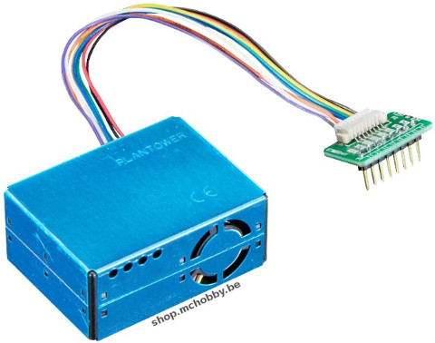
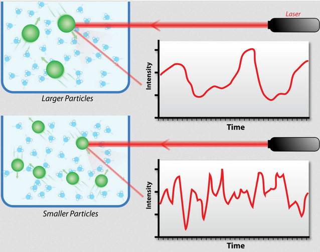
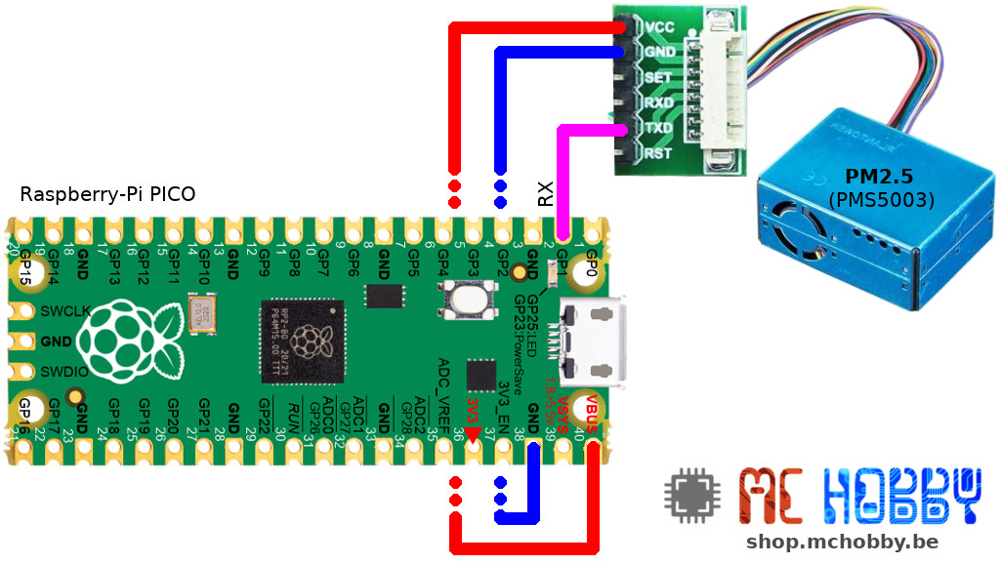

[This file also exists in ENGLISH](readme_ENG.md)

# Utiliser un Capteur de particule fine PM2.5 (PMS5003) avec MicroPython

Ce capteur est conçu pour réaliser des mesures de la concentration de poussière PM2.5! PM2.5 signifie Particule Micron 2.5 et fait référence au diamètre des particules qui peuvent être mesurées (2.5 microns ou plus petit).



Ce capteur utilise un laser pour illuminer les particules en suspension dans l'air, ensuite le capteur collecte la lumière réfléchie ou diffractée pour obtenir une courbe de la lumière diffusée (scattering light) en fonction du temps. Le microprocesseur calcule le diamètre des particules correspondant et le nombre de particules avec des diamètres différents par unité de volume.



Source: [Wikipedia - Dynamic Light Scattering](https://en.wikipedia.org/wiki/Dynamic_light_scattering)

Ce capteur retourne les informations suivantes:
* Les concentrations PM1.0, PM2.5 et PM10.0 dans l'unité standard (en µ g/m^3).<br />devrait être utilisé en environnement industriel.
* Les concentrations PM1.0, PM2.5 et PM10.0 dans l'unité environnemental (en µ g/m^3).<br />sous environnement atmosphérique.
* Les relevés des particules par 0.1L d'air : Indique le nombre de particules au-delà de 0.3µm, 0.5µm, 1.0µm, 2.5µm, 5.0µm et 10µm de diamètre par 0.1 L d'air.

[Plus d'information technique sur cette fiche produit](https://shop.mchobby.be/fr/environnemental-press-temp-hrel-gaz/1332-senseur-qualite-d-air-pm25-pm5003-et-adaptateur-breadboard-3232100013322-adafruit.htm).

Notes:
* '''Set''' : le signal peut être utilisé par le microcontrôleur pour mettre le capteur en mode veille.
* '''Reset''' : permet de réinitialiser le capteur.
* Le capteur nécessite 30 secondes avant de fournir des données cohérentes.

# Bibliothèque

Avant de tester le PM 2.5 (PMS5003), il est nécessaire de copier la bibliothèque [pm25.py](lib/pm25.py) sur la carte MicroPython.

# Brancher

Les exemples nécessitent la présence de la bibliothèque [pm25.py](lib/pm25.py) sur la carte MicroPython.

Le capteur utilise une alimentation 5V mais communique avec une logique 3.3V.

Seule la ligne TX du capteur doit être raccordée sur le microcontrôleur.

## Brancher sur Raspberry-Pi Pico



# Tests

Le script d'exemple [test_simple.py](examples/test_simple.py) (repris ci-dessous en version simplifiée) indique comment obtenir les informations du capteur.

``` python
from machine import UART
from pm25 import PM25
import time

# Raspberry Pico : GP0=tx (non utilisé), GP1=rx (utilisé)
ser = UART( 0, baudrate=9600, timeout=800 )
pm25 = PM25( ser )

pm25.acquire() # Acquisition des données sur la ligne série
print( '-'*40 )
print( 'Concentration Units (standard)')
print( '  pm1.0: %i' % pm25.data.std.pm10 )
print( '  pm2.5: %i' % pm25.data.std.pm25 )
print( '  pm10.0: %i' % pm25.data.std.pm100 )
print( 'Concentration Units (Environmental)')
print( '  pm1.0: %i' % pm25.data.env.pm10 )
print( '  pm2.5: %i' % pm25.data.env.pm25 )
print( '  pm10.0: %i' % pm25.data.env.pm100 )
print( 'Particle > x um / 0.1L air')
print( '  0.3um: %i' % pm25.data.particles.um03 ) # Particules > 0.3 µM / 0.1L air
print( '  0.5um: %i' % pm25.data.particles.um05 ) # Particules > 0.5 µM / 0.1L air
print( '  1.0um: %i' % pm25.data.particles.um10 ) # Particules > 1.0 µM / 0.1L air
print( '  2.5um: %i' % pm25.data.particles.um25 )
print( '  5.0um: %i' % pm25.data.particles.um50 )
print( '  10.0um: %i' % pm25.data.particles.um100 )
```

Les résultats produits ci-dessous correspondent a un environnement de bureau (avec des poussières)

```
Concentration Units (standard)
  pm1.0: 36
  pm2.5: 52
  pm10.0: 53
Concentration Units (Environmental)
  pm1.0: 28
  pm2.5: 42
  pm10.0: 50
Particle > x um / 0.1L air
  0.3um: 6216
  0.5um: 1771
  1.0um: 302
  2.5um: 13
  5.0um: 1
  10.0um: 1
```

Voici les résultats produit lorsque la fumée produite par le fer à souder (fumée de la soudure à l'étain) qui produit beaucoup de particule fines (voyez l'indice 0.3um)

```
----------------------------------------
Concentration Units (standard)
  pm1.0: 168
  pm2.5: 361
  pm10.0: 399
Concentration Units (Environmental)
  pm1.0: 111
  pm2.5: 240
  pm10.0: 265
Particle > x um / 0.1L air
  0.3um: 27864
  0.5um: 8497
  1.0um: 2937
  2.5um: 307
  5.0um: 50
  10.0um: 30
----------------------------------------
Concentration Units (standard)
  pm1.0: 104
  pm2.5: 188
  pm10.0: 209
Concentration Units (Environmental)
  pm1.0: 68
  pm2.5: 124
  pm10.0: 138
Particle > x um / 0.1L air
  0.3um: 17484
  0.5um: 5135
  1.0um: 1323
  2.5um: 142
  5.0um: 28
  10.0um: 18
----------------------------------------
Concentration Units (standard)
  pm1.0: 80
  pm2.5: 134
  pm10.0: 146
Concentration Units (Environmental)
  pm1.0: 52
  pm2.5: 88
  pm10.0: 96
Particle > x um / 0.1L air
  0.3um: 13620
  0.5um: 3934
  1.0um: 900
  2.5um: 87
  5.0um: 14
  10.0um: 9
```

# Où acheter

* [Capteur de qualité d'air PM2.5 (PMS5003) ](https://shop.mchobby.be/product.php?id_product=1332) @ MC Hobby
* [PM2.5 Air Quality Sensor (PMS5003)](https://www.adafruit.com/product/3686)  @ Adafruit
* [PMS5003 Particulate Matter Sensor](https://shop.pimoroni.com/products/pms5003-particulate-matter-sensor-with-cable)
* [Raspberry-Pi Pico](https://shop.mchobby.be/fr/157-pico-rp2040) @ MC Hobby
