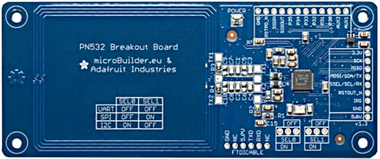
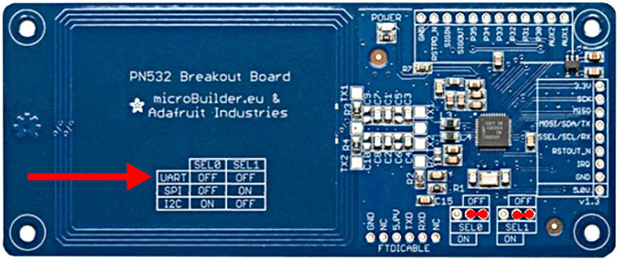
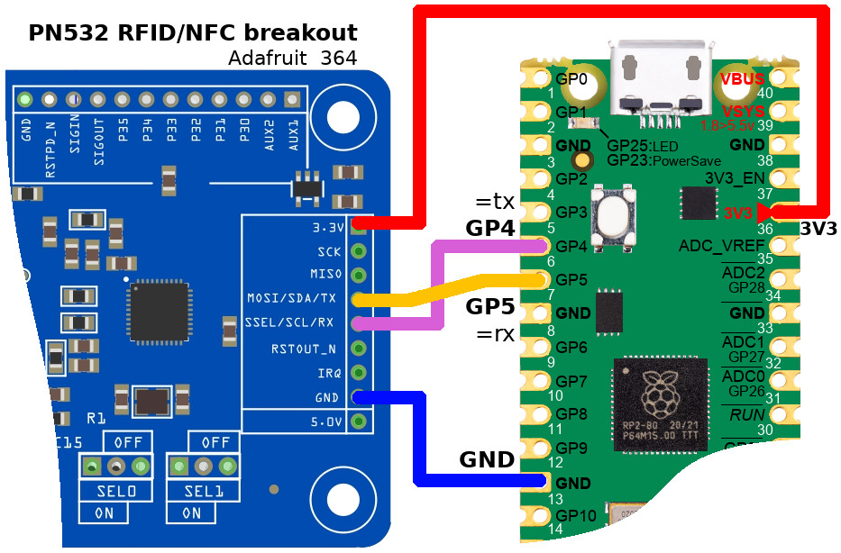

Ce fichier [existe également en Français](readme.md)

#  Read ISO14443A / MiFare tags with PN532 chipset and MicroPython

The PN532 chipset is a popular RFID/NFC controler used to read and write tags.

Thanks to the NFC technology this chip can also communicates and exchange data with smartphone.

Adafruit industries to propose a great [PN532 breakout](https://shop.mchobby.be/fr/cartes-breakout/528-rfid-nfc-controleur-pn532-3232100005280-adafruit.html) board supporting I2C, SPI, UART communication with a HOST (microcontroler or computer).



The PN532 NFC/RFID controller breakout board (ADA364) can be powered with 3.3V and used with 3.3V logic.

Thank to the 3.3V UART, we can easily wire to a UART capable microcontroler.

# Learning about MiFare

Having a card/tag capable of storing data is awesome.

However, it is not as simple as dropping a file onto a USB flash drive.

Here how you can learn more about the storing data onto a memory capable tag:
* [MiFare Cards & Tags](https://learn.adafruit.com/adafruit-pn532-rfid-nfc/mifare) (_Adafruit, English_)
* [Cartes et tags MiFare](https://wiki.mchobby.be/index.php?title=PN532-RFID-NFC-Carte-et-tag-MiFare) (_MCHobby Wiki, French_)
* [PN532 User Manual](https://www.nxp.com/docs/en/user-guide/141520.pdf) (_NXP, English_)

# Library

__Library limitation__ : presently only the __UART based__ version of the library is implemented.

__Library sponsor__ : thank to the [Lycée Français Jean Monnet](https://www.lyceefrancais-jmonnet.be/) which sponsored the creation of this library.

The library must be copied to the MicroPython board before using the examples.

On a WiFi based microcontroler:

```
>>> import mip
>>> mip.install("github:mchobby/esp8266-upy/pn532-rfid")
```

Or by using the mpremote tool:

```
mpremote mip install github:mchobby/esp8266-upy/pn532-rfid
```

# Hardware configuration

## Serial configuration

Prior to wire the PN532 breakout board on the Microcontroler, the breakout must be configured to use the UART for the interact with the MCU.

The SEL0 & SEL1 jumpers must both be on the OFF position.



# Wiring

## Serial wiring to Pico



# Tests

## read_mifare.py

The [read_mifare.py](examples/read_mifare.py) access a ISO14443A/MiFare tag then:
1. display the UID,
2. authenticates on sector 1 (block_nr 4 to 7) with the default KEYA
3. read the 16 bytes stored into the data block #4

By default, a blank card does have all the bits set to 0 in the data block. That means that the 16 bytes should be at 0x00.

``` python
$ mpremote run examples/read_mifare.py
{'FIRMWARE': '1.6', 'CHIPSET': 'pn532'}
SAM configured
Waiting for an ISO14443A/MiFare Card ...
Communication Error!
Communication Error!
Communication Error!
Found an ISO14443A card
  UID Length: 4 bytes
  UID Value: b'AA1CC105'
  UID      : AA 1C C1 05
Seems to be a Mifare Classic card (4 byte UID)
Trying to authenticate block 4 with default KEYA value
Sector 1 (Blocks 4..7) has been authenticated
Data Block 4: 00 00 00 00 00 00 00 00 00 00 00 00 00 00 00 00
```

When the data block contains the data (see example `write_mifare.py` here below) then the content of data block is displayed.

``` python
$ mpremote run examples/read_mifare.py
{'FIRMWARE': '1.6', 'CHIPSET': 'pn532'}
SAM configured
Waiting for an ISO14443A/MiFare Card ...
Communication Error!
Found an ISO14443A card
  UID Length: 4 bytes
  UID Value: b'D5138E71'
  UID      : D5 13 8E 71
Seems to be a Mifare Classic card (4 byte UID)
Trying to authenticate block 4 with default KEYA value
Sector 1 (Blocks 4..7) has been authenticated
Data Block 4: 4D 49 43 52 4F 50 59 54 48 4F 4E 20 48 45 52 45
```

## write_mifare.py

The [write_mifare.py](examples/write_mifare.py) access a ISO14443A/MiFare tag
and display the UID.

It then authenticates with the default KEYA to access the block #4 (sector 1
	from block 4..7).

Finally, once authenticated, the script write the block data (16 bytes)
to the block #4.

When starting, the script also shows the data to be written in various format.
The Hexadecimal representation (the last one) show precisely each of the bytes
as encoded into the data block. Use the [read_mifare.py](examples/read_mifare.py)
script to read back the data.

``` python
$ mpremote run examples/write_mifare.py
{'FIRMWARE': '1.6', 'CHIPSET': 'pn532'}
SAM configured
Waiting for an ISO14443A/MiFare Card for writing...
--- Data to Write ---
MICROPYTHON HERE
bytearray(b'MICROPYTHON HERE')
4D 49 43 52 4F 50 59 54 48 4F 4E 20 48 45 52 45
---------------------

Communication Error!
Communication Error!
Communication Error!
Found an ISO14443A card
  UID Length: 4 bytes
  UID Value: b'D5138E71'
  UID      : D5 13 8E 71
Seems to be a Mifare Classic card (4 byte UID)
Trying to authenticate block 4 with default KEYA value
Sector 1 (Blocks 4..7) has been authenticated
Block writen... script end!
That's all folks!
```

## memdump_mifare.py

The [memdump_mifare.py](examples/memdump_mifare.py) access a ISO14443A/MiFare tag and display the UID.

When a MiFareClassic is detected then the code use the universal key (0xFF,0xFF,0xFF,0xFF,0xFF,0xFF) as keyb to authenticate against the sectors.

When authentication get successfull the 4 blocks (16 bytes each) of the sector are dumped under their hexadecimal representation.

Example of results with a MiFare card written with the [write_mifare.py](examples/write_mifare.py) (see block #4):

```
$ mpremote run examples/memdump_mifare.py
{'FIRMWARE': '1.6', 'CHIPSET': 'pn532'}
SAM configured
Waiting for an ISO14443A/MiFare Card for DUMPING ...
Communication Error!
Found an ISO14443A card
  UID Length: 4 bytes
  UID Value: b'D5138E71'
  UID      : D5 13 8E 71
Seems to be a Mifare Classic card (4 byte UID)
Block 00 : D5 13 8E 71 39 08 04 00 03 93 D5 2B 4D 24 70 90
Block 01 : 00 00 00 00 00 00 00 00 00 00 00 00 00 00 00 00
Block 02 : 00 00 00 00 00 00 00 00 00 00 00 00 00 00 00 00
Block 03 : 00 00 00 00 00 00 FF 07 80 69 FF FF FF FF FF FF
Block 04 : 4D 49 43 52 4F 50 59 54 48 4F 4E 20 48 45 52 45
Block 05 : 00 00 00 00 00 00 00 00 00 00 00 00 00 00 00 00
Block 06 : 00 00 00 00 00 00 00 00 00 00 00 00 00 00 00 00
Block 07 : 00 00 00 00 00 00 FF 07 80 69 FF FF FF FF FF FF
Block 08 : 00 00 00 00 00 00 00 00 00 00 00 00 00 00 00 00
Block 09 : 00 00 00 00 00 00 00 00 00 00 00 00 00 00 00 00
Block 10 : 00 00 00 00 00 00 00 00 00 00 00 00 00 00 00 00
Block 11 : 00 00 00 00 00 00 FF 07 80 69 FF FF FF FF FF FF
Block 12 : 00 00 00 00 00 00 00 00 00 00 00 00 00 00 00 00
Block 13 : 00 00 00 00 00 00 00 00 00 00 00 00 00 00 00 00
Block 14 : 00 00 00 00 00 00 00 00 00 00 00 00 00 00 00 00
Block 15 : 00 00 00 00 00 00 FF 07 80 69 FF FF FF FF FF FF
Block 16 : 00 00 00 00 00 00 00 00 00 00 00 00 00 00 00 00
Block 17 : 00 00 00 00 00 00 00 00 00 00 00 00 00 00 00 00
Block 18 : 00 00 00 00 00 00 00 00 00 00 00 00 00 00 00 00
Block 19 : 00 00 00 00 00 00 FF 07 80 69 FF FF FF FF FF FF
Block 20 : 00 00 00 00 00 00 00 00 00 00 00 00 00 00 00 00
Block 21 : 00 00 00 00 00 00 00 00 00 00 00 00 00 00 00 00
Block 22 : 00 00 00 00 00 00 00 00 00 00 00 00 00 00 00 00
Block 23 : 00 00 00 00 00 00 FF 07 80 69 FF FF FF FF FF FF
Block 24 : 00 00 00 00 00 00 00 00 00 00 00 00 00 00 00 00
Block 25 : 00 00 00 00 00 00 00 00 00 00 00 00 00 00 00 00
Block 26 : 00 00 00 00 00 00 00 00 00 00 00 00 00 00 00 00
Block 27 : 00 00 00 00 00 00 FF 07 80 69 FF FF FF FF FF FF
Block 28 : 00 00 00 00 00 00 00 00 00 00 00 00 00 00 00 00
Block 29 : 00 00 00 00 00 00 00 00 00 00 00 00 00 00 00 00
Block 30 : 00 00 00 00 00 00 00 00 00 00 00 00 00 00 00 00
Block 31 : 00 00 00 00 00 00 FF 07 80 69 FF FF FF FF FF FF
Block 32 : 00 00 00 00 00 00 00 00 00 00 00 00 00 00 00 00
Block 33 : 00 00 00 00 00 00 00 00 00 00 00 00 00 00 00 00
Block 34 : 00 00 00 00 00 00 00 00 00 00 00 00 00 00 00 00
Block 35 : 00 00 00 00 00 00 FF 07 80 69 FF FF FF FF FF FF
Block 36 : 00 00 00 00 00 00 00 00 00 00 00 00 00 00 00 00
Block 37 : 00 00 00 00 00 00 00 00 00 00 00 00 00 00 00 00
Block 38 : 00 00 00 00 00 00 00 00 00 00 00 00 00 00 00 00
Block 39 : 00 00 00 00 00 00 FF 07 80 69 FF FF FF FF FF FF
Block 40 : 00 00 00 00 00 00 00 00 00 00 00 00 00 00 00 00
Block 41 : 00 00 00 00 00 00 00 00 00 00 00 00 00 00 00 00
Block 42 : 00 00 00 00 00 00 00 00 00 00 00 00 00 00 00 00
Block 43 : 00 00 00 00 00 00 FF 07 80 69 FF FF FF FF FF FF
Block 44 : 00 00 00 00 00 00 00 00 00 00 00 00 00 00 00 00
Block 45 : 00 00 00 00 00 00 00 00 00 00 00 00 00 00 00 00
Block 46 : 00 00 00 00 00 00 00 00 00 00 00 00 00 00 00 00
Block 47 : 00 00 00 00 00 00 FF 07 80 69 FF FF FF FF FF FF
Block 48 : 00 00 00 00 00 00 00 00 00 00 00 00 00 00 00 00
Block 49 : 00 00 00 00 00 00 00 00 00 00 00 00 00 00 00 00
Block 50 : 00 00 00 00 00 00 00 00 00 00 00 00 00 00 00 00
Block 51 : 00 00 00 00 00 00 FF 07 80 69 FF FF FF FF FF FF
Block 52 : 00 00 00 00 00 00 00 00 00 00 00 00 00 00 00 00
Block 53 : 00 00 00 00 00 00 00 00 00 00 00 00 00 00 00 00
Block 54 : 00 00 00 00 00 00 00 00 00 00 00 00 00 00 00 00
Block 55 : 00 00 00 00 00 00 FF 07 80 69 FF FF FF FF FF FF
Block 56 : 00 00 00 00 00 00 00 00 00 00 00 00 00 00 00 00
Block 57 : 00 00 00 00 00 00 00 00 00 00 00 00 00 00 00 00
Block 58 : 00 00 00 00 00 00 00 00 00 00 00 00 00 00 00 00
Block 59 : 00 00 00 00 00 00 FF 07 80 69 FF FF FF FF FF FF
Block 60 : 00 00 00 00 00 00 00 00 00 00 00 00 00 00 00 00
Block 61 : 00 00 00 00 00 00 00 00 00 00 00 00 00 00 00 00
Block 62 : 00 00 00 00 00 00 00 00 00 00 00 00 00 00 00 00
Block 63 : 00 00 00 00 00 00 FF 07 80 69 FF FF FF FF FF FF
```

# Shopping list
* [RFID/NFC Controleur PN532 - v1.6 + Extra (ADA 364)](https://shop.mchobby.be/fr/cartes-breakout/528-rfid-nfc-controleur-pn532-3232100005280-adafruit.html) @ MCHobby
* [RFID/NFC Controleur PN532 - v1.6 + Extra (ADA 364)](https://www.adafruit.com/product/364) @ Adafruit
