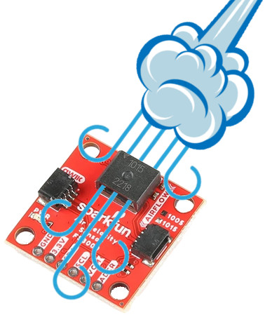
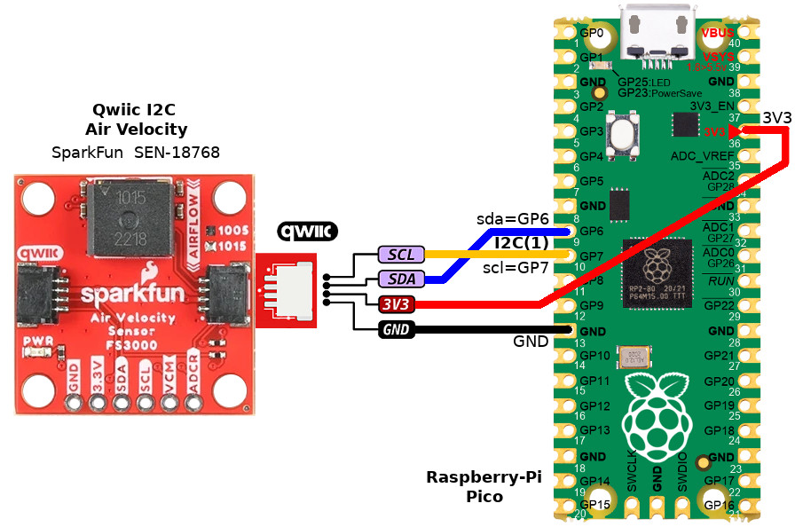

[Ce fichier existe également en FRANCAIS](readme.md)

# Using a SparkFun air velocity sensor (I2C, SEN-18768) with MicroPython

The SparkFun FS3000-1015 breakout is a air velocity sensor able to measure the air speed in a HAVC, ventilation systel or data center.




The FS3000-1015 from Renesas is a SMD module measuring air velocity from 0 to 15m/s (0 to 54 Km/H). It uses a thermopile MEMs sensor offering a 12 bits resolution (0 to 4095).

The library works with the two breakout flavor:

* FS3000-1015 : measurement from 0 to 15m/s
* FS3000-1005 : measurement from 0 to 7ms/s 


The breakout expose an I2C interface available through the Qwiic connector (also named StemmaQT), part of the SparkFun Qwiic EcoSystem simplifying the wiring thanks to its quick and efficient connectivity.

Sparfun offers [https://www.sparkfun.com/sparkfun-air-velocity-sensor-breakout-fs3000-1015-qwiic.html its library] for Arduino and MicroPython. The libraries use a SparFun code overlay abstracting calls for MicroPython and CiruitPython. That approach not being in line with the repository rules, the driver have been rewriten from the Arduino library.

# Library


The `airspeed.py` must be copied to the MicroPython board before using the examples.

On a connected plateform:

```
>>> import mip
>>> mip.install("github:mchobby/esp8266-upy/qwiic-air-velocity")
```

Or with the mpremote utility:

```
mpremote mip install github:mchobby/esp8266-upy/qwiic-air-velocity
```

# Wiring

## Raspberry-Pi Pico



The sensor instance is created with the following instructions:

```
from machine import I2C,Pin
from airspeed import FS3000, AIRFLOW_RANGE_15_MPS
i2c = I2C( 1, sda=Pin.board.GP6, scl=Pin.board.GP7 )
# Adresse par défaut (0x28)
# Ajouter parametre address=0x28 pour une adresse personnalisée
air_speed = FS3000( i2c )
```

# Testing

Here some examples based on the `airspeed.py` library.

* [test_simple.py](examples/test_simple.py) - a simple example (visible here below)


``` python
from machine import I2C,Pin
from airspeed import FS3000, AIRFLOW_RANGE_15_MPS
import time

# Raspberry-Pi Pico
i2c = I2C( 1, sda=Pin.board.GP6, scl=Pin.board.GP7 )
# Default address
air_speed = FS3000( i2c )

# air_speed.set_range( AIRFLOW_RANGE_7_MPS )
air_speed.set_range( AIRFLOW_RANGE_15_MPS )

while True:
	print( "FS3000 raw read:", air_speed.read_raw() ) # 125ms acquisition
	#  Reading in meter per second, return a float value from 0 to 7.23 for FS3000-1005, 0 to 15 for FS3000-1015 
	airflow_mps = air_speed.read_mps()
	if airflow_mps != None: # Returns None in case of CRC error in communication!
		print( "   m/s:", airflow_mps ) 
		airflow_kmh = airflow_mps*3600/1000
		print( "   Km/h:", airflow_kmh ) 
		airflow_mph = airflow_mps*2.2369362912
		print( "   Miles/h:", airflow_mph ) 
	time.sleep( 1 )

```

# Shopping list
* [SparkFun  Air Velocity Sensor Breakout - FS3000-1015 (Qwiic SEN-18768)](https://www.sparkfun.com/sparkfun-air-velocity-sensor-breakout-fs3000-1015-qwiic.html) @ SparkFun

