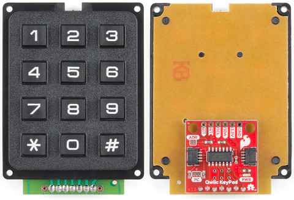
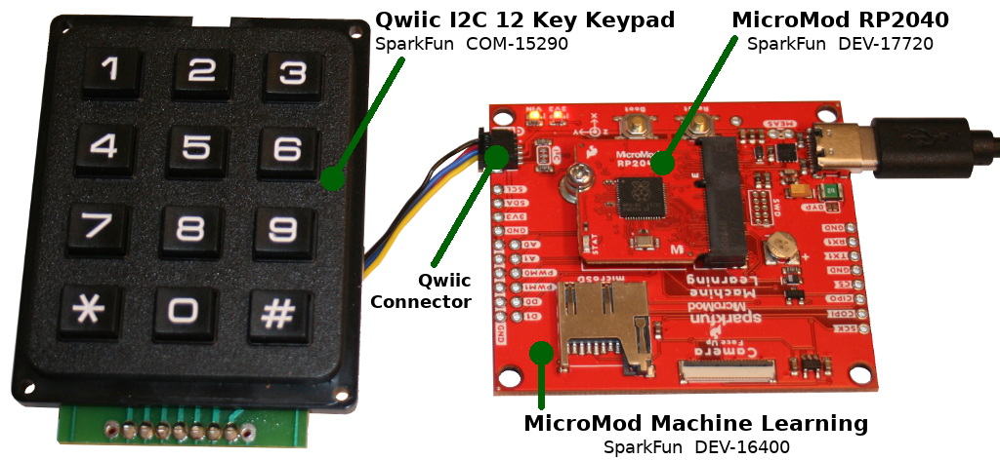
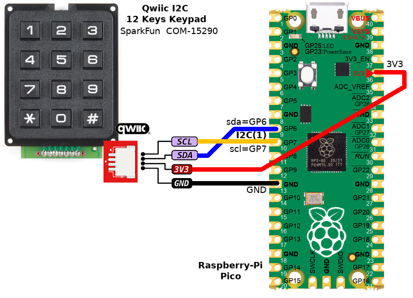

[This file also exists in English](readme_ENG.md)

# Utiliser le Keypad Qwiic 12 touches (I2C) avec MicroPython

SparkFun Produit un [Clavier 12 Touches I2C](https://www.sparkfun.com/products/15290) utilisant la connectique Qwiic (SparkFun, COM-15290).



Ce __clavier autonome__ est capable d'enregistrer les frappes (et leur timing) même si le périphérique n'est pas interrogé!

# Bibliothèque

Avant de tester le Keypad I2C, il est nécessaire de copier la bibliothèque [kpadi2c.py](lib/kpadi2c.py) sur la carte MicroPython.

Bibliothèques:
* [kpadi2c.py](lib/kpadi2c.py) : bibliothèque de base permettant d'interagir avec le module KeyPad I2C.
* [kpadcode.py](lib/kpadcode.py) : bibliothèque complémentaire à [kpadi2c.py](lib/kpadi2c.py) destiné à la saisie type "DigiCode".

# Brancher

## Brancher sur MicroMod-RP2040

Dans l'exemple ci-dessous, la carte péripérique [MicroMod Learning Machine](https://www.sparkfun.com/products/16400) (_Carrier board_, SparkFun,  DEV-16400) est utilisée pour apporter la connectivité Qwiic au MicroMod-RP2040.



## Brancher sur Raspberry-Pi Pico

Vous pouvez également brancher le clavier à l'aide d'un [Qwiic Cable Breakout](https://www.sparkfun.com/products/14425) (SparFun, PRT-14425)




# Tests

Tous les exemples nécessitent la présence de la bibliothèque [kpadi2c.py](lib/kpadi2c.py) sur la carte MicroPython.

Certains exemples utiliserons également la bibliothèque [kpadcode.py](lib/kpadcode.py) .

## test.py : Lecture des touches

Le script [test.py](examples/test.py) lit les touches pressées sur le KeyPad et les affichent sur la console.

Presser la touche "*" interrompt le fonctionnement du script.


``` python
from machine import I2C, Pin
from kpadi2c import Keypad_I2C
import time

# MicroMod-RP2040 - SparkFun
i2c = I2C( 0, sda=Pin(4), scl=Pin(5) )
# Raspberry-Pi Pico
# i2c = I2C( 1 ) # sda=GP6, scl=GP7

kpad = Keypad_I2C( i2c )
print( 'KeyPad connected:', 'Yes' if kpad.is_connected else 'NO' )
print( 'Version:', kpad.version )
print( 'Press buttons: * to exit reading loop')
while True:
	kpad.update_fifo()
	_btn = kpad.button # Retourne le code ASCII
	while _btn != 0:
		print( "ASCII: %s,  Char: %s" % (_btn, chr(_btn) ) )
		if _btn == 42:
			raise Exception( 'User Exit!' )
		kpad.update_fifo()
		_btn = kpad.button # lecture du bouton suivant
	time.sleep_ms( 200 )
```

Ce qui produit le résultat suivant dans une session REPL.

```  
>>> import test
KeyPad connected: Yes
Version: v1.0
Press buttons: * to exit reading loop
ASCII: 49,  Char: 1
ASCII: 50,  Char: 2
ASCII: 51,  Char: 3
ASCII: 52,  Char: 4
ASCII: 53,  Char: 5
ASCII: 54,  Char: 6
ASCII: 55,  Char: 7
ASCII: 56,  Char: 8
ASCII: 57,  Char: 9
ASCII: 48,  Char: 0
ASCII: 35,  Char: #
ASCII: 35,  Char: #
ASCII: 35,  Char: #
ASCII: 42,  Char: *
Traceback (most recent call last):
  File "<stdin>", line 1, in <module>
  File "test.py", line 34, in <module>
Exception: User Exit!
>>>
```

## Test2.py : Lecture touches et temps

Le module Keypad enregistre la pression des touches et moment où elles étaient pressées.

Le module Keypad enregistre toutes les pressions de touches même si le keypad n'est pas interroger entre les pressions de touche.

``` python
from machine import I2C, Pin
from kpadi2c import Keypad_I2C
import time

# MicroMod-RP2040 - SparkFun
i2c = I2C( 0, sda=Pin(4), scl=Pin(5) )
# Raspberry-Pi Pico
# i2c = I2C( 1 ) # sda=GP6, scl=GP7

kpad = Keypad_I2C( i2c )
print( 'KeyPad connected:', 'Yes' if kpad.is_connected else 'NO' )
print( 'Version:', kpad.version )
while True:
	kpad.update_fifo()
	_btn   = kpad.button # Return ASCII code
	_deltaT= kpad.time_since_pressed
	if _btn == 0: # no reading
		time.sleep_ms( 200 )
		continue # restart loop

	print( "Button %s was pressed %d milliseconds ago." % (chr(_btn),_deltaT) )
```

Ce qui produit le résultat suivant:

```
>>> import test2
KeyPad connected: Yes
Version: v1.0
Button 3 was pressed 18463 milliseconds ago.
Button 3 was pressed 18182 milliseconds ago.
Button 3 was pressed 17866 milliseconds ago.
Button 6 was pressed 17481 milliseconds ago.
Button 1 was pressed 16160 milliseconds ago.
Button 7 was pressed 15076 milliseconds ago.
Button # was pressed 13685 milliseconds ago.
Button 9 was pressed 28 milliseconds ago.
Button 8 was pressed 168 milliseconds ago.
Button 7 was pressed 74 milliseconds ago.
Button 6 was pressed 144 milliseconds ago.
Button 5 was pressed 172 milliseconds ago.
Button 4 was pressed 97 milliseconds ago.
Button 3 was pressed 99 milliseconds ago.
Button 2 was pressed 101 milliseconds ago.
Button 1 was pressed 41 milliseconds ago.
Button # was pressed 60 milliseconds ago.
Button # was pressed 100 milliseconds ago.
Button * was pressed 186 milliseconds ago.
Button * was pressed 160 milliseconds ago.
```

Les 7 premiers résultats correspondent à la pression des touches alors que script n'était pas en cours d'exécution pour rapatrier les touches déjà pressées.

Elles sont donc toutes lues au démarrage du script.

Les autres touches sont lues au fur et a mesure qu'elles sont pressées, raison pour laquelle le temps de lecture ne dépasse pas 200ms (la pause/sleep_ms utilisé dans le script).

## checkcode.py : module digicode

L'exemple [checkcode.py](examples/checkcode.py) permet d'implémenter un digicode à l'aide du KeyPad I2C.

Cet exemple nécessite également la présence de la bibliothèque [kpadcode.py](lib/kpadcode.py) sur la carte MicroPython.

``` python
from machine import I2C, Pin
from kpadcode import CodeChecker
import time

# MicroMod-RP2040 - SparkFun
i2c = I2C( 0, sda=Pin(4), scl=Pin(5) )
# Raspberry-Pi Pico
# i2c = I2C( 1 ) # sda=GP6, scl=GP7

# Fonction de rappel utilisée par CodeChecker pour tenir informé
# de l'encodage utilisateur
def update_display( user_entry, timeout ):
	# user_entry : chaîne de caractères
	# timeout : True lorsque l'utilisateur n'encode plus rien (et RAZ user_entry)
	if timeout:
		print( 'Callback: timeout!' )
	print( 'Callback: "%s"' % user_entry )

locker = CodeChecker( i2c, address=0x4B, code='1234*' ) # Code secret = '1234*'
locker.on_update = update_display # Associe la fonction de rappel
print( 'KeyPad connected:', 'Yes' if locker.is_connected else 'NO' )
print( 'Version:', locker.version )

locked = True
while locked:
	print( '==== Enter KeyCode to Unlock ====' )
	# execute() demande un code sur le clavier. Retourne True s'il est correct.
	# Retourne False si l'utilisateur n'encode rien et délai d'attente dépassé (timeout)
	locked = not( locker.execute() )
	if locked:
		print( 'Execute() timeout! Try again' )

# La boucle se termine lorsque le code est correct
print( 'Yes! Unlocked!' )
```
Ce qui produit le résultat suivant

```
MicroPython v1.17 on 2021-09-02; Raspberry Pi Pico with RP2040
Type "help()" for more information.
>>> import checkcode
KeyPad connected: Yes
Version: v1.0
==== Enter KeyCode to Unlock ====
Callback: "     "
Callback: "5    "
Callback: "55   "
Callback: "555  "
Callback: "5555 "
Callback: "55555"
Callback: "     "

Callback: "     "
Callback: "4    "
Callback: "44   "
Callback: timeout!
Callback: "     "
Callback: "4    "
Callback: "44   "
Callback: "444  "
Callback: timeout!
Callback: "     "
Execute() timeout! Try again
==== Enter KeyCode to Unlock ====
Callback: "     "
Execute() timeout! Try again
==== Enter KeyCode to Unlock ====
Callback: "     "
Execute() timeout! Try again
==== Enter KeyCode to Unlock ====
Callback: "     "
Callback: "6    "
Callback: "66   "
Callback: "666  "
Callback: "6666 "
Callback: "66666"
Callback: "     "
Callback: timeout!
Callback: "     "
Execute() timeout! Try again
==== Enter KeyCode to Unlock ====
Callback: "     "
Callback: "1    "
Callback: "12   "
Callback: "123  "
Callback: "1234 "
Callback: "12345"
Callback: "     "
Callback: "1    "
Callback: "12   "
Callback: "123  "
Callback: "1234 "
Callback: "1234*"
Yes! Unlocked!
```

## multicode.py : module digicode supportant plusieurs codes

L'exemple [multicode.py](examples/multicode.py) permet de tester plusieurs codes différents.

Cet exemple nécessite également la présence de la bibliothèque [kpadcode.py](lib/kpadcode.py) sur la carte MicroPython.

``` python
from machine import I2C, Pin
from kpadcode import CodeChecker

# MicroMod-RP2040 - SparkFun
i2c = I2C( 0, sda=Pin(4), scl=Pin(5) )
# Raspberry-Pi Pico
# i2c = I2C( 1 ) # sda=GP6, scl=GP7

code_list = ['1*123','2*777','3*456','4*###','12345']

locker = CodeChecker( i2c, address=0x4B, code=code_list )
print( 'KeyPad connected:', 'Yes' if locker.is_connected else 'NO' )
print( 'Valid codes: ',code_list)

while True:
	print( '==== Enter KeyCode  ====' )
	if locker.execute():
		print( 'Code "%s" catched!' % locker.user_entry )
```

Ce qui produira le résultat suivant:

```
Connected to MicroPython at /dev/ttyACM0
Use Ctrl-] to exit this shell

>>> import multicode
KeyPad connected: Yes
Version: v1.0
Valid codes:  ['1*123', '2*777', '3*456', '4*###', '12345']
==== Enter KeyCode  ====
Code "1*123" catched!
==== Enter KeyCode  ====
==== Enter KeyCode  ====
Code "2*777" catched!
==== Enter KeyCode  ====
Code "4*###" catched!
==== Enter KeyCode  ====
==== Enter KeyCode  ====
==== Enter KeyCode  ====
==== Enter KeyCode  ====
==== Enter KeyCode  ====
Code "3*456" catched!
```
