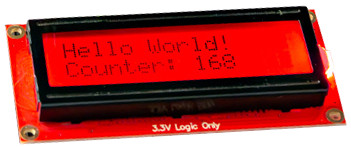

[This file also exists in ENGLISH here](readme_ENG.md)

# Utiliser un afficheur SerLCD de SparkFun (I2C, cristaux liquides) avec MicroPython

SerLCD est un afficheur LCD série propulsé par un microcontrôleur ATmega328P. SerLCD permet d'ajouter un afficheur Cristaux Liquide 16x2 RGB dans votre projet. Le microcontrôleur gère l'écran et les communications séries!



Les afficheurs SerLCD peuvent communiquer de trois façon différentes: série, I2C et SPI. L'afficheur est équipé de d'un connecteur Qwiic (aussi appelé StemmaQT), ce qui l'intègre dans l'écosystème Qwiic qui simplifie les raccordements grâce à sa connexion universelle.

# Bibliothèque

Cette bibliothèque doit être copiée sur la carte MicroPython avant d'utiliser les exemples. La bibliothèque est testée sur le **Firmware SerLCD 1.4**.

Sur une plateforme connectée:

```
>>> import mip
>>> mip.install("github:mchobby/esp8266-upy/qwiic-serlcd-i2c")
```

Ou via l'utilitaire mpremote :

```
mpremote mip install github:mchobby/esp8266-upy/qwiic-serlcd-i2c
```

# Raccordement

## Raspberry-Pi Pico


L'instance de l'afficheur est créé à l'aide des instructions suivantes:

```
from machine import I2C,Pin
from serlcd import SerLCD
i2c = I2C( 1, sda=Pin.board.GP6, scl=Pin.board.GP7 )
# Adresse par défaut (0x72)
# Ajouter parametre address=0x38 pour une adresse personnalisée
lcd = SerLCD( i2c, cols=16, rows=2 )
```

# Utiliser

Voici quelques exemples d'utilisation de la bibliothèque `serlcd.py`.

* [test_simple.py](examples/test_simple.py) - exemples simples (repris ci-dessous)
* [test_custom.py](examples/test_custom.py) - création et affichage de caractères personalisés
* [test_firmware.py](examples/test_firmware.py) - affiche la version du firmware de l'afficheur

Tous les exemples sont disponibles dans le répertoire [examples](examples).

``` python
from machine import I2C,Pin
from serlcd import SerLCD
import time

# Raspberry-Pi Pico
i2c = I2C( 1, sda=Pin.board.GP6, scl=Pin.board.GP7 )


# Adresse par défaut (0x72)
# Ajouter parametre address=0x38 pour une adresse personnalisée
lcd = SerLCD( i2c, cols=16, rows=2 )

lcd.backlight( (0,255,0) ) # Vert
time.sleep_ms(500)
lcd.backlight( (0,0,255) ) # Bleu
time.sleep_ms(500)
lcd.backlight( (255,0,0) ) # Rouge

lcd.print( "Hello" )
time.sleep(2)
lcd.clear()
lcd.print( "World!" )
time.sleep(1)
lcd.display( False ) # Eteindre le LCD et le retro-élcairage
time.sleep(1)
lcd.display( True )  # Allumer le LCD et le rétro-éclairage

lcd.set_cursor( (9,1) ) # colonne,ligne (0 à N-1)
lcd.print("*")

lcd.contrast( 0 ) # Le contraste le plus élevé. Valeur (0..255)
#lcd.contrast( 100 ) # devrait être totalement transparent

# Désactive les messages systèmes comme 'Contrast: 5'
lcd.system_messages( enable=False )

# Sauve le contenu de l'affichage comme  Splash screen
# lcd.save_splash()

# Désactivé le Splash screen (affiché au démarrage)
lcd.splash( enable=False )

# Changer l'adresse I2C du SerLCD vers une nouvelle adresse I2C (Attention, c'est permanent)
# lcd.set_address( 0x73 )
```
# Où acheter
* [SparkFun 16x2 SerLCD - RGB Text (Qwiic LCD-16397)](https://www.sparkfun.com/products/16397) @ SparkFun
* [SparkFun 16x2 SerLCD - RGB Backlight (Qwiic LCD-16396)](https://www.sparkfun.com/products/16396) @ SparkFun
* [SparkFun 20x4 SerLCD - RGB Backlight (Qwiic LCD-16398)](https://www.sparkfun.com/products/16398) @ SparkFun
