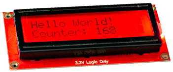
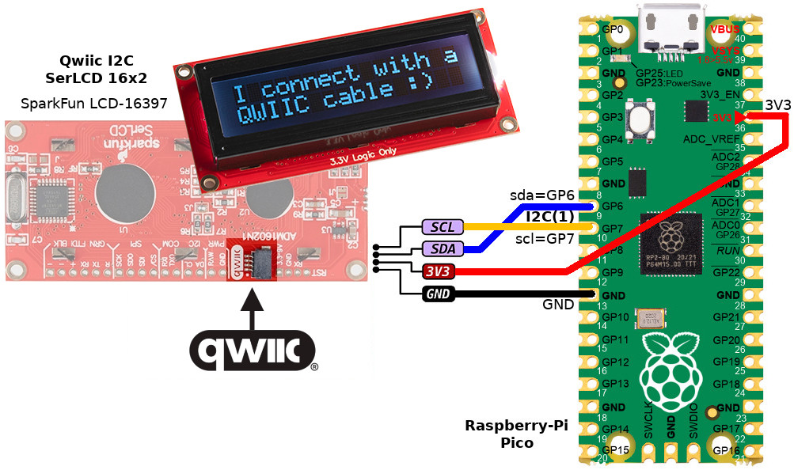

[Ce fichier existe en FRANCAIS ici](readme.md)

# Using a SparkFun SerLCD display (I2C, Liquid Cristal) with MicroPython

The SerLCD is a serial enabled LCD powered by an ATmega328P AVR. SerLCD adds a 16x2 RGB on Black Liquid Crystal Display into your project. The AVR the screen control and serial communication!



The SerLCD display can communicate in three different ways: serial, I2C, and SPI. It comes equipped with a Qwiic connector (also known as StemmaQT), bringing serial LCDs into the Qwiic ecosystem. Qwiic simplifies the wiring with simple and efficient plugs.

# Library

The library must be copied to the MicroPython  board before using the examples. La bibliotheque est testée avec le **Firmware SerLCD 1.4**.

On a connected plateform:

```
>>> import mip
>>> mip.install("github:mchobby/esp8266-upy/qwiic-serlcd-i2c")
```

Or via the mpremote tools:

```
mpremote mip install github:mchobby/esp8266-upy/qwiic-serlcd-i2c
```

# Wiring

## to Raspberry-Pi Pico



The display instance is created with the following instructions:

```
from machine import I2C,Pin
from serlcd import SerLCD
i2c = I2C( 1, sda=Pin.board.GP6, scl=Pin.board.GP7 )
# Default address (0x72)
# Use an additionnal parameter address=0x38 to use a custom address
lcd = SerLCD( i2c, cols=16, rows=2 )
```

# Using

Here some examples of usage for the library `serlcd.py`.

* [test_simple.py](examples/test_simple.py) - simple example (visible here below)
* [test_custom.py](examples/test_custom.py) - create and display custom characters
* [test_firmware.py](examples/test_firmware.py) - display the SerLCD firmware version on the display.

All the samples files are available in the [examples](examples) directory.

``` python
from machine import I2C,Pin
from serlcd import SerLCD
import time

# Raspberry-Pi Pico
i2c = I2C( 1, sda=Pin.board.GP6, scl=Pin.board.GP7 )


# Default address is (0x72)
# Add an extra parameter to specify a custom address (eg: address=0x38 )
lcd = SerLCD( i2c, cols=16, rows=2 )

lcd.backlight( (0,255,0) ) # Green
time.sleep_ms(500)
lcd.backlight( (0,0,255) ) # Blue
time.sleep_ms(500)
lcd.backlight( (255,0,0) ) # Red

lcd.print( "Hello" )
time.sleep(2)
lcd.clear()
lcd.print( "World!" )
time.sleep(1)
lcd.display( False ) # Turn off LCD & BackLight
time.sleep(1)
lcd.display( True )  # Turn on LCD & restore backlight

lcd.set_cursor( (9,1) ) #column,line (zero based)
lcd.print("*")

lcd.contrast( 0 ) # Highest contrast. Value (0..255)
#lcd.contrast( 100 ) # should be totaly transparent

# Disable system messages like 'Contrast: 5'
lcd.system_messages( enable=False )

# Save the current LCD as Splash screen
# lcd.save_splash()

# Disable Splash Screen (at Power Up)
lcd.splash( enable=False )

# Change the SerLCD I2C address to a new I2C address (warning it is permanent)
# lcd.set_address( 0x73 )
```
# Shopping list
* [SparkFun 16x2 SerLCD - RGB Text (Qwiic LCD-16397)](https://www.sparkfun.com/products/16397) @ SparkFun
* [SparkFun 16x2 SerLCD - RGB Backlight (Qwiic LCD-16396)](https://www.sparkfun.com/products/16396) @ SparkFun
* [SparkFun 20x4 SerLCD - RGB Backlight (Qwiic LCD-16398)](https://www.sparkfun.com/products/16398) @ SparkFun
