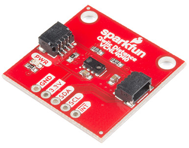
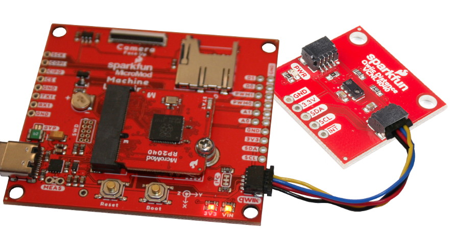
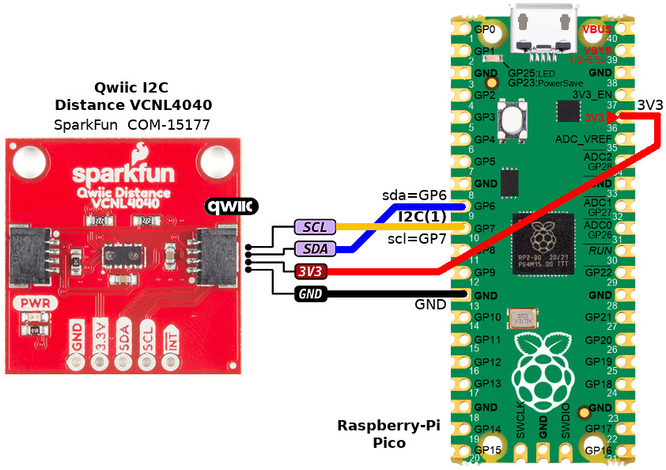

[This file also exists in ENGLISH](readme_ENG.md)

# Utiliser le capteur VCNL4040 de distance/proximité Qwiic (I2C) avec MicroPython

Sparkfun produit un capteur de distance / Proximité I2C basé sur le composant VCNL4040 (SparkFun, SEN-15177). Ce capteur exploitant la connectique Qwiic permet de mesurer une distance de l'ordre de 20cm.




Le VCNL4040 est un capteur de présence Infrarouge (IR) et de lumière ambiante. Ce capteur est excellent pour détecter si quelque-chose apparaît en face du capteur.

Ce type de capteur équipe généralement les distributeurs automatique de serviettes, robinets automatiques, etc. Il est possible de réaliser une détection qualitative jusqu'à une distance de 20cm. Cela signifie que vous pouvez detecter si quelque-chose est là, s'il est près ou plus éloigné (depuis la dernière lecture). Par contre, il n'est pas conçu pour estimer la distance (du genre l'objet est à une distance de 7.2cm).

Si vous avez besoin d'une estimation quantitative de la distance (ex: 177mm) alors il est faut opter pour un capteur du type _Time of Flight_ (ToF) avec une précision au mm.

# Bibliothèque

Cette bibliothèque doit être copiée sur la carte MicroPython avant d'utiliser les exemples.

Sur une plateforme connectée:

```
>>> import mip
>>> mip.install("github:mchobby/esp8266-upy/qwiic-vcnl4040-i2c")
```

Ou via l'utilitaire mpremote :

```
mpremote mip install github:mchobby/esp8266-upy/qwiic-vcnl4040-i2c
```


# Brancher

## Brancher sur MicroMod-RP2040

Dans l'exemple ci-dessous, la carte périphérique [MicroMod Learning Machine](https://www.sparkfun.com/products/16400) (_Carrier board_, SparkFun,  DEV-16400) est utilisée pour apporter la connectivité Qwiic au MicroMod-RP2040.



## Brancher sur Raspberry-Pi Pico

Vous pouvez également brancher le capteur à l'aide d'un [Qwiic Cable Breakout](https://www.sparkfun.com/products/14425) (SparFun, PRT-14425)



# Tester

Avant d'exécuter les exemples, il est nécessaire de copier la bibliothèque [vcnl4040.py](lib/vcnl4040.py) sur la carte MicroPython.

## test.py

Le script d'exemple [test.py](examples/test.py) interroge le capteur VCNL4040.

``` python
from machine import I2C, Pin
from vcnl4040 import VCNL4040

# MicroMod-RP2040 - SparkFun
i2c = I2C( 0, sda=Pin(4), scl=Pin(5) )
# Raspberry-Pi Pico
# i2c = I2C( 1 ) # sda=GP6, scl=GP7

prox = VCNL4040( i2c )
prox.power_proximity( enable=True )
print( "Proximity value :", prox.proximity )
```

## test_readprox.py - lecture de l'indice de proximité

Le script d'exemple [test_readprox.py](examples/test_readprox.py) permet de lire la valeur du capteur de proximité.

Le capteur de Proximité est activé dès l'initialisation.

``` python
from machine import I2C, Pin
from vcnl4040 import VCNL4040
import time

from machine import I2C, Pin
import time

i2c = I2C( 0, sda=Pin(4), scl=Pin(5) )
prox = VCNL4040( i2c )

while True:
	print( "Proximity Value: ", prox.proximity )
	time.sleep_ms(10)
```

Ce qui produit le résultat suivant:

```
Proximity Value:  2   <-- Rien près du capteur
Proximity Value:  2
Proximity Value:  3
...
Proximity Value:  76
Proximity Value:  76
Proximity Value:  133
Proximity Value:  229
Proximity Value:  229
Proximity Value:  229
Proximity Value:  434
Proximity Value:  909
Proximity Value:  909
Proximity Value:  909
Proximity Value:  1169  <-- feuille de papier près du capteur
Proximity Value:  1169
Proximity Value:  1169

Proximity Value:  1699
Proximity Value:  1699
...
Proximity Value:  906  <-- retirer la feuille
Proximity Value:  906
Proximity Value:  791
Proximity Value:  791
Proximity Value:  694
Proximity Value:  694
Proximity Value:  588
...
Proximity Value:  5   <-- Rien en face du capteur
Proximity Value:  3
Proximity Value:  2
Proximity Value:  1
Proximity Value:  2
```

Plus l'objet est proche et plus la valeur `proximity` est grande.

Une valeur proche de 0 signifie donc qu'il n'y a pas d'objet en présence.


## test_something.py - Y a t'il quelque-chose à l'avant du capteur

Le script d'exemple [test_something.py](examples/test_something.py) permet de détecter rapidement si un objet passe devant le capteur.

``` python
from machine import I2C, Pin
from vcnl4040 import VCNL4040
import time

i2c = I2C( 0, sda=Pin(4), scl=Pin(5) )
prox = VCNL4040( i2c )

startingProxValue = 0
deltaNeeded = 0
nothingThere = False

# Fixe le courant de la LED infrarouge - 50mA à 200mA est autorisé.
prox.set_led_current( 200 ) # Puissance max

# Le capteur fait une moyenne des lectures consécutives (8 fois par défaut).
# Réduire à 1 pour obtenir une lecture aussi rapide que possible
prox.set_prox_integration_time(8) # valeurs de 1 à 8

# Valeur de référence: effectuer 8 captures et calculer la moyenne
for i in range( 8 ):
	startingProxValue += prox.proximity
startingProxValue /= 8

# Calculer le Delta, seuil à partir duquel la détection sera effective
deltaNeeded = startingProxValue * 0.05 # écart de 5%
if deltaNeeded < 5:
	deltaNeeded = 5 # delta minimum de 5!

while True:
	value = prox.proximity
	#print( "Proximity Value: ", value )

	# Déclenchement du message "Something is there!", si l'on détecte un écart d'au
	# moins 5% par rapport à la valeur de référence.
	if value > (startingProxValue + deltaNeeded):
		print("Something is there!" ) # Il y a quelque-chose ici
		nothingThere = False
	else:
		if nothingThere == False:
			print( "I don t see anything" ) # Je ne vois rien
		nothingThere = True

	time.sleep_ms(10)
```

Ce qui produit le résultat suivant:

```
I don t see anything
Something is there!   <-- Déplacer la main vers le capteur (~20cm)
Something is there!
Something is there!
Something is there!
Something is there!   <-- Garder la main au dessus du capteur (~5cm)
Something is there!
Something is there!
Something is there!
Something is there!
Something is there!
Something is there!
Something is there!
Something is there!
I don t see anything
Something is there!
Something is there!
Something is there!
Something is there!
Something is there!
I don t see anything
Something is there!
Something is there!
Something is there!
```

## test_ambient.py - luminosité ambiante

Le script d'exemple [test_ambient.py](examples/test_ambiant.py) permet de détecter la lumière ambiante près du capteur.

``` python
from machine import I2C, Pin
from vcnl4040 import VCNL4040
import time

i2c = I2C( 0, sda=Pin(4), scl=Pin(5) )
prox = VCNL4040( i2c )


prox.power_proximity( enable=False ) # Désactiver le capteur de proximité
prox.power_ambient( enable=True ) # Activer le capteur lumière ambiante

while True:
	print("Ambient light level: ", prox.ambient ) # Niveau lumineux
	time.sleep_ms( 50 )
```

Une valeur de 1000 correspond a un éclairage artificiel. En couvrant le capteur de la main, cette valeur diminue rapidement vers 50.


## test_readall.py - lecture des différentes luminosités

Le script d'exemple [test_readall.py](examples/test_readall.py) permet de détecter la lumière ambiante, lumière infrarouge (IR) et lumière blanche.

Au côté des capteurs de proximité et de luminosité ambiante, le VCNL4040 dispose également d'un capteur en "lumière blanche" (_white light_). Pointer le capteur vers une source de lumière au démarrage du script puis couvrir avec votre main.

* La lecture InfraRouge augmente lorsque la lumière IR réfléchie augmente... donc, un objet proche du capteur augmente la quantité d'infrarouge renvoyé vers le capteur de proximité.
* La lecture de la lumière ambiante (_Ambient light_) diminue lorsque la quantité de lumière atteignant le capteur diminue (ex: main au dessus du capteur)
* La lecture de lumière blanche (_White light_) augmente si plus de lumière blanche atteind le capteur (retirer la main du capteur ... ou lumière du soleil à la place de la nuit)

``` python
from machine import I2C, Pin
from vcnl4040 import VCNL4040
import time

# MicroMod-RP2040 - SparkFun
i2c = I2C( 0, sda=Pin(4), scl=Pin(5) )
# Raspberry-Pi Pico
# i2c = I2C( 1 ) # sda=GP6, scl=GP7

prox = VCNL4040( i2c )
prox.power_proximity( enable=True ) # désactiver le capteur de proximité
prox.power_ambient( enable=True ) # Activer le capteur ambient
prox.enable_white_channel( enable=True )

print( "Prox Value : Ambient :  White Level" )
while True:
	print(prox.proximity, prox.ambient, prox.white )
	time.sleep_ms( 100 )
```

## test_interrupt.py - déclencher une interruption de proximité

L'exemple [test_interrupt.py](examples/test_interrupt.py) permet de configurer le module de telle sorte que la broche d'interruption s'active (passe à LOW) lorsqu'un objet à est proximité.

Après vérification avec un simple multimètre, la broche INT passe à 0 Volts lorsqu'un objet est placé à 1-2 cm du capteur.

__L'intérêt de l'interruption, c'est qu'il n'est pas nécessaire d'interroger constamment le capteur__ (_Polling_) pour savoir si un objet est proche du capteur!

Le type d'interruption est défini à l'aide de l'appel `prox.prox_interrupt_type( VCNL4040_PS_INT_BOTH )` dont le type d'interruption est indiqué en paramètre.
