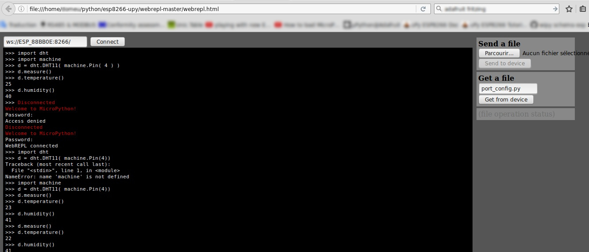

# ESP8266 MicroPython Driver

Voici une collection de pilote (et raccordements) pour différents breakouts utilisés avec un __ESP8266 reflashé en MicroPython__.

La plateforme la plus facile à flasher est un [Feather ESP8266 HUZZA ADA2821](http://shop.mchobby.be/product.php?id_product=846)

Ce dépôt rassemble différents pilotes pour des breakouts utilisés chez MC Hobby dans nos projets documentaires.
* __Wiki pour MicroPython sur ESP8266__ - https://wiki.mchobby.be/index.php?title=MicroPython-Accueil#ESP8266_en_MicroPython
* Achat de matériel - http://shop.mchobby.be

# Bibliothèques disponibles
Voici une description des bibliothèques disponibles dans ce GitHub. Voir les sous répertoires.  

<table>
<thead>
  <th>Répertoire</th><th>Senseur / Description</th>
</thead>
<tbody>
  <tr><td>ads1015-ads1115</td>
      <td>Convertisseur ADC (Analogique vers Digital) 4 canaux pour réaliser des lectures analogiques et lectures différentielles. 
L'ADS1115 dispose d'un amplificateur interne programmable, ce qui permet de lire des tensions très faibles. 
Plus d'info: <a href="https://shop.mchobby.be/breakout/362-ads1115-convertisseur-adc-16bits-i2c-3232100003620-adafruit.html">ADS1115 breakout</a>
  </td>
  </tr>
  <tr><td>am2315</td>
      <td>Senseur de <strong>température et humidité</strong> relative pour relevés en extérieur. 
Plus d'info: <a href="https://shop.mchobby.be/senseur-divers/932-am2315-senseur-de-temperature-et-humidite-sous-boitier-3232100009325.html">AM2315 sensor</a>
  </td>
  </tr>  
  <tr><td>bme280-bmp280</td>
      <td>Le BMP280 est un senseur de <strong>pression et température</strong> très populaire. 
Le BME280 est un senseur de <strong>pression, température et HUMIDITÉ</strong> relative 
Plus d'info: <a href="https://shop.mchobby.be/breakout/684-bme280-sens-temperature-humidite-pression--3232100006843-adafruit.html">BME280 breakout</a> 
Plus d'info: <a href="https://shop.mchobby.be/senseurs-prototypage/1118-bmp280-senseur-de-pression-barometrique-temperature-altitude-33-et-5v-3232100011182-adafruit.html">BMP280 breakout</a> 
  </td>
  </tr>
  <tr><td>bmp180</td>
      <td>Le BMP180 est un senseur de <strong>pression et température</strong> aujourd'hui remplacé par le BMP280. 
Plus d'info: <a href="https://shop.mchobby.be/senseurs-prototypage/708-dht11-senseur-humidite-temperature--3232100007086-adafruit.html">DHT11 sensor</a>
  </td>
  </tr>      
  <tr><td>dht11</td>
      <td>Le DHT11 est un senseur d'<strong>humidité</strong> (20 à 80%) et température très bon marché. 
Plus d'info: <a href="https://shop.mchobby.be/senseurs-prototypage/708-dht11-senseur-humidite-temperature--3232100007086-adafruit.html">DHT11 sensor</a>
  </td>
  </tr>  
  <tr><td>ds18b20</td>
      <td>Le DS18B20 est un senseur de <strong>température</strong> digital très populaire. Il utilise le bus 1-Wire premettant de brancher plusieurs senseurs 1-Wire sur un même bus. 
Plus d'info: <a href="https://shop.mchobby.be/senseur-divers/259-senseur-temperature-ds12b20-extra-3232100002593.html">DS18B20 sensor</a> 
Plus d'info: <a href="https://shop.mchobby.be/senseur-divers/151-senseur-temperature-ds18b20-etanche-extra-3232100001510.html">DS18B20 Encapsulated sensor</a>
  </td>
  </tr>  
  <tr><td>mcp230xx</td>
      <td>Le MCP23017 (et MCP2308) sont des <strong>GPIO Expander</strong> permettant d'ajouter des entrées/sorties supplémentaires sur un microcontrôleur. 
Plus d'info: <a href="https://shop.mchobby.be/ci/218-mcp23017-extension-16-entree-sortie-i2c-3232100002180.html">MCP23017 GPIO expander</a>
  </td>
  </tr>  
  <tr><td>neopixel</td>
      <td>Les <strong>NéoPixels</strong> sont des LEDs digitales intelligentes pouvant être contrôlées indépendamment les unes des autres. 
Plus d'info: <a href="https://shop.mchobby.be/55-leds-neopixels-et-dotstar">NeoPixel category</a>
  </td>
  </tr>
  <tr><td>tsl2561</td>
      <td>Le TSL2561 est un senseur de <strong>luminosité</strong> en lumière visible. Retourne une valeur en LUX. 
Plus d'info: <a href="https://shop.mchobby.be/senseur-divers/238-senseur-lux-luminosite-lumiere-digital-3232100002388-adafruit.html">TSL2561 breakout</a>
  </td>
  </tr>  
  <tr><td>umqtt</td>
      <td> exemples de communication MQTT avec un module ESP8266.
  </td>
  </tr>  

</tbody>
</table>

# Quelques ressources utiles
* [how-to-install-upy.md](how-to-install-upy.md) contient un résumé condensé pour une installation depuis Linux
 * [erase-esp8266.sh](erase-esp8266.sh) - A adapter. Permet d'effacer la flash de l'ESP8266
 * [burn-esp8266.sh](burn-esp8266.sh) - A adapter. Permet de flasher un [binaire téléchargé depuis micropython.org/download](https://micropython.org/download/) sur un ESP8266
* fichiers de configuration
 * [boot.py](boot.py) - A adapter avec l'identifiant et mot de passe de votre réseau WiFi. Une fois copié sur votre ESP8266 (avec RShell), celui-ci se connectera automatiquement sur votre réseau WiFi
 * [port_config.py](port_config.py) - A adapter. Placez y le mot de passe qui protégera votre connexion WebRepl. Une fois copié sur votre ESP8266 (avec REPL), il sera automatiquement utilisé par WebRepl.  

## RShell

__RShell__ est un outil formidable qui permet de d'éditer/transférer/repl sur une carte MicroPython a travers une simple connexion série (et même Bluetooth serial).

C'est un outil vraiment _très utile_ qui vaut la peine de s'y attarder... avec lui plus besoin d'avoir accès au "lecteur Flash" de votre carte MicroPython pour y éditer ou y copier un fichier.

Ce qu'il y de génial avec RShell, c'est qu'il fonctionne aussi avec ESP8266 (tant mieux parce qu'il n'y a pas de _lecteur flash_ comme sur une PyBoard).

 * [Tuto RShell en Français](https://wiki.mchobby.be/index.php?title=MicroPython-Hack-RShell)
 * [Github de rshell](https://github.com/dhylands/rshell) - documentation et instruction d'installation.
 * [rshell-esp8266.sh](rshell-esp8266.sh) - A adapater. Appel RShell avec buffer réduit pour ESP8266.

__ATTENTION__ : pour un ESP8266 il faut absolument réduire le buffer d'échange... sinon on écrase facilement le système de fichier (et il faudra reflasher la bête) :-/  Voyez le fichier [rshell-esp8266.sh](rshell-esp8266.sh) qui est proposé ici.

## WebRepl

Ouvrez WebRepl.html dans votre navigateur et vous pourrez entamer une session REPL avec votre Feather ESP8266 au travers d'une session HTTP.

Tout ce que vous avez besoin de connaître, c'est soit son adresse IP, soit son nom sur le réseau.

__ATTENTION__ :
* Il convient d'avoir un fichier [boot.py](boot.py) correctement configuré pour que votre ESP8266 puisse se connecter sur votre réseau WiFi.
* Vous pouvez également pré-initialiser votre mot de passe WebRepl dans [port_config.py](port_config.py)
RShell sera un outil précieux pour vous assister dans cette tâche.

# Feather ESP8266 Huzza, bus I2C, bloc d'alim. et boot qui plante

Suite à de nombreux tests, nous avons remarqués que l'utilisation de la broche 5 (SCL) sur le Feather ESP8266 Huzza provoquait parfois des problèmes de démarrage dans certains cas. [Voyez ce billet](https://forums.adafruit.com/viewtopic.php?f=57&t=105635)

En effet l'utilisation d'un _bloc d'alimentation_ micro-USB (donc sans USB-Série) _empêche le Feather ESP8266 de booter si un périphérique I2C_ est branché sur SCL (pin 5). En l’occurrence, il s'agissait un senseur Humidité + Température AM2315 (_utilisé seul sur le bus I2C en Pin 4 et 5_).

Avec le temps et nombreuses autres situations, nous avons fini par remarquer que l'AM2315 n'embarque pas de résistance pull-up sur les lignes SDA et SCL.

Si vous rencontrez cette situation, il y a deux solutions:
* Utiliser la broche 2 comme signal SCL pour votre bus I2C (en guise de test par exemple).
* Vérifier s'il manque des résistances pull-up sur le senseur (à coup sûr pour l'AM2315) et les ajouter vous même.

# Ressources

Il y a de nombreux pilotes Adafruit sur ce Github (Tony Dicola)
* https://github.com/adafruit/micropython-adafruit-bundle/tree/master/libraries/drivers

Également trouvé des pilotes pour centrales Intertielles sur ce Github
* https://github.com/micropython-IMU/
