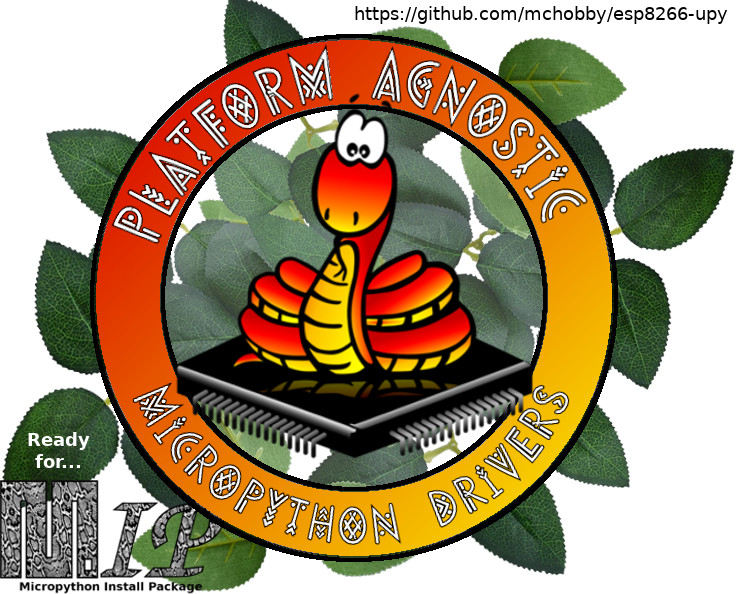

[This file also exists in ENGLISH](readme_ENG.md)

# Plateform Agnostic MicroPython Driver

Initialement, cette collection de pilote + raccordement pour différents breakouts fût  destinée au microcontrôleur ESP8266 reflashé en MicroPython d'où le nom "_esp8266-upy_" pour ce dépôt.

Depuis, cette collection a largement dépassée son cadre initial puisque les pilotes sont écrits pour __fonctionner indépendamment de la [plateforme MicroPython](https://shop.mchobby.be/fr/56-micropython) cible__.

__MIP ready!__ Les bibliothèques peuvent être installées avec l'[outil MIP](https://docs.micropython.org/en/latest/reference/packages.html) (__MicroPython Install Package__).

# Bibliothèques disponibles
Voici une description des bibliothèques disponibles dans ce dépôt. <strong>Chaque sous-répertoire contient des instructions, schémas et codes dans un readme.md personnalisé.</strong>

Explorer par:
* Interface:
[FEATHERWING](docs/indexes/drv_by_intf_FEATHERWING.md), [GPIO](docs/indexes/drv_by_intf_GPIO.md), [GROVE](docs/indexes/drv_by_intf_GROVE.md), [HAT](docs/indexes/drv_by_intf_HAT.md), [I2C](docs/indexes/drv_by_intf_I2C.md), [NCD](docs/indexes/drv_by_intf_NCD.md), [ONEWIRE](docs/indexes/drv_by_intf_ONEWIRE.md), [QWIIC](docs/indexes/drv_by_intf_QWIIC.md), [SPI](docs/indexes/drv_by_intf_SPI.md), [UART](docs/indexes/drv_by_intf_UART.md), [UEXT](docs/indexes/drv_by_intf_UEXT.md), [UNO-R3](docs/indexes/drv_by_intf_UNO-R3.md)* Fabriquant:
[ADAFRUIT](docs/indexes/drv_by_man_ADAFRUIT.md), [DFROBOT](docs/indexes/drv_by_man_DFROBOT.md), [GARATRONIC](docs/indexes/drv_by_man_GARATRONIC.md), [M5STACK](docs/indexes/drv_by_man_M5STACK.md), [NCD](docs/indexes/drv_by_man_NCD.md), [NONE](docs/indexes/drv_by_man_NONE.md), [OLIMEX](docs/indexes/drv_by_man_OLIMEX.md), [PIMORONI](docs/indexes/drv_by_man_PIMORONI.md), [POLOLU](docs/indexes/drv_by_man_POLOLU.md), [SEEEDSTUDIO](docs/indexes/drv_by_man_SEEEDSTUDIO.md), [SPARKFUN](docs/indexes/drv_by_man_SPARKFUN.md)

<table>
<thead>
  <th>Répertoire</th><th>Description</th>
</thead>
<tbody>
  <tr><td><a href="../../tree/master/74HC595">74HC595</a></td>
      <td><strong>Composants</strong> : 74HC595 
      <strong>Interfaces</strong> : GPIO 
<small>Créer un bus d'adresse 16 bits avec des 74HC595.</small>  
      <strong>Testé avec</strong> : PICO 
      <strong>Fabricant</strong> :  
<ul>
<li>Voir <a href="https://shop.mchobby.be/fr/ci/466-74hc595-registre-a-decalage-8-bits-3232100004665.html">74HC595 - Shift Register - Serial to parallel @ MCHobby</a></li>
</ul>
      </td>
  </tr>
  <tr><td><a href="../../tree/master/COLORS">COLORS</a></td>
      <td><strong>Composants</strong> :  
      <strong>Interfaces</strong> :  
<small>Bibliothèque de gestion de couleurs (et outils)</small>  
      <strong>Testé avec</strong> :  
      <strong>Fabricant</strong> :  
      </td>
  </tr>
  <tr><td><a href="../../tree/master/FBGFX">FBGFX</a></td>
      <td><strong>Composants</strong> :  
      <strong>Interfaces</strong> :  
<small>Bibliothèque graphique pour FrameBuffer</small>  
      <strong>Testé avec</strong> :  
      <strong>Fabricant</strong> :  
      </td>
  </tr>
  <tr><td><a href="../../tree/master/NCD">NCD</a></td>
      <td><strong>Composants</strong> : NCD 
      <strong>Interfaces</strong> : I2C, NCD 
<small>Connecter facilement une __mini carte I2C__ de NCD (National Control Device) sur une carte MicroPython grâce au connecteur <strong>NCD</strong> qui facilite grandement les raccordements de périphérique I2C. Logique 5V.</small>  
      <strong>Testé avec</strong> : ESP8266-EVB, FEATHER-ESP8266, WEMOS-D1 
      <strong>Fabricant</strong> : NCD 
<ul>
<li>Voir <a href="https://ncd.io/">NCD.io</a></li>
<li>Voir <a href="https://ncd.io/">National Control Device</a></li>
</ul>
      </td>
  </tr>
  <tr><td><a href="../../tree/master/UEXT">UEXT</a></td>
      <td><strong>Composants</strong> : UEXT 
      <strong>Interfaces</strong> : I2C, SPI, UART 
<small>Connecteur <strong>UEXT</strong> en logique 3.3V est utilisé sur les cartes et capteurs d' Olimex. Il transporte les bus I2C, SPI, UART et alimentation 3.3V</small>  
      <strong>Testé avec</strong> : ESP8266-EVB 
      <strong>Fabricant</strong> : OLIMEX 
<ul>
<li>Voir <a href="https://shop.mchobby.be/fr/138-uext">UEXT @ MCHobby</a></li>
<li>Voir <a href="https://www.olimex.com/Products/Modules/">UEXT @ Olimex</a></li>
</ul>
      </td>
  </tr>
  <tr><td><a href="../../tree/master/ad9833">ad9833</a></td>
      <td><strong>Composants</strong> : AD9833 
      <strong>Interfaces</strong> : SPI 
<small>Créer un générateur de signal à l'aide de l AD9833</small>  
      <strong>Testé avec</strong> : PYBOARD 
      <strong>Fabricant</strong> :  
<ul>
<li>Voir <a href="https://shop.mchobby.be/fr/breakout/1689-generateur-de-signal-sinus-triangle-clock-0-125-mhz.html">AD9833 - signal generator Sinus, triangle and clock @ MCHobby</a></li>
</ul>
      </td>
  </tr>
  <tr><td><a href="../../tree/master/adfmotors">adfmotors</a></td>
      <td><strong>Composants</strong> : PCA9685 
      <strong>Interfaces</strong> : I2C, UNO-R3 
<small>Contrôler des moteurs continu, pas-à-pas ou servo-moteur avec le shield moteur Arduino d'Adafruit.</small>  
      <strong>Testé avec</strong> : PYBOARD, PICO 
      <strong>Fabricant</strong> : ADAFRUIT 
<ul>
<li>Voir <a href="https://shop.mchobby.be/fr/shields/379-shield-de-controle-moteur-motor-shield-v2-3232100003798-adafruit.html">Adafruit Motor Shield @ MCHobby</a></li>
<li>Voir <a href="https://www.adafruit.com/product/1438">Adafruit Motor Shield @ Adafruit</a></li>
</ul>
      </td>
  </tr>
  <tr><td><a href="../../tree/master/ads1015-ads1115">ads1015-ads1115</a></td>
      <td><strong>Composants</strong> : ADS1015, ADS1115, ADA1085 
      <strong>Interfaces</strong> : I2C 
<small>Convertisseur ADC (Analogique vers Digital) 4 canaux pour réaliser des lectures analogiques et lectures différentielles. L'ADS1115 dispose d'un amplificateur interne programmable, ce qui permet de lire des tensions très faibles.</small>  
      <strong>Testé avec</strong> : FEATHER-ESP8266 
      <strong>Fabricant</strong> : ADAFRUIT 
<ul>
<li>Voir <a href="https://shop.mchobby.be/breakout/362-ads1115-convertisseur-adc-16bits-i2c-3232100003620-adafruit.html">ADS1115 breakout</a></li>
</ul>
      </td>
  </tr>
  <tr><td><a href="../../tree/master/am2315">am2315</a></td>
      <td><strong>Composants</strong> : AM2315 
      <strong>Interfaces</strong> : I2C 
<small>Capteur de <strong>température et humidité</strong> relative (0 à 100%) pour relevés en extérieur.</small>  
      <strong>Testé avec</strong> : FEATHER-ESP8266 
      <strong>Fabricant</strong> : ADAFRUIT 
<ul>
<li>Voir <a href="https://shop.mchobby.be/fr/environnemental-press-temp-hrel-gaz/932-am2315-senseur-de-temperature-et-humidite-sous-boitier-3232100009325.html">AM2315 Sensor</a></li>
</ul>
      </td>
  </tr>
  <tr><td><a href="../../tree/master/bme280-bmp280">bme280-bmp280</a></td>
      <td><strong>Composants</strong> : BME280, BMP280, ADA2651, ADA2652 
      <strong>Interfaces</strong> : I2C 
<small>Le BMP280 est un capteur de <strong>pression et température</strong> très populaire. Le BME280 est un capteur de <strong>pression, température et HUMIDITÉ</strong> relative</small>  
      <strong>Testé avec</strong> : FEATHER-ESP8266, PYBOARD, PICO 
      <strong>Fabricant</strong> : ADAFRUIT 
<ul>
<li>Voir <a href="http://shop.mchobby.be/product.php?id_product=1118">Capteur BMP280</a></li>
<li>Voir <a href="http://shop.mchobby.be/product.php?id_product=684">Capteur BME280</a></li>
</ul>
      </td>
  </tr>
  <tr><td><a href="../../tree/master/bmp180">bmp180</a></td>
      <td><strong>Composants</strong> : BMP180 
      <strong>Interfaces</strong> : I2C 
<small>Le BMP180 est un senseur de <strong>pression et température</strong> aujourd'hui remplacé par le BMP280.</small>  
      <strong>Testé avec</strong> : FEATHER-ESP8266 
      <strong>Fabricant</strong> : ADAFRUIT 
<ul>
<li>Voir <a href="http://shop.mchobby.be/product.php?id_product=397">BMP180 Sensor</a></li>
</ul>
      </td>
  </tr>
  <tr><td><a href="../../tree/master/cardkb">cardkb</a></td>
      <td><strong>Composants</strong> : CARDKB, U035 
      <strong>Interfaces</strong> : I2C, GROVE 
<small>CardKB - Mini-clavier QWERTY en I2C.</small>  
      <strong>Testé avec</strong> : PYBOARD, PYBOARD, M5STACK 
      <strong>Fabricant</strong> : M5STACK 
<ul>
<li>Voir <a href="http://shop.mchobby.be/product.php?id_product=1912">CardKB : Mini Qwerty Keyboard from M5Stack</a></li>
</ul>
      </td>
  </tr>
  <tr><td><a href="../../tree/master/ccs811">ccs811</a></td>
      <td><strong>Composants</strong> : CCS811 
      <strong>Interfaces</strong> : I2C 
<small>CCS811 - Capteur qualité d'air - COV et eCO2 avec MicroPython</small>  
      <strong>Testé avec</strong> : PYBOARD 
      <strong>Fabricant</strong> : ADAFRUIT, OLIMEX 
<ul>
<li>Voir <a href="https://shop.mchobby.be/product.php?id_product=1274">CCS811 breakout - VOC and eCO2 gaz sensor (ADA3566) @ MCHobby</a></li>
<li>Voir <a href="https://www.adafruit.com/product/3566">CCS811 breakout - VOC and eCO2 gaz sensor (ADA3566) @ Adafruit</a></li>
<li>Voir <a href="https://www.adafruit.com/product/1780">MOD-ENV capteur environnemental @ MC Hobby</a></li>
<li>Voir <a href="https://www.olimex.com/Products/Modules/Sensors/MOD-ENV">MOD-ENV capteur environnemental @ MC Olimex</a></li>
</ul>
      </td>
  </tr>
  <tr><td><a href="../../tree/master/dht11">dht11</a></td>
      <td><strong>Composants</strong> : DHT11 
      <strong>Interfaces</strong> : GPIO 
<small>Le DHT11 est un senseur d'<strong>humidité</strong> (20 à 80%) et température très bon marché.</small>  
      <strong>Testé avec</strong> : FEATHER-ESP8266 
      <strong>Fabricant</strong> : NONE 
<ul>
<li>Voir <a href="http://shop.mchobby.be/product.php?id_product=708">DHT11 Sensor</a></li>
</ul>
      </td>
  </tr>
  <tr><td><a href="../../tree/master/dotstar">dotstar</a></td>
      <td><strong>Composants</strong> : DOTSTAR, 74AHCT125, APA102 
      <strong>Interfaces</strong> : SPI 
<small>Les <strong>DotStar / APA102</strong> sont des LEDs digitales intelligentes pouvant être contrôlées indépendamment les unes des autres.</small>  
      <strong>Testé avec</strong> : PYBOARD, PYBSTICK 
      <strong>Fabricant</strong> : ADAFRUIT 
<ul>
<li>Voir <a href="https://shop.mchobby.be/fr/55-neopixels-et-dotstar">APA102 / DotStar</a></li>
<li>Voir <a href="https://shop.mchobby.be/fr/ci/1041-74ahct125-4x-level-shifter-3v-a-5v-3232100010413.html">74AHCT125</a></li>
</ul>
      </td>
  </tr>
  <tr><td><a href="../../tree/master/drv8830">drv8830</a></td>
      <td><strong>Composants</strong> : DRV8830, Mini-I2C-Motor-Driver 
      <strong>Interfaces</strong> : I2C 
<small>Le Mini I2C motor driver permet de contrôler 2 moteurs 5V par l'intermédiaire d'une interface I2C.</small>  
      <strong>Testé avec</strong> : PICO 
      <strong>Fabricant</strong> : SEEEDSTUDIO 
<ul>
<li>Voir <a href="https://www.seeedstudio.com/Grove-I2C-Mini-Motor-Driver.html">Mini I2C Motor Driver (DRV8830)</a></li>
</ul>
      </td>
  </tr>
  <tr><td><a href="../../tree/master/ds18b20">ds18b20</a></td>
      <td><strong>Composants</strong> : DS18B20 
      <strong>Interfaces</strong> : ONEWIRE 
<small>Le DS18B20 est un capteur de <strong>température</strong> numérique très populaire. Il utilise le bus 1-Wire permettant de brancher plusieurs capteurs 1-Wire sur un même bus.</small>  
      <strong>Testé avec</strong> : FEATHER-ESP8266, PICO, PYBOARD 
      <strong>Fabricant</strong> : NONE 
<ul>
<li>Voir <a href="http://shop.mchobby.be/product.php?id_product=259">DS18B20 Sensor</a></li>
</ul>
      </td>
  </tr>
  <tr><td><a href="../../tree/master/eeprom">eeprom</a></td>
      <td><strong>Composants</strong> : AT24C512C, AT24C02C, 24LC256 
      <strong>Interfaces</strong> : I2C 
<small>Utiliser des EEPROM I2C pour stocker des informations.</small>  
      <strong>Testé avec</strong> : PYBOARD, PYBSTICK 
      <strong>Fabricant</strong> : NONE 
<ul>
<li>Voir <a href="http://shop.mchobby.be/product.php?id_product=1582">EEPROM 256 Kbit (32Ko), I2C, 24LC256</a></li>
</ul>
      </td>
  </tr>
  <tr><td><a href="../../tree/master/gps-ultimate">gps-ultimate</a></td>
      <td><strong>Composants</strong> : GPS-ULTIMATE, MTK3339 
      <strong>Interfaces</strong> : UART 
<small>Pouvoir obtenir ou suivre votre position actuelle à l'aide d'un module GPS</small>  
      <strong>Testé avec</strong> : PYBOARD 
      <strong>Fabricant</strong> : ADAFRUIT 
<ul>
<li>Voir <a href="https://shop.mchobby.be/fr/breakout/62-gps-adafruit-ultimate-chipset-mtk3339--3232100000629-adafruit.html">GPS Ultime @ MCHobby</a></li>
<li>Voir <a href="https://www.adafruit.com/product/746">GPS Ultimate</a></li>
</ul>
      </td>
  </tr>
  <tr><td><a href="../../tree/master/grav-digital-led">grav-digital-led</a></td>
      <td><strong>Composants</strong> : TM1650, DFR0645 
      <strong>Interfaces</strong> : I2C, GPIO 
<small>Afficheur 4 chiffres de 7 seg. via I2C - sous MicroPython</small>  
      <strong>Testé avec</strong> : PICO 
      <strong>Fabricant</strong> : DFROBOT 
<ul>
<li>Voir <a href="https://shop.mchobby.be/en/leds-leds-displays/2092-4-display-of-7-seg-green-i2c-22-mm-3232100020924-dfrobot.html">Gravity - 4-Digital LED Segment Display Module @ MCHobby</a></li>
<li>Voir <a href="https://www.dfrobot.com/product-1966.html">Gravity - 4-Digital LED Segment Display Module @ DFRobot</a></li>
</ul>
      </td>
  </tr>
  <tr><td><a href="../../tree/master/grove-5-way-switch">grove-5-way-switch</a></td>
      <td><strong>Composants</strong> : 5-Way-Switch, 6-Position-DIP-Switch 
      <strong>Interfaces</strong> : I2C, GROVE 
<small>Joystick 5 directions (et carte 6 DIP) via I2C - sous MicroPython</small>  
      <strong>Testé avec</strong> : PICO 
      <strong>Fabricant</strong> : SEEEDSTUDIO 
<ul>
<li>Voir <a href="https://www.seeedstudio.com/Grove-5-Way-Switch.html">Grove - 5 Way Switch via I2C @ SeeedStudio</a></li>
<li>Voir <a href="https://www.seeedstudio.com/Grove-6-Position-DIP-Switch.html">Grove - 6 position DIP switch via I2C @ SeeedStudio</a></li>
</ul>
      </td>
  </tr>
  <tr><td><a href="../../tree/master/hat-joy-bonnet">hat-joy-bonnet</a></td>
      <td><strong>Composants</strong> : JOY-BONNET 
      <strong>Interfaces</strong> : HAT 
<small>Utiliser le HAT Joy Bonnet avec MicroPython NADHAT PYB405</small>  
      <strong>Testé avec</strong> :  
      <strong>Fabricant</strong> : ADAFRUIT 
<ul>
<li>Voir <a href="https://shop.mchobby.be/fr/micropython/1653-hat-micropython-pyb405-nadhat-3232100016538-garatronic.html">NADHAT PYB405 @ MCHobby</a></li>
<li>Voir <a href="https://shop.mchobby.be/fr/pi-zero-w/1116-gamepad-pizero-joy-bonnet-3232100011168-adafruit.html">Joy Bonnet Gamepad PiZero (ADA3464) @ MCHobby</a></li>
<li>Voir <a href="https://www.adafruit.com/product/3464">Joy Bonnet Gamepad PiZero (ADA3464) @ Adafruit</a></li>
</ul>
      </td>
  </tr>
  <tr><td><a href="../../tree/master/hat-piface">hat-piface</a></td>
      <td><strong>Composants</strong> : HAT-PIFACE 
      <strong>Interfaces</strong> : HAT 
<small>Utiliser le PiFace Digital avec MicroPython Pyboard, PYBStick.</small>  
      <strong>Testé avec</strong> : PYBSTICK, PYBOARD, PICO 
      <strong>Fabricant</strong> :  
<ul>
<li>Voir <a href="https://shop.mchobby.be/fr/pi-hats/221-piface-digital-2-pour-raspberry-pi-3232100002210.html">Hat PiFace Digital 2 @ MCHobby</a></li>
</ul>
      </td>
  </tr>
  <tr><td><a href="../../tree/master/hat-sense">hat-sense</a></td>
      <td><strong>Composants</strong> : HAT-SENSE 
      <strong>Interfaces</strong> : HAT 
<small>Utiliser le Sense HAT avec MicroPython Pyboard, PYBStick, PYB405</small>  
      <strong>Testé avec</strong> : PYBSTICK, PYB405, PYBOARD, PICO 
      <strong>Fabricant</strong> :  
<ul>
<li>Voir <a href="https://shop.mchobby.be/fr/pi-hats/687-sense-hat-pour-raspberry-pi-3232100006874.html">Sense Hat Astro-Pi - le micro laboratoire prêt à l'emploi @ MCHobby</a></li>
<li>Voir <a href="https://www.raspberrypi.org/products/sense-hat">Hat-sense @ Raspberry-Pi.org</a></li>
</ul>
      </td>
  </tr>
  <tr><td><a href="../../tree/master/ht0740-switch">ht0740-switch</a></td>
      <td><strong>Composants</strong> : HT0740, TCA9554A 
      <strong>Interfaces</strong> : I2C 
<small>HT0740 - 40V / 10A MosFet controlable via I2C - sous MicroPython</small>  
      <strong>Testé avec</strong> : PYBOARD, PICO 
      <strong>Fabricant</strong> : PIMORONI 
<ul>
<li>Voir <a href="https://shop.mchobby.be/fr/bouton/1990-40v-10a-mosfet-controlable-via-i2c-3232100019904-pimoroni.html">HT0740 - 40V / 10A MosFet controlable via I2C @ MCHobby</a></li>
<li>Voir <a href="https://shop.pimoroni.com/products/ht0740-breakout">HT0740 - 40V / 10A MosFet controlable via I2C @ Pimoroni</a></li>
</ul>
      </td>
  </tr>
  <tr><td><a href="../../tree/master/ili934x">ili934x</a></td>
      <td><strong>Composants</strong> : ILI9341 
      <strong>Interfaces</strong> : FEATHERWING, I2C 
<small>ILI934x - contrôleur afficheur TFT couleur 16 bits - sous MicroPython</small>  
      <strong>Testé avec</strong> : PYBOARD, PYBSTICK, PICO 
      <strong>Fabricant</strong> : ADAFRUIT 
<ul>
<li>Voir <a href="https://shop.mchobby.be/fr/feather-adafruit/1050-tft-featherwing-24-touch-320x240-3232100010505-adafruit.html">TFT FeatherWing 2.4 inch Touch - 320x240 - ILI9341 @ MCHobby</a></li>
<li>Voir <a href="https://www.adafruit.com/product/3315">TFT FeatherWing 2.4 inch Touch - 320x240 - ILI9341 @ Adafruit</a></li>
</ul>
      </td>
  </tr>
  <tr><td><a href="../../tree/master/is31fl">is31fl</a></td>
      <td><strong>Composants</strong> : IS31FL3731 
      <strong>Interfaces</strong> : FEATHERWING, I2C 
<small>IS31FL3731 - contrôleur CharliePlexing via I2C - sous MicroPython</small>  
      <strong>Testé avec</strong> : PYBOARD, PYBSTICK 
      <strong>Fabricant</strong> : ADAFRUIT 
<ul>
<li>Voir <a href="https://shop.mchobby.be/fr/feather-adafruit/1563-featherwing-matrice-led-15x7-en-charlieplexing-pour-feather-3232100015630-adafruit.html">FeatherWing Matrice LED 15x7, ROUGE, CharliePlexing pour Feather @ MCHobby</a></li>
<li>Voir <a href="https://www.adafruit.com/product/3134">FeatherWing Matrice LED 15x7, ROUGE, CharliePlexing pour Feather @ Adafruit</a></li>
</ul>
      </td>
  </tr>
  <tr><td><a href="../../tree/master/lcdi2c">lcdi2c</a></td>
      <td><strong>Composants</strong> : I2C BackPack, LCD 16x2, LCD 16x4 
      <strong>Interfaces</strong> : I2C 
<small>Afficheur à cristaux liquides (LCD) commandé via le bus I2C.</small>  
      <strong>Testé avec</strong> : PYBOARD 
      <strong>Fabricant</strong> : NONE 
<ul>
<li>Voir <a href="https://shop.mchobby.be/fr/afficheur-lcd-tft-oled/882-lcd-20x4-backpack-i2c-blanc-sur-bleu-3232100008823.html">I2C Backpack for LCD display</a></li>
<li>Voir <a href="https://shop.mchobby.be/fr/afficheur-lcd-tft-oled/881-lcd-20x4-backpack-i2c-blanc-sur-bleu-3232100008816.html">LCD 20x4 + I2C Backpack</a></li>
<li>Voir <a href="https://shop.mchobby.be/fr/nouveaute/1807-afficheur-lcd-16x2-i2c-3232100018075-dfrobot.html">LCD I2C from DFRobot</a></li>
</ul>
      </td>
  </tr>
  <tr><td><a href="../../tree/master/lcdmtrx">lcdmtrx</a></td>
      <td><strong>Composants</strong> : USB + Serial Backpack 
      <strong>Interfaces</strong> : UART 
<small>Afficheur LCD 2 lignes, 16 caractères, Arrière plan RGB. Interface USB + Série</small>  
      <strong>Testé avec</strong> : PYBOARD 
      <strong>Fabricant</strong> : ADAFRUIT 
<ul>
<li>Voir <a href="https://shop.mchobby.be/fr/afficheur-lcd-tft-oled/475-lcd-16x2-rgb-positif-usb-serie-3232100004757.html">USB + Serial Backpack @ MCHobby</a></li>
<li>Voir <a href="https://www.adafruit.com/product/782">USB + Serial Backpack @ Adafruit</a></li>
</ul>
      </td>
  </tr>
  <tr><td><a href="../../tree/master/lcdspi-lcd12864">lcdspi-lcd12864</a></td>
      <td><strong>Composants</strong> : LCD12864 
      <strong>Interfaces</strong> : SPI 
<small>Afficheur LCD graphique 128 x 64 pixels. Interface SPI (3 fils)</small>  
      <strong>Testé avec</strong> : PYBOARD, PYBSTICK, PICO 
      <strong>Fabricant</strong> : DFROBOT 
<ul>
<li>Voir <a href="https://shop.mchobby.be/fr/gravity-boson/1878-afficheur-lcd-128x64-spi-3-fils-3232100018785-dfrobot.html">LCD12864 (DFR0091) 128x64 graphical LCD display @ MCHobby</a></li>
<li>Voir <a href="https://www.dfrobot.com/product-372.html">LCD12864 (DFR0091) 128x64 graphical LCD display @ DFRobot</a></li>
</ul>
      </td>
  </tr>
  <tr><td><a href="../../tree/master/lsm303">lsm303</a></td>
      <td><strong>Composants</strong> : LSM303D 
      <strong>Interfaces</strong> : UNO-R3, I2C 
<small>Utiliser une boussole et accéléromètre LSM303D avec MicroPython</small>  
      <strong>Testé avec</strong> : PYBOARD 
      <strong>Fabricant</strong> : POLOLU 
<ul>
<li>Voir <a href="https://www.pololu.com/product/2127">LSM303D breakout - 3D Compass and Accelerometer @ Pololu</a></li>
<li>Voir <a href="https://www.pololu.com/product/2510">Robot Zumo pour Arduino (2510) @ Pololu</a></li>
<li>Voir <a href="https://shop.mchobby.be/fr/prototypage-robotique-roue/448-robot-zumo-pour-arduino-assemble-moteurs-3232100004481-pololu.html">Robot Zumo pour Arduino @ MC Hobby</a></li>
<li>Voir <a href="https://shop.mchobby.be/fr/nouveaute/1745-adaptateur-pyboard-vers-uno-r3-extra-3232100017450.html">PYBOARD-UNO-R3 - Adaptateur Pyboard vers UNO-R3 + Extra @ MC Hobby</a></li>
</ul>
      </td>
  </tr>
  <tr><td><a href="../../tree/master/m5stack-u024">m5stack-u024</a></td>
      <td><strong>Composants</strong> : U004, JOYSTICK 
      <strong>Interfaces</strong> : GROVE, I2C 
<small>Module Joystick Analogique I2C</small>  
      <strong>Testé avec</strong> : PICO, M5STACK 
      <strong>Fabricant</strong> : M5STACK 
<ul>
<li>Voir <a href="https://shop.mchobby.be/fr/tactile-flex-pot-softpad/2459-m5stack-joystick-grove-i2c-3232100024595-m5stack.html">M5Stack : module joystick analogique en I2C, Grove</a></li>
</ul>
      </td>
  </tr>
  <tr><td><a href="../../tree/master/m5stack-u087">m5stack-u087</a></td>
      <td><strong>Composants</strong> : U087, ADS1115, VMeter 
      <strong>Interfaces</strong> : GROVE, I2C 
<small>Module Voltmetre I2C</small>  
      <strong>Testé avec</strong> : PICO, M5STACK 
      <strong>Fabricant</strong> : M5STACK 
<ul>
<li>Voir <a href="https://shop.mchobby.be/fr/grove/2153-m5stack-voltmetre-mesure-de-tension-36v-ds1115-grove-3232100021532-m5stack.html">M5Stack : module Voltmètre en I2C, Grove</a></li>
</ul>
      </td>
  </tr>
  <tr><td><a href="../../tree/master/m5stack-u097">m5stack-u097</a></td>
      <td><strong>Composants</strong> : U097, RELAYS 
      <strong>Interfaces</strong> : GROVE, I2C 
<small>Module 4 relais I2C</small>  
      <strong>Testé avec</strong> : PICO, M5STACK 
      <strong>Fabricant</strong> : M5STACK 
<ul>
<li>Voir <a href="https://shop.mchobby.be/fr/nouveaute/2149-m5stack-module-4-relais-i2c-grove-3232100021495.html">M5Stack : module 4 relais en I2C, Grove</a></li>
</ul>
      </td>
  </tr>
  <tr><td><a href="../../tree/master/m5stack-u105">m5stack-u105</a></td>
      <td><strong>Composants</strong> : U105, AD9833 
      <strong>Interfaces</strong> : GROVE, I2C 
<small>I2C DDS unit (Direct Digital Synthesis, AD9833, ), Grove</small>  
      <strong>Testé avec</strong> : PICO, M5STACK 
      <strong>Fabricant</strong> : M5STACK 
<ul>
<li>Voir <a href="https://shop.mchobby.be/fr/nouveaute/2151-m5stack-generateur-de-signal-dds-stm32f0-ad9833-grove-3232100021518.html">M5Stack : DDS unit (AD9833) with STM32F0 I2C custom firmware, Grove</a></li>
</ul>
      </td>
  </tr>
  <tr><td><a href="../../tree/master/m5stack-u135">m5stack-u135</a></td>
      <td><strong>Composants</strong> : U135, ENCODER 
      <strong>Interfaces</strong> : GROVE, I2C 
<small>I2C Encoder unit, Grove</small>  
      <strong>Testé avec</strong> : PICO, M5STACK 
      <strong>Fabricant</strong> : M5STACK 
<ul>
<li>Voir <a href="https://shop.mchobby.be/fr/grove/2456-m5stack-encodeur-led-rgb-grove-3232100024564-m5stack.html">M5Stack : I2C Encoder unit with custom firmware, Grove @ MCHobby</a></li>
<li>Voir <a href="https://shop.m5stack.com/products/encoder-unit">M5Stack : I2C Encoder unit with custom firmware, Grove @ M5Stack</a></li>
</ul>
      </td>
  </tr>
  <tr><td><a href="../../tree/master/m5stack-u136">m5stack-u136</a></td>
      <td><strong>Composants</strong> : U136, BH1750FVI-TR 
      <strong>Interfaces</strong> : GROVE, I2C 
<small>I2C DLight unit - Luminosité Ambiante (Lux), Grove</small>  
      <strong>Testé avec</strong> : PICO 
      <strong>Fabricant</strong> : M5STACK 
<ul>
<li>Voir <a href="https://shop.mchobby.be/fr/grove/2444-m5stack-capteur-luminosite-ambiante-bh1750fvi-tr-grove-i2c-3232100024441-m5stack.html">M5Stack : I2C Capteur luminosité ambiante DLight, Grove @ MCHobby</a></li>
<li>Voir <a href="https://shop.m5stack.com/products/dlight-unit-ambient-light-sensor-bh1750fvi-tr">M5Stack : Dlight Unit - Ambient Light Sensor , Grove @ M5Stack</a></li>
</ul>
      </td>
  </tr>
  <tr><td><a href="../../tree/master/max31855">max31855</a></td>
      <td><strong>Composants</strong> : MAX31855 
      <strong>Interfaces</strong> : SPI 
<small>ThermoCouple Type-K + amplificateur MAX31855 - sous MicroPython</small>  
      <strong>Testé avec</strong> : PICO 
      <strong>Fabricant</strong> : ADAFRUIT 
<ul>
<li>Voir <a href="https://shop.mchobby.be/fr/temperature/301-thermocouple-type-k-3232100003019.html">MAX31855 - Amplificateur Thermocouple Type-K via SPI d'Adafruit @ MCHobby</a></li>
<li>Voir <a href="https://www.adafruit.com/product/269">AX31855 - Amplificateur Thermocouple Type-K via SPI d'Adafruit @ Adafruit</a></li>
</ul>
      </td>
  </tr>
  <tr><td><a href="../../tree/master/max6675">max6675</a></td>
      <td><strong>Composants</strong> : MOD-TC, MAX6675 
      <strong>Interfaces</strong> : UEXT, SPI 
<small>MAX6675 Amplificateur Thermocouple Type-K - MOD-TC - sous MicroPython</small>  
      <strong>Testé avec</strong> : PYBOARD 
      <strong>Fabricant</strong> : OLIMEX 
<ul>
<li>Voir <a href="https://shop.mchobby.be/product.php?id_product=1623">MOD-TC - Amplificateur Thermocouple Type-K d'Olimex @ MCHobby</a></li>
<li>Voir <a href="https://www.olimex.com/Products/Modules/Sensors/MOD-TC">MOD-TC - Amplificateur Thermocouple Type-K @ Olimex</a></li>
</ul>
      </td>
  </tr>
  <tr><td><a href="../../tree/master/mcp230xx">mcp230xx</a></td>
      <td><strong>Composants</strong> : MCP23017, MCP23008 
      <strong>Interfaces</strong> : I2C 
<small>Le MCP23017 (et MCP2308) sont des <strong>GPIO Expander</strong> sur bus I2C ajoutant des entrées/sorties sur un microcontrôleur.</small>  
      <strong>Testé avec</strong> : FEATHER-ESP8266 
      <strong>Fabricant</strong> : NONE 
<ul>
<li>Voir <a href="http://shop.mchobby.be/product.php?id_product=218">MCP23017 GPIO Expander</a></li>
</ul>
      </td>
  </tr>
  <tr><td><a href="../../tree/master/mcp23Sxx">mcp23Sxx</a></td>
      <td><strong>Composants</strong> : MCP23S17 
      <strong>Interfaces</strong> : SPI 
<small>Le MCP23S17 est un <strong>GPIO Expander</strong> sur bus SPI ajoutant des entrées/sorties sur un microcontrôleur.</small>  
      <strong>Testé avec</strong> : PYBOARD, PYBSTICK 
      <strong>Fabricant</strong> : NONE 
      </td>
  </tr>
  <tr><td><a href="../../tree/master/mcp4725">mcp4725</a></td>
      <td><strong>Composants</strong> : MCP4725 
      <strong>Interfaces</strong> : I2C 
<small>Le MCP4725 (bus I2C) est un DAC -ou- une vraie sortie Analogique 12 bits (0 à 65535).</small>  
      <strong>Testé avec</strong> : FEATHER-ESP8266, PYBOARD 
      <strong>Fabricant</strong> : ADAFRUIT 
<ul>
<li>Voir <a href="http://shop.mchobby.be/product.php?id_product=132">MCP4725 12 bits DAC @ MCHobby : Convertisseur Digital/Analogique pour MicroControlleur, interface I2C</a></li>
<li>Voir <a href="https://www.adafruit.com/product/935">MCP4725 12 bits DAC @ Adafruit : 12 bits DAC over I2C bus</a></li>
</ul>
      </td>
  </tr>
  <tr><td><a href="../../tree/master/mcp9808">mcp9808</a></td>
      <td><strong>Composants</strong> : MCP9808 
      <strong>Interfaces</strong> : I2C 
<small>Le MCP9808 (bus I2C) permettant de faire un relevé de température avec une précision de 0.25°C.</small>  
      <strong>Testé avec</strong> : FEATHER-ESP8266, PYBOARD 
      <strong>Fabricant</strong> : ADAFRUIT 
<ul>
<li>Voir <a href="http://shop.mchobby.be/product.php?id_product=572">MCP9808 @ MCHobby : mesure de température de précision via I2C</a></li>
<li>Voir <a href="https://www.adafruit.com/product/1782">MCP9808 @ Adafruit : High precision temperature sensor</a></li>
</ul>
      </td>
  </tr>
  <tr><td><a href="../../tree/master/modenv">modenv</a></td>
      <td><strong>Composants</strong> : CCS811, BME280 
      <strong>Interfaces</strong> : UEXT, I2C 
<small>Capteur environnementale tout-en-un - BME280 + CCS811 - sous MicroPython</small>  
      <strong>Testé avec</strong> : PYBOARD 
      <strong>Fabricant</strong> : OLIMEX 
<ul>
<li>Voir <a href="https://shop.mchobby.be/product.php?id_product=1280">MOD-ENV - Capteur environnemental d'Olimex CCS811 + BME280 @ MCHobby</a></li>
<li>Voir <a href="https://www.olimex.com/Products/Modules/Sensors/MOD-ENV">MOD-ENV capteur environnemental @ Olimex</a></li>
</ul>
      </td>
  </tr>
  <tr><td><a href="../../tree/master/modio">modio</a></td>
      <td><strong>Composants</strong> : MOD-IO 
      <strong>Interfaces</strong> : I2C, UEXT 
<small>MOD-IO est une carte d'extension I2C avec port de connexion <strong>UEXT</strong>. Cette carte d'Olimex équipé de relais, d'entrée OptoCoupleur (24V) et entrées analogiques (0-3.3V). Cette carte est compatible avec le standard industriel en 24V.</small>  
      <strong>Testé avec</strong> : ESP8266-EVB 
      <strong>Fabricant</strong> : OLIMEX 
<ul>
<li>Voir <a href="https://shop.mchobby.be/fr/138-uext">UEXT @ MCHobby</a></li>
<li>Voir <a href="https://www.olimex.com/Products/Modules/">UEXT @ Olimex</a></li>
</ul>
      </td>
  </tr>
  <tr><td><a href="../../tree/master/modio2">modio2</a></td>
      <td><strong>Composants</strong> : MOD-IO2 
      <strong>Interfaces</strong> : I2C, UEXT 
<small>MOD-IO est une carte d'extension I2C avec port de connexion <strong>UEXT</strong>. Cette carte d'Olimex équipé de relais, de GPIO aux fonctions multiples (Input, Output, Analog, PWM; 0-3.3V).</small>  
      <strong>Testé avec</strong> : ESP8266-EVB 
      <strong>Fabricant</strong> : OLIMEX 
<ul>
<li>Voir <a href="https://shop.mchobby.be/fr/138-uext">UEXT @ MCHobby</a></li>
<li>Voir <a href="https://www.olimex.com/Products/Modules/">UEXT @ Olimex</a></li>
</ul>
      </td>
  </tr>
  <tr><td><a href="../../tree/master/modirdaplus">modirdaplus</a></td>
      <td><strong>Composants</strong> : MOD-IRDA+ 
      <strong>Interfaces</strong> : I2C, UEXT 
<small>MOD-IRDA+ est un module émetteur/récepteur Infrarouge I2C supportant les protocols RC5 (Philips) et SIRCS (Sony).</small>  
      <strong>Testé avec</strong> : PICO, PYBOARD 
      <strong>Fabricant</strong> : OLIMEX 
<ul>
<li>Voir <a href="https://shop.mchobby.be/fr/138-uext">UEXT @ MCHobby</a></li>
<li>Voir <a href="https://www.olimex.com/Products/Modules/">UEXT @ Olimex</a></li>
</ul>
      </td>
  </tr>
  <tr><td><a href="../../tree/master/modirtemp">modirtemp</a></td>
      <td><strong>Composants</strong> : MOD-IR-TEMP, MLX90614 
      <strong>Interfaces</strong> : I2C, UEXT 
<small>Mesure de température -70°C à 380°C Infrarouge sans contact (MXL90164)</small>  
      <strong>Testé avec</strong> : FEATHER-ESP8266, PYBOARD 
      <strong>Fabricant</strong> : OLIMEX 
<ul>
<li>Voir <a href="https://www.olimex.com/Products/Modules/Sensors/MOD-IR-TEMP/open-source-hardware">MOD-IR-TEMP @ Olimex</a></li>
</ul>
      </td>
  </tr>
  <tr><td><a href="../../tree/master/modlcd1x9">modlcd1x9</a></td>
      <td><strong>Composants</strong> : MOD-LCD-1x9 
      <strong>Interfaces</strong> : I2C, UEXT 
<small>MOD-LCD1x9 est un afficheur 9 caractères alphanumérique I2C avec port de connexion <strong>UEXT</strong>.</small>  
      <strong>Testé avec</strong> : ESP8266-EVB, PYBOARD 
      <strong>Fabricant</strong> : OLIMEX 
<ul>
<li>Voir <a href="https://shop.mchobby.be/esp8266-esp32-wifi-iot/1414-uext-lcd-display-1-line-of-9-alphanumeric-chars-3232100014145-olimex.html">MOD-LCD1x9 @ MCHobby</a></li>
<li>Voir <a href="https://www.olimex.com/Products/Modules/">UEXT @ Olimex</a></li>
</ul>
      </td>
  </tr>
  <tr><td><a href="../../tree/master/modlcd3310">modlcd3310</a></td>
      <td><strong>Composants</strong> : MOD-LCD3310, PCD8544 
      <strong>Interfaces</strong> : SPI, UEXT 
<small>MOD-LCD3310 est l'afficheur LCD du Nokia 3310 offrant 84 x 48 pixels et un port de connexion <strong>UEXT</strong>.</small>  
      <strong>Testé avec</strong> : PYBOARD 
      <strong>Fabricant</strong> : OLIMEX 
<ul>
<li>Voir <a href="https://shop.mchobby.be/fr/uext/1867-afficheur-noirblanc-84x48-px-nokia-3310-3232100018679-olimex.html">MOD-LCD3310 @ MCHobby</a></li>
<li>Voir <a href="https://www.olimex.com/Products/Modules/LCD/MOD-LCD3310/open-source-hardware">MOD-LCD3310 @ Olimex</a></li>
</ul>
      </td>
  </tr>
  <tr><td><a href="../../tree/master/modled8x8">modled8x8</a></td>
      <td><strong>Composants</strong> : MOD-LED8x8RGB 
      <strong>Interfaces</strong> : GPIO, SPI 
<small>Un afficheur 8x8 LEDs RGB chaînable.</small>  
      <strong>Testé avec</strong> : PYBOARD 
      <strong>Fabricant</strong> : OLIMEX 
<ul>
<li>Voir <a href="https://shop.mchobby.be/fr/nouveaute/1625-mod-led8x8rgb-matrice-led-rgb-8x8-3232100016255-olimex.html">MOD-LED8x8RGB @ MCHobby</a></li>
<li>Voir <a href="https://www.olimex.com/Products/Modules/LED/MOD-LED8x8RGB/open-source-hardware">MOD-LED8x8RGB @ Olimex</a></li>
</ul>
      </td>
  </tr>
  <tr><td><a href="../../tree/master/modltr501">modltr501</a></td>
      <td><strong>Composants</strong> : MOD-LTR-501ALS, LTR-501ALS 
      <strong>Interfaces</strong> : I2C, UEXT 
<small>LTR-501ALS permet de faire une lecture de luminosité de 0.01 à 64.000 Lux (64K lux) et détection de proximité (jusqu'à 10cm). Le MOD-LTR-501ALS dispose d'une connexion <strong>UEXT</strong> facilitant les raccordements.</small>  
      <strong>Testé avec</strong> : ESP8266-EVB 
      <strong>Fabricant</strong> : OLIMEX 
<ul>
<li>Voir <a href="https://shop.mchobby.be/uext/1415-senseur-proximite-et-lumiere-ltr501-connecteur-uext-3232100014152-olimex.html">MOD-LTR-501ALS @ MCHobby</a></li>
<li>Voir <a href="https://www.olimex.com/Products/Modules/">UEXT @ Olimex</a></li>
</ul>
      </td>
  </tr>
  <tr><td><a href="../../tree/master/modmag">modmag</a></td>
      <td><strong>Composants</strong> : MOD-MAG, MAG3110 
      <strong>Interfaces</strong> : I2C, UEXT 
<small>Le MAG3110 est un magénomètre digital 3 axes de NXP accessible via I2C. Le MOD-MAG dispose d'une connexion <strong>UEXT</strong> facilitant les raccordements.</small>  
      <strong>Testé avec</strong> : ESP8266-EVB 
      <strong>Fabricant</strong> : OLIMEX 
<ul>
<li>Voir <a href="https://shop.mchobby.be/esp8266-esp32-wifi-iot/1413-uext-mag3110-magnetometer-module-3232100014138-olimex.html">MOD-MAG @ MCHobby</a></li>
<li>Voir <a href="https://www.olimex.com/Products/Modules/">UEXT @ Olimex</a></li>
</ul>
      </td>
  </tr>
  <tr><td><a href="../../tree/master/modoled128x64">modoled128x64</a></td>
      <td><strong>Composants</strong> : SSD1306, MOD-OLED-128x64, OLED, OLED-FEATHERWING, MINI-OLED 
      <strong>Interfaces</strong> : I2C, UEXT 
<small>Un afficheur OLED 128x64 / 128x32 / 64x48 avec contrôleur SSD1306 (I2C) et connecteur UEXT, Feather, Qwiic.</small>  
      <strong>Testé avec</strong> : ESP8266-EVB, PICO, MICROMOD-RP2040 
      <strong>Fabricant</strong> : OLIMEX, ADAFRUIT, SPARKFUN 
<ul>
<li>Voir <a href="https://shop.mchobby.be/product.php?id_product=1411">Afficheur OLED 128 x 64 avec interface I2C et UEXT</a></li>
</ul>
      </td>
  </tr>
  <tr><td><a href="../../tree/master/modrfid">modrfid</a></td>
      <td><strong>Composants</strong> : MOD-RFID1536MIFARE 
      <strong>Interfaces</strong> : UART, UEXT 
<small>MOD-RFID1356 MIFARE : lecteur NFC / RFID Mifare via port série/usb-série/usb-hid.</small>  
      <strong>Testé avec</strong> : PYBOARD 
      <strong>Fabricant</strong> : OLIMEX 
<ul>
<li>Voir <a href="https://shop.mchobby.be/product.php?id_product=1619">MOD-RFID1536MIFARE @ MCHobby</a></li>
<li>Voir <a href="https://www.olimex.com/Products/Modules/RFID/MOD-RFID1356MIFARE/">MOD-RFID1536MIFARE @ Olimex</a></li>
</ul>
      </td>
  </tr>
  <tr><td><a href="../../tree/master/modrgb">modrgb</a></td>
      <td><strong>Composants</strong> : MOD-RGB 
      <strong>Interfaces</strong> : I2C, UEXT 
<small>MOD-RGB est une carte d'extension I2C avec port de connexion <strong>UEXT</strong>. Cette carte d'Olimex équipé de MosFet de puissance pour commander des rubans LED RGB analogiques via I2C (ou DMX).</small>  
      <strong>Testé avec</strong> : ESP8266-EVB 
      <strong>Fabricant</strong> : OLIMEX 
<ul>
<li>Voir <a href="https://shop.mchobby.be/fr/138-uext">UEXT @ MCHobby</a></li>
<li>Voir <a href="https://www.olimex.com/Products/Modules/">UEXT @ Olimex</a></li>
</ul>
      </td>
  </tr>
  <tr><td><a href="../../tree/master/modrs485iso">modrs485iso</a></td>
      <td><strong>Composants</strong> : MOD-RS485-ISO 
      <strong>Interfaces</strong> : I2C, UART, UEXT 
<small>MOD-RS485-ISO est un adaptateur RS485 Full-Duplex/Half-Duplex avec isolation. La transmission de données se fait via UART (MODE_PASS) ou I2C (MODE_BRIDE). Expose une interface <strong>UEXT</strong> pour connexion rapide.</small>  
      <strong>Testé avec</strong> : PYBOARD 
      <strong>Fabricant</strong> : OLIMEX 
<ul>
<li>Voir <a href="https://shop.mchobby.be/fr/138-uext">UEXT @ MCHobby</a></li>
<li>Voir <a href="https://www.olimex.com/Products/Modules/">UEXT @ Olimex</a></li>
</ul>
      </td>
  </tr>
  <tr><td><a href="../../tree/master/modtc-mk2">modtc-mk2</a></td>
      <td><strong>Composants</strong> : MOD-TC-MK2-31855 
      <strong>Interfaces</strong> : UEXT, I2C 
<small>MAX6MOD-TC-MK2 : Amplificateur Thermocouple Type-K (MAX31855) via I2C - sous MicroPython</small>  
      <strong>Testé avec</strong> : PYBOARD 
      <strong>Fabricant</strong> : OLIMEX 
<ul>
<li>Voir <a href="https://shop.mchobby.be/fr/uext/1624-mod-tc-mk2-31855-interface-thermocouple-type-k-avec-max31855-bus-i2c-gpio-3232100016248-olimex.html">MOD-TC-MK2 - Amplificateur Thermocouple Type-K (MAX31855) via I2C d'Olimex @ MCHobby</a></li>
<li>Voir <a href="https://www.olimex.com/Products/Modules/Sensors/MOD-TC-MK2-31855/open-source-hardware">MOD-TC-MK2 - Type-K Thermocouple Amplifier (MAX31855) over I2C from Olimex @ Olimex</a></li>
</ul>
      </td>
  </tr>
  <tr><td><a href="../../tree/master/modwii">modwii</a></td>
      <td><strong>Composants</strong> : MOD-Wii-UEXT-NUNCHUCK, NUNCHUCK 
      <strong>Interfaces</strong> : I2C, UEXT 
<small>La Wii NUNCHUCK est une manette de jeu super confortable et s'utilise sur le bus I2C. Ce controleur dispose d'une connexion <strong>UEXT</strong> facilitant les raccordements.</small>  
      <strong>Testé avec</strong> : ESP8266-EVB 
      <strong>Fabricant</strong> : OLIMEX 
<ul>
<li>Voir <a href="https://shop.mchobby.be/esp8266-esp32-wifi-iot/1416-uext-wii-nunchuck-controller-3232100014169-olimex.html">Wii Nunchuck game controller (UEXT) @ MCHobby</a></li>
<li>Voir <a href="https://www.olimex.com/Products/Modules/">UEXT @ Olimex</a></li>
</ul>
      </td>
  </tr>
  <tr><td><a href="../../tree/master/mpr121">mpr121</a></td>
      <td><strong>Composants</strong> : MPR121 
      <strong>Interfaces</strong> : I2C 
<small>Créer des pastilles/entrées capacitives (tactiles) avec le MPR121</small>  
      <strong>Testé avec</strong> : PYBOARD, FEATHER-ESP8266 
      <strong>Fabricant</strong> : ADAFRUIT 
<ul>
<li>Voir <a href="https://shop.mchobby.be/fr/tactile-flex-pot-softpad/1685-capteur-capacitif-12-touches-mpr121-3232100016859-adafruit.html">MPR121 - capteur capacitif 12 entrées/touches @ MCHobby</a></li>
<li>Voir <a href="https://www.adafruit.com/product/1982">12-Key Capacitive Touch Sensor Breakout - MPR121 @ Adafruit</a></li>
</ul>
      </td>
  </tr>
  <tr><td><a href="../../tree/master/mpx5700a">mpx5700a</a></td>
      <td><strong>Composants</strong> : MPX5700AP 
      <strong>Interfaces</strong> : GROVE 
<small>Utiliser un capteur de pression ANALOGIQUE MPX5700AP.</small>  
      <strong>Testé avec</strong> : PICO, PYBSTICK 
      <strong>Fabricant</strong> : SEEEDSTUDIO 
<ul>
<li>Voir <a href="https://www.seeedstudio.com/Grove-Integrated-Pressure-Sensor-Kit-MPX5700AP-p-4295.html">Capteur ANALOGIQUE de pression 15 kPa à 480 kPa sous 3.3V (700 kPa) @ SeeedStudio</a></li>
</ul>
      </td>
  </tr>
  <tr><td><a href="../../tree/master/ncd-fet-solenoid">ncd-fet-solenoid</a></td>
      <td><strong>Composants</strong> : I2CDRV8W4I12V, MCP23008 
      <strong>Interfaces</strong> : I2C, NCD 
<small>Contrôleur de sortie FET + GPIO (basé sur un MCP23008) pour charge résistive / inductive 12V (valve). La <i>carte I2C de NCD</i> propose un  connecteur <strong>NCD</strong> qui facilite grandement les raccordements de périphérique I2C. Ce senseur est également disponible sous forme de breakout.</small>  
      <strong>Testé avec</strong> : FEATHER-ESP8266, PYBOARD 
      <strong>Fabricant</strong> : NCD 
<ul>
<li>Voir <a href="https://ncd.io/">NCD.io</a></li>
<li>Voir <a href="https://ncd.io/">National Control Device</a></li>
</ul>
      </td>
  </tr>
  <tr><td><a href="../../tree/master/ncd-mpl115a2">ncd-mpl115a2</a></td>
      <td><strong>Composants</strong> : MPL115A2, ADA992 
      <strong>Interfaces</strong> : I2C, NCD 
<small>Le MPL115A2 est un capteur de pression et température I2C. La <i>mini carte I2C de NCD</i> propose un  connecteur <strong>NCD</strong> qui facilite grandement les raccordements de périphérique I2C. Ce senseur est également disponible sous forme de breakout.</small>  
      <strong>Testé avec</strong> : FEATHER-ESP8266, PYBOARD 
      <strong>Fabricant</strong> : NCD, ADAFRUIT 
<ul>
<li>Voir <a href="https://ncd.io/">NCD.io</a></li>
<li>Voir <a href="https://ncd.io/">National Control Device</a></li>
</ul>
      </td>
  </tr>
  <tr><td><a href="../../tree/master/ncd-oled">ncd-oled</a></td>
      <td><strong>Composants</strong> : SSD1306, I2COLED, OLED 
      <strong>Interfaces</strong> : I2C, NCD 
<small>Un afficheur OLED 128x64 avec contrôleur SSD1306 (I2C) et connecteur NCD.</small>  
      <strong>Testé avec</strong> : FEATHER-ESP8266, PYBOARD 
      <strong>Fabricant</strong> : NCD 
<ul>
<li>Voir <a href="https://ncd.io/">NCD.io - National Control Device</a></li>
<li>Voir <a href="https://store.ncd.io/product/oled-128x64-graphic-display-i2c-mini-module/">NCD oled 128x64 i2c mini module</a></li>
</ul>
      </td>
  </tr>
  <tr><td><a href="../../tree/master/ncd-pecmac">ncd-pecmac</a></td>
      <td><strong>Composants</strong> : DLCT27C10, OPCT16AL, I2CCMAC230A, PECMAC2xxxA 
      <strong>Interfaces</strong> : I2C, NCD 
<small>Capteur de courant alternatif sur bus I2C (ou interface IoT). La <i>carte I2C de NCD</i> propose un  connecteur <strong>NCD</strong> qui facilite grandement les raccordements de périphérique I2C. Ce senseur est également disponible sous forme de breakout.</small>  
      <strong>Testé avec</strong> : FEATHER-ESP8266, PYBOARD 
      <strong>Fabricant</strong> : NCD 
<ul>
<li>Voir <a href="https://ncd.io/">NCD.io</a></li>
<li>Voir <a href="https://ncd.io/">National Control Device</a></li>
</ul>
      </td>
  </tr>
  <tr><td><a href="../../tree/master/ncd-si7005">ncd-si7005</a></td>
      <td><strong>Composants</strong> : SI7005 
      <strong>Interfaces</strong> : I2C, NCD 
<small>Le SI7005 est un capteur d'humidité relative et température I2C. La <i>mini carte I2C de NCD</i> propose un  connecteur <strong>NCD</strong> qui facilite grandement les raccordements de périphérique I2C. Ce senseur est également disponible sous forme de breakout.</small>  
      <strong>Testé avec</strong> : FEATHER-ESP8266, PYBOARD 
      <strong>Fabricant</strong> : NCD 
<ul>
<li>Voir <a href="https://ncd.io/">NCD.io</a></li>
<li>Voir <a href="https://ncd.io/">National Control Device</a></li>
</ul>
      </td>
  </tr>
  <tr><td><a href="../../tree/master/ncd-water-detect">ncd-water-detect</a></td>
      <td><strong>Composants</strong> : WATER-DETECT, WDBZ, PCA9536 
      <strong>Interfaces</strong> : I2C, NCD 
<small>Détecteur de présence d'eau + Buzzer + 2 GPIOs (basé sur un PCA9536). La <i>mini carte I2C de NCD</i> propose un  connecteur <strong>NCD</strong> qui facilite grandement les raccordements de périphérique I2C. Ce senseur est également disponible sous forme de breakout.</small>  
      <strong>Testé avec</strong> : FEATHER-ESP8266, PYBOARD 
      <strong>Fabricant</strong> : NCD 
<ul>
<li>Voir <a href="https://ncd.io/">NCD.io</a></li>
<li>Voir <a href="https://ncd.io/">National Control Device</a></li>
</ul>
      </td>
  </tr>
  <tr><td><a href="../../tree/master/neopixel">neopixel</a></td>
      <td><strong>Composants</strong> : NEOPIXEL, 74AHCT125, WS2812 
      <strong>Interfaces</strong> : GPIO 
<small>Les <strong>NéoPixels</strong> sont des LEDs digitales intelligentes pouvant être contrôlées indépendamment les unes des autres.</small>  
      <strong>Testé avec</strong> : FEATHER-ESP8266, PYBOARD 
      <strong>Fabricant</strong> : ADAFRUIT 
<ul>
<li>Voir <a href="https://shop.mchobby.be/fr/55-neopixels-et-dotstar">NeoPixels</a></li>
<li>Voir <a href="https://shop.mchobby.be/fr/ci/1041-74ahct125-4x-level-shifter-3v-a-5v-3232100010413.html">74AHCT125</a></li>
</ul>
      </td>
  </tr>
  <tr><td><a href="../../tree/master/oled-ssd1306">oled-ssd1306</a></td>
      <td><strong>Composants</strong> : SSD1306, FEATHER-OLED-WING, ADA2900, OLED 
      <strong>Interfaces</strong> : I2C, FEATHERWING, QWIIC 
<small>Le SSD1306 est un contrôleur d'écran OLED</small>  
      <strong>Testé avec</strong> : FEATHER-ESP8266 
      <strong>Fabricant</strong> : ADAFRUIT 
<ul>
<li>Voir <a href="https://shop.mchobby.be/product.php?id_product=879">FeatherWing OLED ssd1306 128x32</a></li>
</ul>
      </td>
  </tr>
  <tr><td><a href="../../tree/master/opt3101-fov">opt3101-fov</a></td>
      <td><strong>Composants</strong> : OPT3101, POL3412 
      <strong>Interfaces</strong> : I2C 
<small>Capteur de distance Time-Of-Flight FoV 3 canaux OPT3101 (POL3412)</small>  
      <strong>Testé avec</strong> : PICO, PYBSTICK 
      <strong>Fabricant</strong> : POLOLU 
<ul>
<li>Voir <a href="https://shop.mchobby.be/product.php?id_product=2289">Capteur Time-Of-Flight FoV 3 canaux OPT3101 (POL3412)</a></li>
<li>Voir <a href="https://www.pololu.com/product/3412">3-Channel Wide FOV Time-of-Flight Distance Sensor Using OPT310 (POL3412)</a></li>
</ul>
      </td>
  </tr>
  <tr><td><a href="../../tree/master/pca9536">pca9536</a></td>
      <td><strong>Composants</strong> : PCA9536 
      <strong>Interfaces</strong> : I2C 
<small>Contrôleur GPIO 4 bits I2C.</small>  
      <strong>Testé avec</strong> :  
      <strong>Fabricant</strong> : NONE 
      </td>
  </tr>
  <tr><td><a href="../../tree/master/pca9685">pca9685</a></td>
      <td><strong>Composants</strong> : PCA9685, PWM-Driver 
      <strong>Interfaces</strong> : I2C 
<small>Controleur PWM-Driver à base de PCA9685 de NXP, 16 canaux, résolution 12 bits, pour commande des LEDs ou Servo.</small>  
      <strong>Testé avec</strong> : PYBOARD 
      <strong>Fabricant</strong> : ADAFRUIT 
<ul>
<li>Voir <a href="https://shop.mchobby.be/fr/breakout/89-adafruit-controleur-pwm-servo-16-canaux-12-bits-i2c-interface-pca9685-3232100000896-adafruit.html">PCA9685 - PWM Driver @ MCHobby</a></li>
<li>Voir <a href="https://www.adafruit.com/product/815">PCA9685 - PWM Driver @ Adafruit</a></li>
</ul>
      </td>
  </tr>
  <tr><td><a href="../../tree/master/pcf8523">pcf8523</a></td>
      <td><strong>Composants</strong> : PCF8523 
      <strong>Interfaces</strong> : I2C 
<small>Une Horloge temps réel RTC + alarme avec MicroPython</small>  
      <strong>Testé avec</strong> : PYBSTICK, PICO 
      <strong>Fabricant</strong> : ADAFRUIT 
<ul>
<li>Voir <a href="https://shop.mchobby.be/fr/pi-extensions/1148-pirtc-pcf8523-real-time-clock-for-raspberry-pi-3232100011489-adafruit.html">PiRTC (PCF8523) @ MCHobby</a></li>
<li>Voir <a href="https://shop.mchobby.be/fr/feather-adafruit/1056-adalogger-featherwing-rtc-pcf8523-microsd-3232100010567-adafruit.html">Adafruit AdaLogger FeatherWing (PCF8523) @ MCHobby</a></li>
</ul>
      </td>
  </tr>
  <tr><td><a href="../../tree/master/pm25">pm25</a></td>
      <td><strong>Composants</strong> : MP2.5, PMS5003 
      <strong>Interfaces</strong> : UART 
<small>Utiliser un capteur de particule fine PM2.5 (PMS5003) avec MicroPython</small>  
      <strong>Testé avec</strong> : PICO 
      <strong>Fabricant</strong> : ADAFRUIT, PIMORONI 
<ul>
<li>Voir <a href="https://shop.mchobby.be/product.php?id_product=1332">PM2.5 Particle Sensor (PMS5003) @ MCHobby</a></li>
<li>Voir <a href="https://www.adafruit.com/product/3686">PM2.5 Air Quality Sensor (PMS5003) @ Adafruit</a></li>
<li>Voir <a href="(https://shop.pimoroni.com/products/pms5003-particulate-matter-sensor-with-cable">PMS5003 Particulate Matter Sensor @ Pimoroni</a></li>
</ul>
      </td>
  </tr>
  <tr><td><a href="../../tree/master/pn532-rfid">pn532-rfid</a></td>
      <td><strong>Composants</strong> : pn532 
      <strong>Interfaces</strong> : UART 
<small>Utiliser un lecteur PN532 RFID/NFC avec MicroPython</small>  
      <strong>Testé avec</strong> : PICO 
      <strong>Fabricant</strong> : ADAFRUIT 
<ul>
<li>Voir <a href="https://shop.mchobby.be/fr/cartes-breakout/528-rfid-nfc-controleur-pn532-3232100005280-adafruit.html">RFID/NFC Controleur PN532 - v1.6 + Extra @ MCHobby</a></li>
<li>Voir <a href="https://www.adafruit.com/product/364">RFID/NFC Controller PN532 - v1.6 + Extra @ Adafruit</a></li>
</ul>
      </td>
  </tr>
  <tr><td><a href="../../tree/master/qwiic-joystick-i2c">qwiic-joystick-i2c</a></td>
      <td><strong>Composants</strong> : JOYSTICK-I2C 
      <strong>Interfaces</strong> : I2C, QWIIC 
<small>Utiliser un joystick analogique I2C (Qwiic) avec MicroPython</small>  
      <strong>Testé avec</strong> : MICROMOD-RP2040, PICO 
      <strong>Fabricant</strong> : SPARKFUN 
<ul>
<li>Voir <a href="https://www.sparkfun.com/products/15168">Qwiic Analog Joystick @ SparkFun</a></li>
<li>Voir <a href="https://www.sparkfun.com/products/17720">MicroMod RP2040 Processor @ SparkFun</a></li>
<li>Voir <a href="https://www.sparkfun.com/products/16400">MicroMod Machine Learning Carrier Board @ SparkFun</a></li>
</ul>
      </td>
  </tr>
  <tr><td><a href="../../tree/master/qwiic-keypad-i2c">qwiic-keypad-i2c</a></td>
      <td><strong>Composants</strong> : KEYPAD-I2C 
      <strong>Interfaces</strong> : I2C, QWIIC 
<small>Utiliser un clavier I2C 12 touches (Qwiic) avec MicroPython</small>  
      <strong>Testé avec</strong> : MICROMOD-RP2040, PICO 
      <strong>Fabricant</strong> : SPARKFUN 
<ul>
<li>Voir <a href="https://www.sparkfun.com/products/15290">Qwiic 12 Keys Keypad @ SparkFun</a></li>
<li>Voir <a href="https://www.sparkfun.com/products/17720">MicroMod RP2040 Processor @ SparkFun</a></li>
<li>Voir <a href="https://www.sparkfun.com/products/16400">MicroMod Machine Learning Carrier Board @ SparkFun</a></li>
</ul>
      </td>
  </tr>
  <tr><td><a href="../../tree/master/qwiic-relay-i2c">qwiic-relay-i2c</a></td>
      <td><strong>Composants</strong> : SingleRelay, QuadRelay, DualSsrRelay, QuadSsrRelay 
      <strong>Interfaces</strong> : I2C, QWIIC 
<small>Utiliser un Relais-Simple/Quad-Relais/Quad-Relais-SSR I2C (qwiic) avec MicroPython</small>  
      <strong>Testé avec</strong> : MICROMOD-RP2040, PICO 
      <strong>Fabricant</strong> : SPARKFUN 
<ul>
<li>Voir <a href="https://www.sparkfun.com/products/15093">Qwiic Single Relay @ SparkFun</a></li>
<li>Voir <a href="https://www.sparkfun.com/products/16566">Qwiic Quad Relay @ SparkFun</a></li>
<li>Voir <a href="https://www.sparkfun.com/products/16833">Qwiic Quad Solid State Relay  @ SparkFun</a></li>
<li>Voir <a href="https://www.sparkfun.com/products/16810">Qwiic Dual Solid State Relay  @ SparkFun</a></li>
<li>Voir <a href="https://www.sparkfun.com/products/17720">MicroMod RP2040 Processor @ SparkFun</a></li>
<li>Voir <a href="https://www.sparkfun.com/products/16400">MicroMod Machine Learning Carrier Board @ SparkFun</a></li>
</ul>
      </td>
  </tr>
  <tr><td><a href="../../tree/master/qwiic-vcnl4040-i2c">qwiic-vcnl4040-i2c</a></td>
      <td><strong>Composants</strong> : VCNL4040-I2C 
      <strong>Interfaces</strong> : I2C, QWIIC 
<small>Utiliser un capteur de proximité VCNL4040 (Qwiic, I2C) avec MicroPython</small>  
      <strong>Testé avec</strong> : MICROMOD-RP2040, PICO 
      <strong>Fabricant</strong> : SPARKFUN 
<ul>
<li>Voir <a href="https://www.sparkfun.com/products/15177">Qwiic VCNL4040 distance & proximity sensor @ SparkFun</a></li>
<li>Voir <a href="https://www.sparkfun.com/products/17720">MicroMod RP2040 Processor @ SparkFun</a></li>
<li>Voir <a href="https://www.sparkfun.com/products/16400">MicroMod Machine Learning Carrier Board @ SparkFun</a></li>
</ul>
      </td>
  </tr>
  <tr><td><a href="../../tree/master/rfm69">rfm69</a></td>
      <td><strong>Composants</strong> : RFM69, RFM69HCW 
      <strong>Interfaces</strong> : SPI 
<small>Utiliser module Packet Radio RFM69HCW (SPI) avec MicroPython</small>  
      <strong>Testé avec</strong> : PICO 
      <strong>Fabricant</strong> : ADAFRUIT 
<ul>
<li>Voir <a href="https://shop.mchobby.be/product.php?id_product=1390">Breakout RFM69HCW Transpondeur Radio - 433 MHz - RadioFruit @ MCHobby</a></li>
<li>Voir <a href="https://www.adafruit.com/product/3071">RFM69HCW radio transceiver breakout - 433 MHz - RadioFruit @ Adafruit</a></li>
</ul>
      </td>
  </tr>
  <tr><td><a href="../../tree/master/sht3x">sht3x</a></td>
      <td><strong>Composants</strong> : SHT31-F, SHT3x 
      <strong>Interfaces</strong> : I2C 
<small>Exploiter un capteur d'humidité SHT3x avec MicroPython</small>  
      <strong>Testé avec</strong> : PYBOARD, PYBSTICK 
      <strong>Fabricant</strong> : DFROBOT 
<ul>
<li>Voir <a href="https://shop.mchobby.be/fr/environnemental-press-temp-hrel-gaz/1882-sht31-f-capteur-d-humidite-et-temperature-3232100018822-dfrobot.html">Capteur d'humidité SHT31-F SENS0332 @ MCHobby</a></li>
<li>Voir <a href="https://www.dfrobot.com/product-2015.html">Capteur d'humidité SHT31-F SENS0332 @ DFRobot</a></li>
</ul>
      </td>
  </tr>
  <tr><td><a href="../../tree/master/st7687s">st7687s</a></td>
      <td><strong>Composants</strong> : ST7687S 
      <strong>Interfaces</strong> : SPI 
<small>Exploiter un TFT rond avec MicroPython</small>  
      <strong>Testé avec</strong> : PYBOARD, PYBSTICK 
      <strong>Fabricant</strong> : DFROBOT 
<ul>
<li>Voir <a href="https://shop.mchobby.be/fr/afficheur-lcd-tft-oled/1856-tft-couleur-22-rond-spi-breakout-3232100018563-dfrobot.html">Ecran TFT DFRobot DFR0529 @ MCHobby</a></li>
<li>Voir <a href="https://www.dfrobot.com/product-1794.html">Ecran TFT DFRobot DFR0529 @ DFRobot</a></li>
</ul>
      </td>
  </tr>
  <tr><td><a href="../../tree/master/stmpe610">stmpe610</a></td>
      <td><strong>Composants</strong> : STMPE610 
      <strong>Interfaces</strong> : SPI 
<small>Utiliser un capteur tactile résistif avec MicroPython</small>  
      <strong>Testé avec</strong> : PICO 
      <strong>Fabricant</strong> :  
<ul>
<li>Voir <a href="https://shop.mchobby.be/fr/feather-adafruit/1050-tft-featherwing-24-touch-320x240-3232100010505-adafruit.html">Ecran FeatherWing TFT 2.4 Adafruit @ MCHobby</a></li>
</ul>
      </td>
  </tr>
  <tr><td><a href="../../tree/master/tca9554a">tca9554a</a></td>
      <td><strong>Composants</strong> : TCA9554A 
      <strong>Interfaces</strong> : I2C 
<small>Ajouter 8 entrées/sortie avec le TCA9554A</small>  
      <strong>Testé avec</strong> : PYBOARD, PICO 
      <strong>Fabricant</strong> :  
<ul>
<li>Voir <a href="https://shop.mchobby.be/">TCA9544A - 8 bits GPIO extender</a></li>
</ul>
      </td>
  </tr>
  <tr><td><a href="../../tree/master/tcs34725">tcs34725</a></td>
      <td><strong>Composants</strong> : TCS34725 
      <strong>Interfaces</strong> : I2C 
<small>Capturer la couleur (rgb ou Kelvin) avec un capteur TCS34725 + LED + filtre IR</small>  
      <strong>Testé avec</strong> : PYBOARD, FEATHER-ESP8266 
      <strong>Fabricant</strong> : ADAFRUIT 
<ul>
<li>Voir <a href="https://shop.mchobby.be/fr/afficheur-lcd-tft-oled/475-lcd-16x2-rgb-positif-usb-serie-3232100004757.html">TCS34725 - capteur de couleur RGB + Filtre IR + LED blanche @ MCHobby</a></li>
<li>Voir <a href="https://www.adafruit.com/product/1334">RGB Color Sensor with IR filter and White LED - TCS34725 @ Adafruit</a></li>
</ul>
      </td>
  </tr>
  <tr><td><a href="../../tree/master/trackball">trackball</a></td>
      <td><strong>Composants</strong> : TRACKBALL-BREAKOUT 
      <strong>Interfaces</strong> : I2C 
<small>Ajouter un Trackball + LED RGBW sur votre projet MicroPython</small>  
      <strong>Testé avec</strong> : PYBOARD, PYBSTICK 
      <strong>Fabricant</strong> : PIMORONI 
<ul>
<li>Voir <a href="https://shop.mchobby.be/fr/tactile-flex-pot-softpad/1833-trackball-i2c-avec-retro-eclairage-3232100018334-pimoroni.html">Trackball I2C avec retro-éclairage @ MCHobby</a></li>
<li>Voir <a href="https://shop.pimoroni.com/products/trackball-breakout">Trackball Breakout @ Pimoroni</a></li>
</ul>
      </td>
  </tr>
  <tr><td><a href="../../tree/master/tsl2561">tsl2561</a></td>
      <td><strong>Composants</strong> : TSL2561, ADA439 
      <strong>Interfaces</strong> : I2C 
<small>Le TSL2561 est un senseur de <strong>luminosité</strong> en lumière visible ayant un réponse proche de l'oeil humain. Retourne une valeur en LUX</small>  
      <strong>Testé avec</strong> : FEATHER-ESP8266 
      <strong>Fabricant</strong> : ADAFRUIT 
<ul>
<li>Voir <a href="https://shop.mchobby.be/product.php?id_product=238">Capteur Lux/Luminosité/Lumière digital</a></li>
</ul>
      </td>
  </tr>
  <tr><td><a href="../../tree/master/tsl2591">tsl2591</a></td>
      <td><strong>Composants</strong> : TSL2591, ADA1980 
      <strong>Interfaces</strong> : I2C 
<small>Le TSL2591 est un capteur de <strong>luminosité</strong> en lumière visible ayant un réponse proche de l'oeil humain. Retourne une valeur en LUX</small>  
      <strong>Testé avec</strong> : FEATHER-ESP8266, PYBOARD 
      <strong>Fabricant</strong> : ADAFRUIT 
<ul>
<li>Voir <a href="https://shop.mchobby.be/product.php?id_product=1599">TSL2591 @ MCHobby - Capteur Lux/Luminosité/Lumière digital</a></li>
<li>Voir <a href="https://www.adafruit.com/product/1980">TSL2591 @ Adafruit - Capteur Lux/Luminosité/Lumière digital</a></li>
</ul>
      </td>
  </tr>
  <tr><td><a href="../../tree/master/umqtt">umqtt</a></td>
      <td><strong>Composants</strong> :  
      <strong>Interfaces</strong> :  
<small>Exemples de communication MQTT avec un module ESP8266.</small>  
      <strong>Testé avec</strong> : FEATHER-ESP8266, PYBOARD 
      <strong>Fabricant</strong> : NONE 
<ul>
<li>Voir <a href="https://shop.mchobby.be/product.php?id_product=846">Feather ESP8266</a></li>
</ul>
      </td>
  </tr>
  <tr><td><a href="../../tree/master/weather-station">weather-station</a></td>
      <td><strong>Composants</strong> : GPIO 
      <strong>Interfaces</strong> : UART 
<small>Station Météo - Kit 5 capteurs - anémomètre, girouette, pluie, temperature, humidité</small>  
      <strong>Testé avec</strong> : PICO 
      <strong>Fabricant</strong> : DFROBOT 
<ul>
<li>Voir <a href="https://shop.mchobby.be/product.php?id_product=2385">Station Meteo @ MCHobby</a></li>
<li>Voir <a href="https://www.dfrobot.com/product-1308.html">Weather Station @ DFRobot</a></li>
</ul>
      </td>
  </tr>
</tbody>
</table>

# Lien divers
* [__Wiki pour MicroPython sur ESP8266__]( https://wiki.mchobby.be/index.php?title=MicroPython-Accueil#ESP8266_en_MicroPython) pour apprendre comment flasher votre ESP sous MicroPython.
* [__GitHub dédicacé Pyboard__](https://github.com/mchobby/pyboard-driver) avec des pilotes nécessitant plus de ressources. https://github.com/mchobby/pyboard-driver.
* Achat de matériel - https://shop.mchobby.be

Il y a de nombreux pilotes Adafruit sur ce Github (Tony Dicola)
* https://github.com/adafruit/micropython-adafruit-bundle/tree/master/libraries/drivers

Également trouvé des pilotes pour centrales Intertielles sur ce Github
* https://github.com/micropython-IMU/
