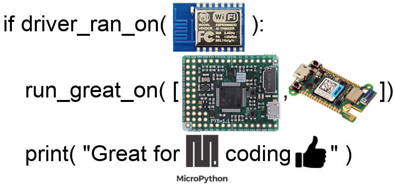
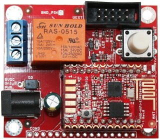
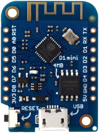

[Ce fichier existe également en FRANCAIS](readme.md)

# ESP8266 MicroPython Driver

This is a collection of drivers (and wiring) for various board, breakout and connectors used with an __ESP8266 under MicroPython__.

IF it works with the ESP8266 THEN it will also run with the [MicroPython Pyboard](https://shop.mchobby.be/fr/56-micropython) or any other MicroPython boards!

The most easiest plateform to flash with MicroPython are the [Feather ESP8266 HUZZA ADA2821](http://shop.mchobby.be/product.php?id_product=846) or an [ESP8266-EVB evaluation board from Olimex](https://shop.mchobby.be/esp8266-esp32-wifi-iot/668-module-wifi-esp8266-carte-d-evaluation-3232100006683-olimex.html) or a [WEMOS / LOLIN (ESP modules) boards](https://shop.mchobby.be/fr/123-wemos-lolin-esp)

# Other information source
* [__Wiki about MicroPython on ESP8266__]( https://wiki.mchobby.be/index.php?title=MicroPython-Accueil#ESP8266_en_MicroPython), a french support to learn how to flash an ESP with MicroPython.
* [__GitHub dedicated to the Pyboard__](https://github.com/mchobby/pyboard-driver) with other drivers requiring more ressources. https://github.com/mchobby/pyboard-driver.
* Where to buy - https://shop.mchobby.be

# Available libraries
Here is a description of the libraries available in this repository. <strong>Each sub-folders contain README file with additionnal informations about the driver, examples and wiring.</strong>

Explore it by:
* Interface:
[FEATHERWING](docs/indexes/drv_by_intf_FEATHERWING_ENG.md), [GPIO](docs/indexes/drv_by_intf_GPIO_ENG.md), [HAT](docs/indexes/drv_by_intf_HAT_ENG.md), [I2C](docs/indexes/drv_by_intf_I2C_ENG.md), [NCD](docs/indexes/drv_by_intf_NCD_ENG.md), [ONEWIRE](docs/indexes/drv_by_intf_ONEWIRE_ENG.md), [QWIIC](docs/indexes/drv_by_intf_QWIIC_ENG.md), [SPI](docs/indexes/drv_by_intf_SPI_ENG.md), [UART](docs/indexes/drv_by_intf_UART_ENG.md), [UEXT](docs/indexes/drv_by_intf_UEXT_ENG.md), [UNO-R3](docs/indexes/drv_by_intf_UNO-R3_ENG.md)
* Manufacturer:
[ADAFRUIT](docs/indexes/drv_by_man_ADAFRUIT_ENG.md), [DFROBOT](docs/indexes/drv_by_man_DFROBOT_ENG.md), [GARATRONIC](docs/indexes/drv_by_man_GARATRONIC_ENG.md), [NCD](docs/indexes/drv_by_man_NCD_ENG.md), [NONE](docs/indexes/drv_by_man_NONE_ENG.md), [OLIMEX](docs/indexes/drv_by_man_OLIMEX_ENG.md), [PIMORONI](docs/indexes/drv_by_man_PIMORONI_ENG.md), [POLOLU](docs/indexes/drv_by_man_POLOLU_ENG.md), [SPARKFUN](docs/indexes/drv_by_man_SPARKFUN_ENG.md)
<table>
<thead>
  <th>Folder</th><th>Description</th>
</thead>
<tbody>
  <tr><td><a href="../../tree/master/COLORS">COLORS</a></td>
      <td><strong>Components</strong> :  
      <strong>Interfaces</strong> :  
<small>Color management/tool library</small>  
      <strong>Tested with</strong> :  
      <strong>Manufacturer</strong> :  
      </td>
  </tr>
  <tr><td><a href="../../tree/master/NCD">NCD</a></td>
      <td><strong>Components</strong> : NCD 
      <strong>Interfaces</strong> : I2C, NCD 
<small>Connect NCD (National Control Device) __I2C mini board__  easily to a MicroPython microcontroler with the <strong>NCD connector</strong>. I2C connexion made easy, 5V logic.</small>  
      <strong>Tested with</strong> : ESP8266-EVB, FEATHER-ESP8266, WEMOS-D1 
      <strong>Manufacturer</strong> : NCD 
<ul>
<li>See <a href="https://ncd.io/">NCD.io</a></li>
<li>See <a href="https://ncd.io/">National Control Device</a></li>
</ul>
      </td>
  </tr>
  <tr><td><a href="../../tree/master/UEXT">UEXT</a></td>
      <td><strong>Components</strong> : UEXT 
      <strong>Interfaces</strong> : I2C, SPI, UART 
<small><strong>UEXT</strong> connector work in 3.3V logic and is used on many board and extension of Olimex. It ship I2C, SPI, UART buses as well as 3.3V</small>  
      <strong>Tested with</strong> : ESP8266-EVB 
      <strong>Manufacturer</strong> : OLIMEX 
<ul>
<li>See <a href="https://shop.mchobby.be/fr/138-uext">UEXT @ MCHobby</a></li>
<li>See <a href="https://www.olimex.com/Products/Modules/">UEXT @ Olimex</a></li>
</ul>
      </td>
  </tr>
  <tr><td><a href="../../tree/master/ad9833">ad9833</a></td>
      <td><strong>Components</strong> : AD9833 
      <strong>Interfaces</strong> : SPI 
<small>Create a signal generator with the MPR121 chip.</small>  
      <strong>Tested with</strong> : PYBOARD 
      <strong>Manufacturer</strong> :  
<ul>
<li>See <a href="https://shop.mchobby.be/fr/breakout/1689-generateur-de-signal-sinus-triangle-clock-0-125-mhz.html">AD9833 - signal generator Sinus, triangle and clock @ MCHobby</a></li>
</ul>
      </td>
  </tr>
  <tr><td><a href="../../tree/master/adfmotors">adfmotors</a></td>
      <td><strong>Components</strong> : PCA9685 
      <strong>Interfaces</strong> : I2C, UNO-R3 
<small>Drive DC motors, steppers or servos with the Adafruit Industries MotorShield.</small>  
      <strong>Tested with</strong> : PYBOARD 
      <strong>Manufacturer</strong> : ADAFRUIT 
<ul>
<li>See <a href="https://shop.mchobby.be/fr/shields/379-shield-de-controle-moteur-motor-shield-v2-3232100003798-adafruit.html">Adafruit Motor Shield @ MCHobby</a></li>
<li>See <a href="https://www.adafruit.com/product/1438">Adafruit Motor Shield @ Adafruit</a></li>
</ul>
      </td>
  </tr>
  <tr><td><a href="../../tree/master/ads1015-ads1115">ads1015-ads1115</a></td>
      <td><strong>Components</strong> : ADS1015, ADS1115, ADA1085 
      <strong>Interfaces</strong> : I2C 
<small>ADC converter (Analog to Digital) 4 channel allowing analog reading and differential reading. L'ADS1115 have a internal amplifier (programmable) that can be used to read very small voltage.</small>  
      <strong>Tested with</strong> : FEATHER-ESP8266 
      <strong>Manufacturer</strong> : ADAFRUIT 
<ul>
<li>See <a href="https://shop.mchobby.be/breakout/362-ads1115-convertisseur-adc-16bits-i2c-3232100003620-adafruit.html">ADS1115 breakout</a></li>
</ul>
      </td>
  </tr>
  <tr><td><a href="../../tree/master/am2315">am2315</a></td>
      <td><strong>Components</strong> : AM2315 
      <strong>Interfaces</strong> : I2C 
<small><strong>Temperature & relative humidity</strong> (0 to 100%) sensor for capture outside data.</small>  
      <strong>Tested with</strong> : FEATHER-ESP8266 
      <strong>Manufacturer</strong> : ADAFRUIT 
<ul>
<li>See <a href="https://shop.mchobby.be/fr/environnemental-press-temp-hrel-gaz/932-am2315-senseur-de-temperature-et-humidite-sous-boitier-3232100009325.html">AM2315 Sensor</a></li>
</ul>
      </td>
  </tr>
  <tr><td><a href="../../tree/master/bme280-bmp280">bme280-bmp280</a></td>
      <td><strong>Components</strong> : BME280, BMP280, ADA2651, ADA2652 
      <strong>Interfaces</strong> : I2C 
<small>The BMP280 is a very popular <strong>pressure and temperatur</strong> sensor. The BME280 is a sensor for <strong>pressure, temperature and relative HUMIDITY</strong></small>  
      <strong>Tested with</strong> : FEATHER-ESP8266, PYBOARD 
      <strong>Manufacturer</strong> : ADAFRUIT 
<ul>
<li>See <a href="http://shop.mchobby.be/product.php?id_product=1118">BMP280 Sensor</a></li>
<li>See <a href="http://shop.mchobby.be/product.php?id_product=684">BME280 Sensor</a></li>
</ul>
      </td>
  </tr>
  <tr><td><a href="../../tree/master/bmp180">bmp180</a></td>
      <td><strong>Components</strong> : BMP180 
      <strong>Interfaces</strong> : I2C 
<small>The BMP180 is a <strong>pressure & temperature</strong> sensor now replaced with the BMP280.</small>  
      <strong>Tested with</strong> : FEATHER-ESP8266 
      <strong>Manufacturer</strong> : ADAFRUIT 
<ul>
<li>See <a href="http://shop.mchobby.be/product.php?id_product=397">BMP180 Sensor</a></li>
</ul>
      </td>
  </tr>
  <tr><td><a href="../../tree/master/ccs811">ccs811</a></td>
      <td><strong>Components</strong> : CCS811 
      <strong>Interfaces</strong> : I2C 
<small>CCS811 - air quality sensor - COV and eCO2 with MicroPython.</small>  
      <strong>Tested with</strong> : PYBOARD 
      <strong>Manufacturer</strong> : ADAFRUIT, OLIMEX 
<ul>
<li>See <a href="https://shop.mchobby.be/product.php?id_product=1274">CCS811 breakout - VOC and eCO2 gaz sensor (ADA3566) @ MCHobby</a></li>
<li>See <a href="https://www.adafruit.com/product/3566">CCS811 breakout - VOC and eCO2 gaz sensor (ADA3566) @ Adafruit</a></li>
<li>See <a href="https://www.adafruit.com/product/1780">MOD-ENV capteur environnemental @ MC Hobby</a></li>
<li>See <a href="https://www.olimex.com/Products/Modules/Sensors/MOD-ENV">MOD-ENV capteur environnemental @ MC Olimex</a></li>
</ul>
      </td>
  </tr>
  <tr><td><a href="../../tree/master/dht11">dht11</a></td>
      <td><strong>Components</strong> : DHT11 
      <strong>Interfaces</strong> : GPIO 
<small>The DHT11 is a very cheap <strong>humidity</strong> (20 to 80%) and temperature sensor.</small>  
      <strong>Tested with</strong> : FEATHER-ESP8266 
      <strong>Manufacturer</strong> : NONE 
<ul>
<li>See <a href="http://shop.mchobby.be/product.php?id_product=708">DHT11 Sensor</a></li>
</ul>
      </td>
  </tr>
  <tr><td><a href="../../tree/master/dotstar">dotstar</a></td>
      <td><strong>Components</strong> : DOTSTAR, 74AHCT125, APA102 
      <strong>Interfaces</strong> : SPI 
<small>The <strong>DotStar / APA102</strong> are Smart digitals LED that can be controled individually.</small>  
      <strong>Tested with</strong> : PYBOARD, PYBSTICK 
      <strong>Manufacturer</strong> : ADAFRUIT 
<ul>
<li>See <a href="https://shop.mchobby.be/fr/55-neopixels-et-dotstar">APA102 / DotStar</a></li>
<li>See <a href="https://shop.mchobby.be/fr/ci/1041-74ahct125-4x-level-shifter-3v-a-5v-3232100010413.html">74AHCT125</a></li>
</ul>
      </td>
  </tr>
  <tr><td><a href="../../tree/master/ds18b20">ds18b20</a></td>
      <td><strong>Components</strong> : DS18B20 
      <strong>Interfaces</strong> : ONEWIRE 
<small>The DS18B20 is a very popular <strong>temperature</strong> sensor. It use the 1-Wire bus to connect several sensors.</small>  
      <strong>Tested with</strong> : FEATHER-ESP8266 
      <strong>Manufacturer</strong> : NONE 
<ul>
<li>See <a href="http://shop.mchobby.be/product.php?id_product=259">DS18B20 Sensor</a></li>
</ul>
      </td>
  </tr>
  <tr><td><a href="../../tree/master/gps-ultimate">gps-ultimate</a></td>
      <td><strong>Components</strong> : GPS-ULTIMATE, MTK3339 
      <strong>Interfaces</strong> : UART 
<small>Being able to capture (or follow) your position with a GPS module</small>  
      <strong>Tested with</strong> : PYBOARD 
      <strong>Manufacturer</strong> : ADAFRUIT 
<ul>
<li>See <a href="https://shop.mchobby.be/fr/breakout/62-gps-adafruit-ultimate-chipset-mtk3339--3232100000629-adafruit.html">GPS Ultime @ MCHobby</a></li>
<li>See <a href="https://www.adafruit.com/product/746">GPS Ultimate</a></li>
</ul>
      </td>
  </tr>
  <tr><td><a href="../../tree/master/hat-joy-bonnet">hat-joy-bonnet</a></td>
      <td><strong>Components</strong> : JOY-BONNET 
      <strong>Interfaces</strong> : HAT 
<small>Use the Joy Bonnet HAT with the MicroPython NADHAT PYB405.</small>  
      <strong>Tested with</strong> :  
      <strong>Manufacturer</strong> : ADAFRUIT 
<ul>
<li>See <a href="https://shop.mchobby.be/fr/micropython/1653-hat-micropython-pyb405-nadhat-3232100016538-garatronic.html">NADHAT PYB405 @ MCHobby</a></li>
<li>See <a href="https://shop.mchobby.be/fr/pi-zero-w/1116-gamepad-pizero-joy-bonnet-3232100011168-adafruit.html">Joy Bonnet Gamepad PiZero (ADA3464) @ MCHobby</a></li>
<li>See <a href="https://www.adafruit.com/product/3464">Joy Bonnet Gamepad PiZero (ADA3464) @ Adafruit</a></li>
</ul>
      </td>
  </tr>
  <tr><td><a href="../../tree/master/is31fl">is31fl</a></td>
      <td><strong>Components</strong> : IS31FL3731 
      <strong>Interfaces</strong> : FEATHERWING, I2C 
<small>IS31FL3731 - CharliePlexing controler via I2C - under MicroPython.</small>  
      <strong>Tested with</strong> : PYBOARD, PYBSTICK 
      <strong>Manufacturer</strong> : ADAFRUIT 
<ul>
<li>See <a href="https://shop.mchobby.be/fr/feather-adafruit/1563-featherwing-matrice-led-15x7-en-charlieplexing-pour-feather-3232100015630-adafruit.html">FeatherWing Matrice LED 15x7, ROUGE, CharliePlexing pour Feather @ MCHobby</a></li>
<li>See <a href="https://www.adafruit.com/product/3134">FeatherWing Matrice LED 15x7, ROUGE, CharliePlexing pour Feather @ Adafruit</a></li>
</ul>
      </td>
  </tr>
  <tr><td><a href="../../tree/master/lcdi2c">lcdi2c</a></td>
      <td><strong>Components</strong> : I2C BackPack, LCD 16x2, LCD 16x4 
      <strong>Interfaces</strong> : I2C 
<small>Liquid Crystal display (LCD) controled via I2C bus.</small>  
      <strong>Tested with</strong> : PYBOARD 
      <strong>Manufacturer</strong> : NONE 
<ul>
<li>See <a href="https://shop.mchobby.be/fr/afficheur-lcd-tft-oled/882-lcd-20x4-backpack-i2c-blanc-sur-bleu-3232100008823.html">I2C Backpack for LCD display</a></li>
<li>See <a href="https://shop.mchobby.be/fr/afficheur-lcd-tft-oled/881-lcd-20x4-backpack-i2c-blanc-sur-bleu-3232100008816.html">LCD 20x4 + I2C Backpack</a></li>
<li>See <a href="https://shop.mchobby.be/fr/nouveaute/1807-afficheur-lcd-16x2-i2c-3232100018075-dfrobot.html">LCD I2C from DFRobot</a></li>
</ul>
      </td>
  </tr>
  <tr><td><a href="../../tree/master/lcdmtrx">lcdmtrx</a></td>
      <td><strong>Components</strong> : USB + Serial Backpack 
      <strong>Interfaces</strong> : UART 
<small>USB + Serial Backpack Kit with 16x2 RGB backlight positive LCD - Black on RGB.</small>  
      <strong>Tested with</strong> : PYBOARD 
      <strong>Manufacturer</strong> : ADAFRUIT 
<ul>
<li>See <a href="https://shop.mchobby.be/fr/afficheur-lcd-tft-oled/475-lcd-16x2-rgb-positif-usb-serie-3232100004757.html">USB + Serial Backpack @ MCHobby</a></li>
<li>See <a href="https://www.adafruit.com/product/782">USB + Serial Backpack @ Adafruit</a></li>
</ul>
      </td>
  </tr>
  <tr><td><a href="../../tree/master/lsm303">lsm303</a></td>
      <td><strong>Components</strong> : LSM303D 
      <strong>Interfaces</strong> : UNO-R3, I2C 
<small>Use a LSM303D compas and accelerometer with MicroPython.</small>  
      <strong>Tested with</strong> : PYBOARD 
      <strong>Manufacturer</strong> : POLOLU 
<ul>
<li>See <a href="https://www.pololu.com/product/2127">LSM303D breakout - 3D Compass and Accelerometer @ Pololu</a></li>
<li>See <a href="https://www.pololu.com/product/2510">Robot Zumo pour Arduino (2510) @ Pololu</a></li>
<li>See <a href="https://shop.mchobby.be/fr/prototypage-robotique-roue/448-robot-zumo-pour-arduino-assemble-moteurs-3232100004481-pololu.html">Robot Zumo pour Arduino @ MC Hobby</a></li>
<li>See <a href="https://shop.mchobby.be/fr/nouveaute/1745-adaptateur-pyboard-vers-uno-r3-extra-3232100017450.html">PYBOARD-UNO-R3 - Adaptateur Pyboard vers UNO-R3 + Extra @ MC Hobby</a></li>
</ul>
      </td>
  </tr>
  <tr><td><a href="../../tree/master/max6675">max6675</a></td>
      <td><strong>Components</strong> : MOD-TC, MAX6675 
      <strong>Interfaces</strong> : UEXT, SPI 
<small>MAX6675 Type-K Thermocouple amplifier - MOD-TC - under MicroPython.</small>  
      <strong>Tested with</strong> : PYBOARD 
      <strong>Manufacturer</strong> : OLIMEX 
<ul>
<li>See <a href="https://shop.mchobby.be/product.php?id_product=1623">MOD-TC - Amplificateur Thermocouple Type-K d'Olimex @ MCHobby</a></li>
<li>See <a href="https://www.olimex.com/Products/Modules/Sensors/MOD-TC">MOD-TC - Amplificateur Thermocouple Type-K @ Olimex</a></li>
</ul>
      </td>
  </tr>
  <tr><td><a href="../../tree/master/mcp230xx">mcp230xx</a></td>
      <td><strong>Components</strong> : MCP23017, MCP23008 
      <strong>Interfaces</strong> : I2C 
<small>The MCP23017 (and MCP2308) are <strong>GPIO Expander</strong> adding additionnal input/output to a microcontroler.</small>  
      <strong>Tested with</strong> : FEATHER-ESP8266 
      <strong>Manufacturer</strong> : NONE 
<ul>
<li>See <a href="http://shop.mchobby.be/product.php?id_product=218">MCP23017 GPIO Expander</a></li>
</ul>
      </td>
  </tr>
  <tr><td><a href="../../tree/master/mcp4725">mcp4725</a></td>
      <td><strong>Components</strong> : MCP4725 
      <strong>Interfaces</strong> : I2C 
<small>The MCP4725 (I2C bus) is a DAC -or- a TRUE 12 bits analog output (0 à 65535).</small>  
      <strong>Tested with</strong> : FEATHER-ESP8266, PYBOARD 
      <strong>Manufacturer</strong> : ADAFRUIT 
<ul>
<li>See <a href="http://shop.mchobby.be/product.php?id_product=132">MCP4725 12 bits DAC @ MCHobby : Convertisseur Digital/Analogique pour MicroControlleur, interface I2C</a></li>
<li>See <a href="https://www.adafruit.com/product/935">MCP4725 12 bits DAC @ Adafruit : 12 bits DAC over I2C bus</a></li>
</ul>
      </td>
  </tr>
  <tr><td><a href="../../tree/master/mcp9808">mcp9808</a></td>
      <td><strong>Components</strong> : MCP9808 
      <strong>Interfaces</strong> : I2C 
<small>The MCP9808 (I2C bus) can measure temperature with high accuracy (0.25°C).</small>  
      <strong>Tested with</strong> : FEATHER-ESP8266, PYBOARD 
      <strong>Manufacturer</strong> : ADAFRUIT 
<ul>
<li>See <a href="http://shop.mchobby.be/product.php?id_product=572">MCP9808 @ MCHobby : mesure de température de précision via I2C</a></li>
<li>See <a href="https://www.adafruit.com/product/1782">MCP9808 @ Adafruit : High precision temperature sensor</a></li>
</ul>
      </td>
  </tr>
  <tr><td><a href="../../tree/master/modenv">modenv</a></td>
      <td><strong>Components</strong> : CCS811, BME280 
      <strong>Interfaces</strong> : UEXT, I2C 
<small>Environmental sensor all-in-one - BME280 + CCS811 - under MicroPython.</small>  
      <strong>Tested with</strong> : PYBOARD 
      <strong>Manufacturer</strong> : OLIMEX 
<ul>
<li>See <a href="https://shop.mchobby.be/product.php?id_product=1280">MOD-ENV - Capteur environnemental d'Olimex CCS811 + BME280 @ MCHobby</a></li>
<li>See <a href="https://www.olimex.com/Products/Modules/Sensors/MOD-ENV">MOD-ENV capteur environnemental @ Olimex</a></li>
</ul>
      </td>
  </tr>
  <tr><td><a href="../../tree/master/modio">modio</a></td>
      <td><strong>Components</strong> : MOD-IO 
      <strong>Interfaces</strong> : I2C, UEXT 
<small>MOD-IO is an I2C extension board with <strong>UEXT</strong> connector. This Olimex's Board have relays, OptoCoupler input (24V) and analog input (0-3.3V). This board is compatible with the industrial grade voltages (24V).</small>  
      <strong>Tested with</strong> : ESP8266-EVB 
      <strong>Manufacturer</strong> : OLIMEX 
<ul>
<li>See <a href="https://shop.mchobby.be/fr/138-uext">UEXT @ MCHobby</a></li>
<li>See <a href="https://www.olimex.com/Products/Modules/">UEXT @ Olimex</a></li>
</ul>
      </td>
  </tr>
  <tr><td><a href="../../tree/master/modio2">modio2</a></td>
      <td><strong>Components</strong> : MOD-IO2 
      <strong>Interfaces</strong> : I2C, UEXT 
<small>MOD-IO is an I2C extension board with <strong>UEXT</strong> connector. This Olimex's Board have relays, and GPIOs with various functions (Input, Output, Analog, PWM; 0-3.3V).</small>  
      <strong>Tested with</strong> : ESP8266-EVB 
      <strong>Manufacturer</strong> : OLIMEX 
<ul>
<li>See <a href="https://shop.mchobby.be/fr/138-uext">UEXT @ MCHobby</a></li>
<li>See <a href="https://www.olimex.com/Products/Modules/">UEXT @ Olimex</a></li>
</ul>
      </td>
  </tr>
  <tr><td><a href="../../tree/master/modirtemp">modirtemp</a></td>
      <td><strong>Components</strong> : MOD-IR-TEMP, MLX90614 
      <strong>Interfaces</strong> : I2C, UEXT 
<small>NON-Contact IR temperature sensor, from -70°C to 380°C with MXL90164.</small>  
      <strong>Tested with</strong> : FEATHER-ESP8266, PYBOARD 
      <strong>Manufacturer</strong> : OLIMEX 
<ul>
<li>See <a href="https://www.olimex.com/Products/Modules/Sensors/MOD-IR-TEMP/open-source-hardware">MOD-IR-TEMP @ Olimex</a></li>
</ul>
      </td>
  </tr>
  <tr><td><a href="../../tree/master/modlcd1x9">modlcd1x9</a></td>
      <td><strong>Components</strong> : MOD-LCD-1x9 
      <strong>Interfaces</strong> : I2C, UEXT 
<small>MOD-LCD1x9 is an I2C'based 9 characters alphanumeric display using the <strong>UEXT</strong> connector.</small>  
      <strong>Tested with</strong> : ESP8266-EVB, PYBOARD 
      <strong>Manufacturer</strong> : OLIMEX 
<ul>
<li>See <a href="https://shop.mchobby.be/esp8266-esp32-wifi-iot/1414-uext-lcd-display-1-line-of-9-alphanumeric-chars-3232100014145-olimex.html">MOD-LCD1x9 @ MCHobby</a></li>
<li>See <a href="https://www.olimex.com/Products/Modules/">UEXT @ Olimex</a></li>
</ul>
      </td>
  </tr>
  <tr><td><a href="../../tree/master/modled8x8">modled8x8</a></td>
      <td><strong>Components</strong> : MOD-LED8x8RGB 
      <strong>Interfaces</strong> : GPIO, SPI 
<small>A 8x8 RGB led display that can be daisy chained.</small>  
      <strong>Tested with</strong> : PYBOARD 
      <strong>Manufacturer</strong> : OLIMEX 
<ul>
<li>See <a href="https://shop.mchobby.be/fr/nouveaute/1625-mod-led8x8rgb-matrice-led-rgb-8x8-3232100016255-olimex.html">MOD-LED8x8RGB @ MCHobby</a></li>
<li>See <a href="https://www.olimex.com/Products/Modules/LED/MOD-LED8x8RGB/open-source-hardware">MOD-LED8x8RGB @ Olimex</a></li>
</ul>
      </td>
  </tr>
  <tr><td><a href="../../tree/master/modltr501">modltr501</a></td>
      <td><strong>Components</strong> : MOD-LTR-501ALS, LTR-501ALS 
      <strong>Interfaces</strong> : I2C, UEXT 
<small>LTR-501ALS can be used to acquires luminosity data from 0.01 to 64.000 Lux (64K lux) and make proximity detection (up to 10cm). The MOD-MAG have an <strong>UEXT</strong> connector to ease wiring.</small>  
      <strong>Tested with</strong> : ESP8266-EVB 
      <strong>Manufacturer</strong> : OLIMEX 
<ul>
<li>See <a href="https://shop.mchobby.be/uext/1415-senseur-proximite-et-lumiere-ltr501-connecteur-uext-3232100014152-olimex.html">MOD-LTR-501ALS @ MCHobby</a></li>
<li>See <a href="https://www.olimex.com/Products/Modules/">UEXT @ Olimex</a></li>
</ul>
      </td>
  </tr>
  <tr><td><a href="../../tree/master/modmag">modmag</a></td>
      <td><strong>Components</strong> : MOD-MAG, MAG3110 
      <strong>Interfaces</strong> : I2C, UEXT 
<small>The MAG3110 is a digital 3 axis magnetometer from NXP running over an I2C bus. The MOD-MAG have an <strong>UEXT</strong> connector to ease wiring.</small>  
      <strong>Tested with</strong> : ESP8266-EVB 
      <strong>Manufacturer</strong> : OLIMEX 
<ul>
<li>See <a href="https://shop.mchobby.be/esp8266-esp32-wifi-iot/1413-uext-mag3110-magnetometer-module-3232100014138-olimex.html">MOD-MAG @ MCHobby</a></li>
<li>See <a href="https://www.olimex.com/Products/Modules/">UEXT @ Olimex</a></li>
</ul>
      </td>
  </tr>
  <tr><td><a href="../../tree/master/modoled128x64">modoled128x64</a></td>
      <td><strong>Components</strong> : SSD1306, MOD-OLED-128x64, OLED 
      <strong>Interfaces</strong> : I2C, UEXT 
<small>A 128x64 display with the SSD1306 I2C controler exposing a UEXT connector.</small>  
      <strong>Tested with</strong> : ESP8266-EVB 
      <strong>Manufacturer</strong> : OLIMEX 
<ul>
<li>See <a href="https://shop.mchobby.be/product.php?id_product=1411">Afficheur OLED 128 x 64 avec interface I2C et UEXT</a></li>
</ul>
      </td>
  </tr>
  <tr><td><a href="../../tree/master/modrfid">modrfid</a></td>
      <td><strong>Components</strong> : MOD-RFID1536MIFARE 
      <strong>Interfaces</strong> : UART, UEXT 
<small>NFC RFID reader writer for 13.56Mhz NFC MIFARE RFID tags.</small>  
      <strong>Tested with</strong> : PYBOARD 
      <strong>Manufacturer</strong> : OLIMEX 
<ul>
<li>See <a href="https://shop.mchobby.be/product.php?id_product=1619">MOD-RFID1536MIFARE @ MCHobby</a></li>
<li>See <a href="https://www.olimex.com/Products/Modules/RFID/MOD-RFID1356MIFARE/">MOD-RFID1536MIFARE @ Olimex</a></li>
</ul>
      </td>
  </tr>
  <tr><td><a href="../../tree/master/modrgb">modrgb</a></td>
      <td><strong>Components</strong> : MOD-RGB 
      <strong>Interfaces</strong> : I2C, UEXT 
<small>MOD-RGB is an I2C extension board with <strong>UEXT</strong> connector. This Olimex's Board have power MosFet to control RGB analogic LED strips via I2C (or DMX).</small>  
      <strong>Tested with</strong> : ESP8266-EVB 
      <strong>Manufacturer</strong> : OLIMEX 
<ul>
<li>See <a href="https://shop.mchobby.be/fr/138-uext">UEXT @ MCHobby</a></li>
<li>See <a href="https://www.olimex.com/Products/Modules/">UEXT @ Olimex</a></li>
</ul>
      </td>
  </tr>
  <tr><td><a href="../../tree/master/modtc-mk2">modtc-mk2</a></td>
      <td><strong>Components</strong> : MOD-TC-MK2-31855 
      <strong>Interfaces</strong> : UEXT, I2C 
<small>MAX6MOD-TC-MK2 : Type-K Thermocouple amplifier (MAX31855) over I2C - under MicroPython.</small>  
      <strong>Tested with</strong> : PYBOARD 
      <strong>Manufacturer</strong> : OLIMEX 
<ul>
<li>See <a href="https://shop.mchobby.be/fr/uext/1624-mod-tc-mk2-31855-interface-thermocouple-type-k-avec-max31855-bus-i2c-gpio-3232100016248-olimex.html">MOD-TC-MK2 - Amplificateur Thermocouple Type-K (MAX31855) via I2C d'Olimex @ MCHobby</a></li>
<li>See <a href="https://www.olimex.com/Products/Modules/Sensors/MOD-TC-MK2-31855/open-source-hardware">MOD-TC-MK2 - Type-K Thermocouple Amplifier (MAX31855) over I2C from Olimex @ Olimex</a></li>
</ul>
      </td>
  </tr>
  <tr><td><a href="../../tree/master/modwii">modwii</a></td>
      <td><strong>Components</strong> : MOD-Wii-UEXT-NUNCHUCK, NUNCHUCK 
      <strong>Interfaces</strong> : I2C, UEXT 
<small>The Wii NUNCHUCK is a game controler very comfortable to used and runs over the I2C bus. This controler have an <strong>UEXT</strong> connector to ease wiring.</small>  
      <strong>Tested with</strong> : ESP8266-EVB 
      <strong>Manufacturer</strong> : OLIMEX 
<ul>
<li>See <a href="https://shop.mchobby.be/esp8266-esp32-wifi-iot/1416-uext-wii-nunchuck-controller-3232100014169-olimex.html">Wii Nunchuck game controller (UEXT) @ MCHobby</a></li>
<li>See <a href="https://www.olimex.com/Products/Modules/">UEXT @ Olimex</a></li>
</ul>
      </td>
  </tr>
  <tr><td><a href="../../tree/master/mpr121">mpr121</a></td>
      <td><strong>Components</strong> : MPR121 
      <strong>Interfaces</strong> : I2C 
<small>Create tactile pad/inputs with capacitive effect with the MPR121 chip.</small>  
      <strong>Tested with</strong> : PYBOARD, FEATHER-ESP8266 
      <strong>Manufacturer</strong> : ADAFRUIT 
<ul>
<li>See <a href="https://shop.mchobby.be/fr/tactile-flex-pot-softpad/1685-capteur-capacitif-12-touches-mpr121-3232100016859-adafruit.html">MPR121 - capteur capacitif 12 entrées/touches @ MCHobby</a></li>
<li>See <a href="https://www.adafruit.com/product/1982">12-Key Capacitive Touch Sensor Breakout - MPR121 @ Adafruit</a></li>
</ul>
      </td>
  </tr>
  <tr><td><a href="../../tree/master/ncd-fet-solenoid">ncd-fet-solenoid</a></td>
      <td><strong>Components</strong> : I2CDRV8W4I12V, MCP23008 
      <strong>Interfaces</strong> : I2C, NCD 
<small>FET Output controler + GPIO (based on a MCP23008) for 12V resistive / inductive load (like valve). The <i>I2C NCD board</i> have the <strong>NCD</strong> connector which facilitate the device wiring. The MPL115A2 is also available as breakout.</small>  
      <strong>Tested with</strong> : FEATHER-ESP8266, PYBOARD 
      <strong>Manufacturer</strong> : NCD 
<ul>
<li>See <a href="https://ncd.io/">NCD.io</a></li>
<li>See <a href="https://ncd.io/">National Control Device</a></li>
</ul>
      </td>
  </tr>
  <tr><td><a href="../../tree/master/ncd-mpl115a2">ncd-mpl115a2</a></td>
      <td><strong>Components</strong> : MPL115A2, ADA992 
      <strong>Interfaces</strong> : I2C, NCD 
<small>The MPL115A2 sensor capture the pressure and temperature over I2C bus. The <i>I2C NCD mini board</i> have the <strong>NCD</strong> connector which facilitate the device wiring. The MPL115A2 is also available as breakout.</small>  
      <strong>Tested with</strong> : FEATHER-ESP8266, PYBOARD 
      <strong>Manufacturer</strong> : NCD, ADAFRUIT 
<ul>
<li>See <a href="https://ncd.io/">NCD.io</a></li>
<li>See <a href="https://ncd.io/">National Control Device</a></li>
</ul>
      </td>
  </tr>
  <tr><td><a href="../../tree/master/ncd-oled">ncd-oled</a></td>
      <td><strong>Components</strong> : SSD1306, I2COLED, OLED 
      <strong>Interfaces</strong> : I2C, NCD 
<small>A 128x64 display with the SSD1306 I2C controler exposing a NCD connector.</small>  
      <strong>Tested with</strong> : FEATHER-ESP8266, PYBOARD 
      <strong>Manufacturer</strong> : NCD 
<ul>
<li>See <a href="https://ncd.io/">NCD.io - National Control Device</a></li>
<li>See <a href="https://store.ncd.io/product/oled-128x64-graphic-display-i2c-mini-module/">NCD oled 128x64 i2c mini module</a></li>
</ul>
      </td>
  </tr>
  <tr><td><a href="../../tree/master/ncd-pecmac">ncd-pecmac</a></td>
      <td><strong>Components</strong> : DLCT27C10, OPCT16AL, I2CCMAC230A, PECMAC2xxxA 
      <strong>Interfaces</strong> : I2C, NCD 
<small>AC Current sensor on I2C bus (or IoT interface). The <i>I2C NCD board</i> have the <strong>NCD</strong> connector which facilitate the device wiring. The MPL115A2 is also available as breakout.</small>  
      <strong>Tested with</strong> : FEATHER-ESP8266, PYBOARD 
      <strong>Manufacturer</strong> : NCD 
<ul>
<li>See <a href="https://ncd.io/">NCD.io</a></li>
<li>See <a href="https://ncd.io/">National Control Device</a></li>
</ul>
      </td>
  </tr>
  <tr><td><a href="../../tree/master/ncd-si7005">ncd-si7005</a></td>
      <td><strong>Components</strong> : SI7005 
      <strong>Interfaces</strong> : I2C, NCD 
<small>The SI7005 is a pressure and temperature sensor working over the I2C bus. The <i>I2C NCD mini board</i> have the <strong>NCD</strong> connector which facilitate the device wiring. The MPL115A2 is also available as breakout.</small>  
      <strong>Tested with</strong> : FEATHER-ESP8266, PYBOARD 
      <strong>Manufacturer</strong> : NCD 
<ul>
<li>See <a href="https://ncd.io/">NCD.io</a></li>
<li>See <a href="https://ncd.io/">National Control Device</a></li>
</ul>
      </td>
  </tr>
  <tr><td><a href="../../tree/master/ncd-water-detect">ncd-water-detect</a></td>
      <td><strong>Components</strong> : WATER-DETECT, WDBZ, PCA9536 
      <strong>Interfaces</strong> : I2C, NCD 
<small>Water detection + Buzzer + 2 extra GPIOs (based on a PCA9536). The <i>I2C NCD mini board</i> have the <strong>NCD</strong> connector which facilitate the device wiring. The MPL115A2 is also available as breakout.</small>  
      <strong>Tested with</strong> : FEATHER-ESP8266, PYBOARD 
      <strong>Manufacturer</strong> : NCD 
<ul>
<li>See <a href="https://ncd.io/">NCD.io</a></li>
<li>See <a href="https://ncd.io/">National Control Device</a></li>
</ul>
      </td>
  </tr>
  <tr><td><a href="../../tree/master/neopixel">neopixel</a></td>
      <td><strong>Components</strong> : NEOPIXEL, 74AHCT125, WS2812 
      <strong>Interfaces</strong> : GPIO 
<small>The <strong>NéoPixels</strong> are Smart digitals LED that can be controled individually.</small>  
      <strong>Tested with</strong> : FEATHER-ESP8266, PYBOARD 
      <strong>Manufacturer</strong> : ADAFRUIT 
<ul>
<li>See <a href="https://shop.mchobby.be/fr/55-neopixels-et-dotstar">NeoPixels</a></li>
<li>See <a href="https://shop.mchobby.be/fr/ci/1041-74ahct125-4x-level-shifter-3v-a-5v-3232100010413.html">74AHCT125</a></li>
</ul>
      </td>
  </tr>
  <tr><td><a href="../../tree/master/oled-ssd1306">oled-ssd1306</a></td>
      <td><strong>Components</strong> : SSD1306, FEATHER-OLED-WING, ADA2900, OLED 
      <strong>Interfaces</strong> : I2C, FEATHERWING 
<small>The SSD1306 is an OLED display controler.</small>  
      <strong>Tested with</strong> : FEATHER-ESP8266 
      <strong>Manufacturer</strong> : ADAFRUIT 
<ul>
<li>See <a href="https://shop.mchobby.be/product.php?id_product=879">FeatherWing OLED ssd1306 128x32</a></li>
</ul>
      </td>
  </tr>
  <tr><td><a href="../../tree/master/pca9536">pca9536</a></td>
      <td><strong>Components</strong> : PCA9536 
      <strong>Interfaces</strong> : I2C 
<small>4 bit I2C controled GPIO expander.</small>  
      <strong>Tested with</strong> :  
      <strong>Manufacturer</strong> : NONE 
      </td>
  </tr>
  <tr><td><a href="../../tree/master/pca9685">pca9685</a></td>
      <td><strong>Components</strong> : PCA9685, PWM-Driver 
      <strong>Interfaces</strong> : I2C 
<small>PWM-Driver driver contrôler based on PCA9685 from NXP, 16 channel, 12 bits resolution, to drive LEDs and Servos.</small>  
      <strong>Tested with</strong> : PYBOARD 
      <strong>Manufacturer</strong> : ADAFRUIT 
<ul>
<li>See <a href="https://shop.mchobby.be/fr/breakout/89-adafruit-controleur-pwm-servo-16-canaux-12-bits-i2c-interface-pca9685-3232100000896-adafruit.html">PCA9685 - PWM Driver @ MCHobby</a></li>
<li>See <a href="https://www.adafruit.com/product/815">PCA9685 - PWM Driver @ Adafruit</a></li>
</ul>
      </td>
  </tr>
  <tr><td><a href="../../tree/master/st7687s">st7687s</a></td>
      <td><strong>Components</strong> : ST7687S 
      <strong>Interfaces</strong> : SPI 
<small>Using a round TFT under MicroPython</small>  
      <strong>Tested with</strong> : PYBOARD, PYBSTICK 
      <strong>Manufacturer</strong> : DFROBOT 
<ul>
<li>See <a href="https://shop.mchobby.be/fr/afficheur-lcd-tft-oled/1856-tft-couleur-22-rond-spi-breakout-3232100018563-dfrobot.html">Ecran TFT DFRobot DFR0529 @ MCHobby</a></li>
<li>See <a href="https://www.dfrobot.com/product-1794.html">Ecran TFT DFRobot DFR0529 @ DFRobot</a></li>
</ul>
      </td>
  </tr>
  <tr><td><a href="../../tree/master/tcs34725">tcs34725</a></td>
      <td><strong>Components</strong> : TCS34725 
      <strong>Interfaces</strong> : I2C 
<small>Read the color (rgb or Kelvin) with a TCS34725 sensor + MED + IR filter.</small>  
      <strong>Tested with</strong> : PYBOARD, FEATHER-ESP8266 
      <strong>Manufacturer</strong> : ADAFRUIT 
<ul>
<li>See <a href="https://shop.mchobby.be/fr/afficheur-lcd-tft-oled/475-lcd-16x2-rgb-positif-usb-serie-3232100004757.html">TCS34725 - capteur de couleur RGB + Filtre IR + LED blanche @ MCHobby</a></li>
<li>See <a href="https://www.adafruit.com/product/1334">RGB Color Sensor with IR filter and White LED - TCS34725 @ Adafruit</a></li>
</ul>
      </td>
  </tr>
  <tr><td><a href="../../tree/master/trackball">trackball</a></td>
      <td><strong>Components</strong> : TRACKBALL-BREAKOUT 
      <strong>Interfaces</strong> : I2C 
<small>Add a Trackball + RGBW LED to your MicroPython project</small>  
      <strong>Tested with</strong> : PYBOARD, PYBSTICK 
      <strong>Manufacturer</strong> : PIMORONI 
<ul>
<li>See <a href="https://shop.mchobby.be/fr/tactile-flex-pot-softpad/1833-trackball-i2c-avec-retro-eclairage-3232100018334-pimoroni.html">Trackball I2C avec retro-éclairage @ MCHobby</a></li>
<li>See <a href="https://shop.pimoroni.com/products/trackball-breakout">Trackball Breakout @ Pimoroni</a></li>
</ul>
      </td>
  </tr>
  <tr><td><a href="../../tree/master/tsl2561">tsl2561</a></td>
      <td><strong>Components</strong> : TSL2561, ADA439 
      <strong>Interfaces</strong> : I2C 
<small>The TSL2561 is a visible light <strong>luminosity</strong> sensor having a response close from human Eyes. It produces values in LUX.</small>  
      <strong>Tested with</strong> : FEATHER-ESP8266 
      <strong>Manufacturer</strong> : ADAFRUIT 
<ul>
<li>See <a href="https://shop.mchobby.be/product.php?id_product=238">Capteur Lux/Luminosité/Lumière digital</a></li>
</ul>
      </td>
  </tr>
  <tr><td><a href="../../tree/master/tsl2591">tsl2591</a></td>
      <td><strong>Components</strong> : TSL2591, ADA1980 
      <strong>Interfaces</strong> : I2C 
<small>The TSL2591 is a visible light <strong>luminosity</strong> sensor having a response close from human Eyes. It produces values in LUX.</small>  
      <strong>Tested with</strong> : FEATHER-ESP8266, PYBOARD 
      <strong>Manufacturer</strong> : ADAFRUIT 
<ul>
<li>See <a href="https://shop.mchobby.be/product.php?id_product=1599">TSL2591 @ MCHobby - Capteur Lux/Luminosité/Lumière digital</a></li>
<li>See <a href="https://www.adafruit.com/product/1980">TSL2591 @ Adafruit - Capteur Lux/Luminosité/Lumière digital</a></li>
</ul>
      </td>
  </tr>
  <tr><td><a href="../../tree/master/umqtt">umqtt</a></td>
      <td><strong>Components</strong> :  
      <strong>Interfaces</strong> :  
<small>MQTT Communication exemples with ESP8266 module.</small>  
      <strong>Tested with</strong> : FEATHER-ESP8266, PYBOARD 
      <strong>Manufacturer</strong> : NONE 
<ul>
<li>See <a href="https://shop.mchobby.be/product.php?id_product=846">Feather ESP8266</a></li>
</ul>
      </td>
  </tr>
</tbody>
</table>

# Some useful information
* [how-to-install-upy.md](how-to-install-upy.md) how to install MicroPython on ESP8266 from a Linux machine (like the Raspberry-Pi)
 * [erase-esp8266.sh](erase-esp8266.sh) - used to erase the flash from the ESP8266
 * [burn-esp8266.sh](burn-esp8266.sh) - used to flash the [MicroPython binary downloaded from micropython.org/download](https://micropython.org/download/) on a ESP8266
* Configuration file
 * [boot.py](boot.py) - to update with netword SSID and password for the WiFi network. Once copied on the ESP8266 (with RShell), it this file will automatically connect the ESP8266 on the WiFi network.
 * [port_config.py](port_config.py) - to update, it will contain the WebRepl password to protect the connexion. It will be automatically used by WebRepl deamon.  

## RShell

__RShell__ is a wonderfull tool used to edit/transfert/repl your board running MicroPython from a single serial connexion (or Serial over bluetooth).

It is a _really useful_ that would be great to learn... with RShell, you can access the MicroPython filesystem (in Flash memory) to edit and copy files.

The wonderfulnes of RShell, is that it also works great with ESP8266 (thankfully because there are no way to emulate USB Mass Storage on ESP8266, a _flash drive_ like is work with the genuine PyBoard).

 * [French tutorial on RShell](https://wiki.mchobby.be/index.php?title=MicroPython-Hack-RShell)
 * [Rshell GitHub](https://github.com/dhylands/rshell) - with english documentation and installation instruction.
 * [rshell-esp8266.sh](rshell-esp8266.sh) - to update. Calls RShell with a small size exchange buffer (needed for ESP8266).

__WARNING__ : On a ESP8266 it is necessary to reduce the exchange buffer... otherwise, it may corrupt the MicroPython filesystem (and it would be necessary to re-flash the ESP8266 with MicroPython) :-/  See the file [rshell-esp8266.sh](rshell-esp8266.sh) suggested in this repository.

## WebRepl

Open WebRepl.html in your WebBrowser to start a REPL Session through an HTTP network connexion.

All you need to know is the IP of the the ESP8266 board on the Network.

__WARNING__ :
* You will have to get your [boot.py](boot.py) file properly configured to connect the WiFi network and to start the WebRepl deamon.
* You can also initialise the WebRepl password in the [port_config.py](port_config.py) file. More recent MicroPython firmware will set the WebRepl password from the Boot.py file.
RShell will be a valuable tool for this configuration task.

# Various links

There are many Adafruit  drivers (various plateforms) on this Github (Tony Dicola)
* https://github.com/adafruit/micropython-adafruit-bundle/tree/master/libraries/drivers

And some IMU (inertial sensor) driver on Github
* https://github.com/micropython-IMU/
