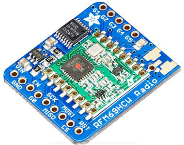
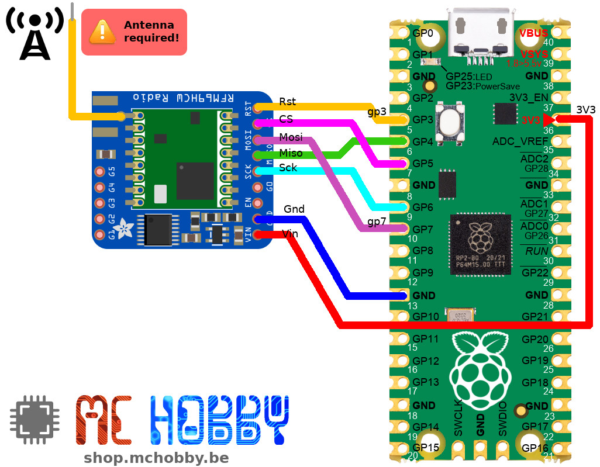

# Transmit data over the air with RFM69 (SX1231) Packet Radio module and MicroPython

The RFM69's are easiest to work with. It is a well known and understood module.



Do not confuse this module with LoRa radios technology which is more powerful but also more expensive.

It exists many variant of the module running at different frequencies (433 Mhz, 868 Mhz to 915 Mhz) and 2 differents modulations.

__The RFM69HW is a reliable module capable to sent 60 bytes data packets over the air__.

The RFM69HCW features:
* SX1231 based module with SPI interface
* a +20dBm FSK packet radios
* auto-retransmit capability
* can send data about 200-500 meters line-of-sight with a simple wire antennas
* can transmit up to 2km or even 5Km with well-tuned directional antennas (perfect line-of-sight, and settings tweakings)
* +13 to +20 dBm up to 100 mW Power Output Capability (software configuration)
* Transmission current:
 * 50mA (+13 dBm)
 * 150mA (+20dBm)
* Reception current: ~30mA.
* Create multipoint networks with individual node addresses thank to RadioHead (4 bytes header)
* 60 bytes max data packet.
* Encrypted packet engine with AES-128
* Additional configurable IRQ pins (G0 to G5)

The examples in this tutorial relies on a 433 MHz RFM version.

## Transmit distance

500 meters in line of sight with tuned uni-directional antennas is not a problem with default settings (+13 dBm).

Remember that depending on obstructions (line of sight), frequency, antenna and power output, you can get lower range.

With properly tuned parameter, a line of sight, this module can reach 2 Km distance and possibly 5 km in really good condition.


# Wiring

## RFM69 to Raspberry-Pico



# Testing

Prior to run the examples script, you will need to copy the [rfm69.py](lib/rfm69.py) library to the MicroPython board.

## test_config.py - check wiring and module

The [test_config.py](examples/test_config.py) establish a communication link with the RFM69 module then query & display the module configuration.

It is a very convenient way to check the wiring and communication with the module.

```
RFM version     : 36
Freq            : 433.1
Freq. deviation : 250000.0 Hz
bitrate         : 250000.0 bits/sec
tx power        : 13 dBm
tx power        : 19.95262 mW
Temperature     : 23 Celsius
Sync on         : yes
Sync size       : 1
Sync Word Length: 2 (Sync size+1)
Sync Word       : bytearray(b'-\xd4')
crc on          : 1
Preamble Lenght : 4
aes on          : 1
Encryption Key  : bytearray(b'\x01\x02\x03\x04\x05\x06\x07\x08\x01\x02\x03\x04\x05\x06\x07\x08')
```

## test_simple.py - basic broadcast communication

The [test_simple.py](examples/test_simple.py) script send "hello world!" 10 times then listen for incoming messages.

The most simple usage is __the default behavior__ which broadcast the message to any destination (rfm.destination = _RH_BROADCAST_ADDRESS).

So any listener locked on the right frequency with the same encryption key will receive the message.

Here follows the code fragment for message sending:

``` python
from machine import SPI, Pin
from rfm69 import RFM69
import time

spi = SPI(0, baudrate=50000, polarity=0, phase=0, firstbit=SPI.MSB)
nss = Pin( 5, Pin.OUT, value=True )
rst = Pin( 3, Pin.OUT, value=False )
rfm = RFM69( spi=spi, nss=nss, reset=rst )
rfm.frequency_mhz = 433.1
rfm.encryption_key = ( b"\x01\x02\x03\x04\x05\x06\x07\x08\x01\x02\x03\x04\x05\x06\x07\x08" )

for i in range(10):
	# string is transformed into an array of bytes (binary data)
	rfm.send(bytes("Hello world %i!\r\n" % i , "utf-8"))
	time.sleep(1)
```

Here follows the code fragment for message receiving:

``` python
from machine import SPI, Pin
from rfm69 import RFM69
import time

spi = SPI(0, baudrate=50000, polarity=0, phase=0, firstbit=SPI.MSB)
nss = Pin( 5, Pin.OUT, value=True )
rst = Pin( 3, Pin.OUT, value=False )

rfm = RFM69( spi=spi, nss=nss, reset=rst )
rfm.frequency_mhz = 433.1
rfm.encryption_key = ( b"\x01\x02\x03\x04\x05\x06\x07\x08\x01\x02\x03\x04\x05\x06\x07\x08" )


print("Waiting for packets...")
while True:
	packet = rfm.receive()
	# packet = rfm.receive(timeout=5.0)
	if packet is None:
		print("Received nothing! Listening again...")
	else:
		print( "Received (raw bytes):", packet )
```

__To properly use the test `test_simple.py` script:__
* 2 board+RFM69 setup must be ready to use.
* start the `test_simple.py` script on one plateform and wait for script to check for received message.
* WHEN the first plateform is checking the received message THEN start the script on the second plateform.
* As the second plateform immediately sends messages, the former plateform must display the messages in between the message reception attempt.

On the former plateform, we do wait long enough for "Waiting for packets..."

```
Temperature     : 23 Celsius
Freq            : 433.1
Freq. deviation : 250000.0 Hz
bitrate         : 250000.0 bits/sec
Sent hello world message 0!
Sent hello world message 1!
Sent hello world message 2!
Sent hello world message 3!
Sent hello world message 4!
Sent hello world message 5!
Sent hello world message 6!
Sent hello world message 7!
Sent hello world message 8!
Sent hello world message 9!
Waiting for packets...       <---- It is the right time to start the second plateform
Received nothing! Listening again...
Received nothing! Listening again...
Received nothing! Listening again...
Received nothing! Listening again...
Received (raw bytes): bytearray(b'Hello world 3!\r\n')
Received (ASCII): Hello world 3!

Received nothing! Listening again...
Received (raw bytes): bytearray(b'Hello world 4!\r\n')
Received (ASCII): Hello world 4!

Received nothing! Listening again...
Received (raw bytes): bytearray(b'Hello world 5!\r\n')
Received (ASCII): Hello world 5!

Received nothing! Listening again...
Received (raw bytes): bytearray(b'Hello world 6!\r\n')
Received (ASCII): Hello world 6!

Received nothing! Listening again...
Received (raw bytes): bytearray(b'Hello world 7!\r\n')
Received (ASCII): Hello world 7!

Received nothing! Listening again...
Received (raw bytes): bytearray(b'Hello world 8!\r\n')
Received (ASCII): Hello world 8!

Received nothing! Listening again...
Received (raw bytes): bytearray(b'Hello world 9!\r\n')
Received (ASCII): Hello world 9!

Received nothing! Listening again...
Received nothing! Listening again...
Received nothing! Listening again...
Received nothing! Listening again...
Received nothing! Listening again...
```

Starting the script on the second plateform will immediately send messages over the air
```
Temperature     : 23 Celsius
Freq            : 433.1
Freq. deviation : 250000.0 Hz
bitrate         : 250000.0 bits/sec
Sent hello world message 0!     <--- will be received by the former plateform
Sent hello world message 1!
Sent hello world message 2!
Sent hello world message 3!
Sent hello world message 4!
Sent hello world message 5!
Sent hello world message 6!
Sent hello world message 7!
Sent hello world message 8!
Sent hello world message 9!
Waiting for packets...
```

## test_ack_xxx.py - communication with acknowledgment

The [test_ack_send.py](example/test_ack_send.py) script sends "Send with ACK!" messages and requires reception acknowledgment from receiver.

On the other side, the [test_ack_rec.py](example/test_ack_rec.py) script is configured to receive messages AND SEND acknowledgement to the sender.

__ACKs management cannot be used with broadcasted messages__. ACK are never sent on received boardcast messages.

__ACKs works with plateforms configured as NODEs__:
* Nodes must still share the same frequency and encryption key.
* Each node must have unique node identification (from 0 to 254).
* Message are sent to `destination` node.
* Message are sent with `send_with_ack()`. It will retries sending up to `ack_retries` (or ACK received).
* `send_with_ack()` returns True when the message is successfully acknowledged by the `destination` node.
* The destination node must use `receive( with_ack=True )`
* The destination will only reads:
 * all broadcast message (but do not send ACK them)
 * all messages having its node id as destinatory (will send ACK to sender)

Here the SENDER code fragment :

``` python
...
rfm = RFM69( spi=spi, nss=nss, reset=rst ) # dio0_pin=None)
...
rfm.node    = 111 # This instance is the node 111

# Send a packets to node 123 with reception ACK.
rfm.destination = 123
for i in range(10):
	print("Send with ACK %i!" % i)
	ack = rfm.send_with_ack(bytes("Send with ACK %i!\r\n" % i , "utf-8"))
	print("   +->", "ACK received" if ack else "ACK missing" )
	time.sleep(1)
```

Here is the RECEIVER code fragment:


``` python
...
rfm = RFM69( spi=spi, nss=nss, reset=rst ) # dio0_pin=None)
...
rfm.node = 123 # This instance is the node 123

print("Waiting for packets...")
while True:
	packet = rfm.receive( with_ack=True )
	if packet is None:
		print("Received nothing! Listening again...")
	else:
		print( "Received (raw bytes):", packet )
```

## test_header_xxx.py - communication between nodes with RadioHead header inspection

The [test_header_send.py](example/test_header_send.py) script sends messages:
* to a target node
* with a customized 8 bits `identifier` sent to the destination in the radiohead.
* with a customized 4 bits `flags` sent to the destination in the radiohead.

On the other side, the [test_header_rec.py](example/test_header_rec.py) script is configured to receive messages + radiohead header THEN it decodes everything on the screen.

Here follows the result of the [test_header_rec.py](example/test_header_rec.py) script.

```
----------------------------------------
Received (RAW)   : bytearray(b'{o\x04\x0bSend message 64!')
destination node : 123  (Hey it is me!)
Sender node      : 111
Identifier       : 4 (a sequence number for reliable datagram)
Flags            : 11 0b1011
   _RH_FLAG_ACK  : no
   _RH_FLAG_RETRY: no
   user defined  : 0xb (lower 4 bits)
Received (ASCII) : Send message 64!
.
----------------------------------------
Received (RAW)   : bytearray(b'{o\x05\x0bSend message 65!')
destination node : 123  (Hey it is me!)
Sender node      : 111
Identifier       : 5 (a sequence number for reliable datagram)
Flags            : 11 0b1011
   _RH_FLAG_ACK  : no
   _RH_FLAG_RETRY: no
   user defined  : 0xb (lower 4 bits)
Received (ASCII) : Send message 65!
.
----------------------------------------
Received (RAW)   : bytearray(b'{o\x06\x0bSend message 66!')
destination node : 123  (Hey it is me!)
Sender node      : 111
Identifier       : 6 (a sequence number for reliable datagram)
Flags            : 11 0b1011
   _RH_FLAG_ACK  : no
   _RH_FLAG_RETRY: no
   user defined  : 0xb (lower 4 bits)
Received (ASCII) : Send message 66!
```

# About Encryption

It is highly recommended to activates AES encryption when working with data packet send over radio.

The AES encryption key is made of 16 bytes.

The various examples use a binary definition directly inside the code where it is easy to read the key as `1234567812345678` .

``` python
...
rfm = RFM69( spi=spi, nss=nss, reset=rst )
rfm.encryption_key = (  b"\x01\x02\x03\x04\x05\x06\x07\x08\x01\x02\x03\x04\x05\x06\x07\x08" )
```

 If you are not confortable with this kind of writing you can also rewrite it as follows:

 ``` python
 ...
 rfm = RFM69( spi=spi, nss=nss, reset=rst )
 rfm.encryption_key = bytes( [1,2,3,4,5,6,7,8,1,2,3,4,5,6,7,8] )
 ```

# Shopping list
* [RFM69HCW Radio Transponder Breakout - 433 MHz - RadioFruit](https://shop.mchobby.be/product.php?id_product=1390) ADF-3071 @ MCHobby
* [RFM69HCW Radio Transponder Breakout - 433 MHz - RadioFruit](https://www.adafruit.com/product/3071) ADF-3071 @ Adafruit Industries
* [Raspberry-Pi Pico](https://shop.mchobby.be/fr/157-pico-rp2040) @ MCHobby

# Ressources
## Datasheets
* [Semtech SX1231](https://df.mchobby.be/datasheet/RFM69W_HOPERF_datasheet.pdf)<br />(the underlying RF chip, which much of the RFM69 datasheet is lifted from)

## Prior Art
This version is based on the following two implementations:

__rfm69-python by Arko:__<br />The [rfm69-python](https://github.com/arkorobotics/rfm69-micropython) original Ported to Micropython by Arko at EMFCAMP 2016 - Habville. A library to control HopeRF RFM69-series radio modules through SPI and GPIO. This is designed for use on the Micro Python Pyboard.
Written for use with the [ukhas.net](http://ukhas.net) project.

__Adafruit_CircuitPython_RFM69 by Adafruit Industries:__<br />That [ressources](https://github.com/adafruit/Adafruit_CircuitPython_RFM69)) was essential to adapt the features of the Arko version to make it working.

The rfm69-python by Arko did reported the following list.
* [rfm69-python](https://github.com/russss/rfm69-python)
* [ukhasnet-rfm69](https://github.com/UKHASnet/ukhasnet-rfm69)
* [UKHASNetPiGateway](https://github.com/dbrooke/UKHASNetPiGateway) (in
  C/Wiring)
* [ukhasnet LPC810 node](https://github.com/jamescoxon/LPC810)
* [Python code for the beaglebone black](https://github.com/wcalvert/rfm69-python)
