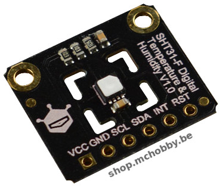
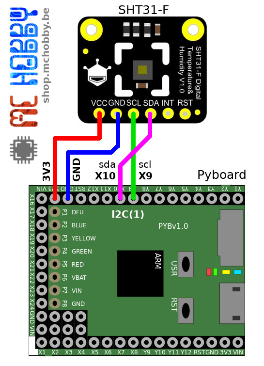
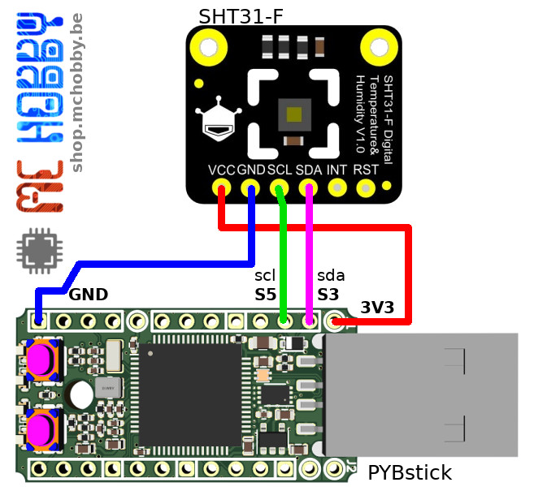

[Ce fichier existe également en FRANCAIS](readme.md)

# Using a SHT3x relative humidity sensor under MicroPython

**** TRANSLATE ****

The SHT3x sensor from Sensirion is quite popular and present on many breakout board.



SHT31-F is the standard version of the SHT3x serie. If offert a relative humidity
reading with an accuracy of +/-2% RH over a range of 0% to 100% RH (@ 25°C). The temperature reading have an accuracy of +/- 0.2°C over the range of 0 to 90°C.

This sensor expose an I2C interface used to grab the data from the sensor by using only 2 wires (SDA & SCL).

The sensor also integrates a heater which should be used when measuring the humidity in high relative humidity envrionment otherwise the results will not be accurate.

## About this MicroPython driver

The `sht3x.py` driver available in this repository is a portage from [the SHT31-F Arduino driver from DFRobot for its SHT31-F breakout](https://www.dfrobot.com/product-2015.html).

Please note that advanced features (eg:alarms) have not been ported to MicroPython driver.

The file [`portage.txt`](docs/portage.txt) contains a list of the C methods and their corresponding MicroPython method (if any otherwise it displays [NOT IMPLEMENTED]).

# Wiring

## with the Pyboard



## with the PYBStick



# Test

Before using the examples scripts, it will be necessary to copy the `lib/sht3x.py` library on the MicroPython board.

The `examples` sub-directory contains example scripts containing may comments and details.

I strongly recommand to read them to have an idea of the available functionnalities.

The following example shows how to read the temperature and relative humidity from the sensor.

``` Python
from machine import I2C
from sht3x import SHT3x, REPEATABILITY_HIGH, REPEATABILITY_LOW
import time

i2c = I2C(1)
sht = SHT3x( i2c )
print( "Chip Serial Number %s" % hex(sht.serial_number) )


if sht.soft_reset():
	print( "Software Reset done")

# Activate the heater (in high RH environment)
sht.heater( enabled=True )

# Read temp & RH with selected repeatability
temp,rh = sht.read_all( REPEATABILITY_LOW )

# Read  REPEATABILITY_HIGH by default
temp,rh = sht.tmp_rh
print( "Temp: %s, %%Humidity: %s" % (temp,rh) )


# read temperature only
temp = sht.temperature
print( "temperature : %s" % temp )
# read humidity only (initiate a second I2C read)
rh = sht.humidity
print( "humidity : %s" % rh )
```

See also the `test_periodic.py` example which activate the periodic read only collect the data periodically over the I2C bus.

# Ressources

* Image file [SHT31-F.png](docs/SHT31-F.png) to create your own schematics

# Where to buy
* [breakout SHT31-F from DFRobot (SEN0332)](https://shop.mchobby.be/fr/environnemental-press-temp-hrel-gaz/1882-sht31-f-capteur-d-humidite-et-temperature-3232100018822-dfrobot.html) @ MCHobby
