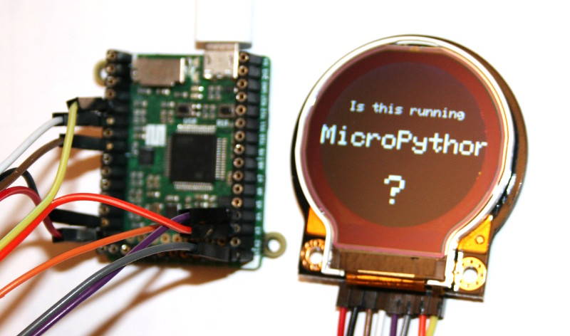
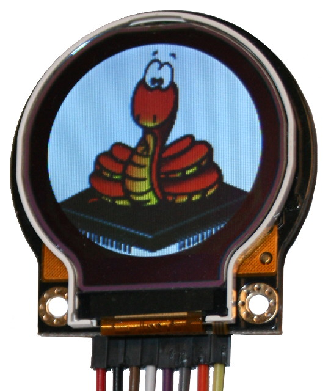
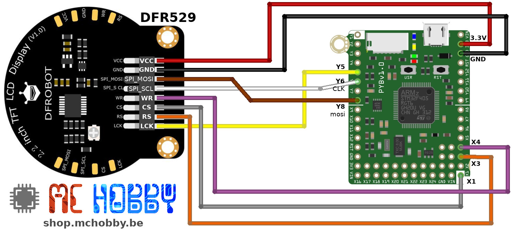
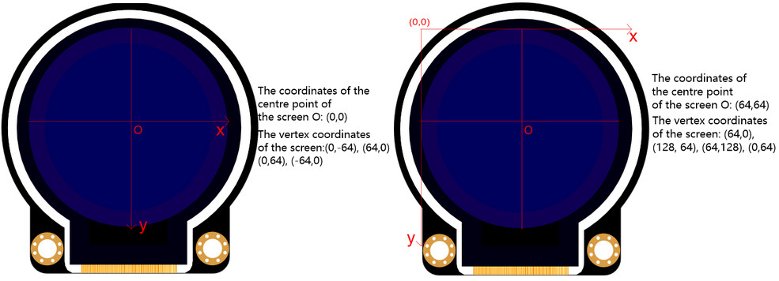

[This file also exists in ENGLISH](readme_ENG.md)

# Le premier écran rond supporté sous MicroPython ?
DFRobot distribue un [écran 2.2” TFT LCD (Interface SPI) sous la référence DFR0529](https://www.dfrobot.com/product-1794.html).



Ce que je trouve de très excitant avec cet écran, c'est sa forme ronde!

L'écran utilise un __contrôleur ST7687S__ et une interface SPI, couplée à un registre à décalage 8bits (HC595). Il s'agit donc d'une interface ST7687S avec Latch réclamant la manipulation de plus de signaux qu'un simple bus SPI.

L'afficheur rond est découpé dans une dalle TFT carrée de 128px * 128 px (donc 79% de pixels visibles).



Voir les détails de la fiche [produit TFT-2.2pc-ROND](https://shop.mchobby.be/fr/afficheur-lcd-tft-oled/1856-tft-couleur-22-rond-spi-breakout-3232100018563-dfrobot.html) pour plus d'information.

__Avantages:__
* Accès direct à la mémoire de l'écran sans passer par un FrameBuffer MicroPython... __donc très économe en RAM__ sur le MCU.
* Accès au Pixel près
* Ecran rond découpé dans une dalle carré (128px * 128px)
* Angle de vue de 180° (cfr. spécification de la dalle)
* Le pilote prend en charge le dessin de forme géométrique et texte
* Possibilité de désactiver le rétro-éclairage (économie d'énergie).

__Inconvenient:__
* Débit de donnée significativement ralenti par la manipulation du Latch (HC595).<br />Le remplissage de l'écran en rouge nécessite 5 secondes.
* Animations graphiques et transfert d'image limité par le débit.

# Bibliothèque

Cette bibliothèque doit être copiée sur la carte MicroPython avant d'utiliser les exemples.

Sur une plateforme connectée:

```
>>> import mip
>>> mip.install("github:mchobby/esp8266-upy/st7687s")
```

Ou via l'utilitaire mpremote :

```
mpremote mip install github:mchobby/esp8266-upy/st7687s
```

## limite du portage
Le portage de la bibliothèque prend en charge presque toutes les fonctions de l'écran.

Les fonctions suivantes de [DFRobot_Display.cpp](https://raw.githubusercontent.com/DFRobot/DFRobot_Display/master/DFRobot_Display.cpp) n'ont pas été portées sous micropython.
* fillCircleHelper()
* circleHelper()
* fillRoundRect()
* drawRoundRect()

## En vidéo
Une [vidéo YouTube](https://youtu.be/ceWs7rgPLbw) du pilote et script `test_simple.py`.

# Brancher

## MicroPython Pyboard



# Tester

## Les bibliothèques
Plusieurs bibliothèques sont nécessaires pour faire fonctionner cet écran. Celles-ci sont disponibles dans le sous répertoire `lib/` .

Ces bibliothèques doivent être copiées sur la carte MicroPython avant de pouvoir utiliser les exemples.

* `st7687s.py` : contient des classes de contrôle au niveau matériel et des fonctions de base pour dessiner des pixels dans la mémoire de l'écran.  
* `display.py` : contient une classe Helper permettant de dessiner des formes et du texte par l'intermédiaire du pilote (porté depuis display.cpp de DFRobot).
* `character.py` : contient la définition d'une Font 6x8 pixels.

## Origine des axes
sur un écran rectangulaire/carré, il est assez logique d'avoir l'origine des axes en haut à gauche de l'écran (cas de la classe `st7687s.py`).

Par contre, c'est nettement moins logique pour un écran rond!

La classe de dessin `Display` déplace l'origine des axes au centre de l'écran, ce qui rend l'écriture du code (et sa compréhension) beaucoup plus simple.



## Exemple test_simple.py
Le script [test_simple.py](example/test_simple.py), repris-ci-dessous, permet d'évaluer les fonctionnalités de base de la bibliothèque.

La première chose que fait le script, c'est allumer et éteindre le rétro-éclairage de l'écran. Cela se fait en écrivant un simple octet de commande et permet de vérifier que le câble est correctement réalisé.

Voir cette [vidéo YouTube](https://youtu.be/ceWs7rgPLbw).

```
from machine import Pin, SPI
from st7687s import ST7687S_Latch
from display import *
from time import sleep

# Gestion des couleurs -> depuis COLORS/colortls.py
def rgb24_to_rgb16( r,g,b ):
	""" Conversion de RGB888 en RGB565 """
	return (  ((r >> 3) << 11) | ((g >> 2) << 5) | (b >> 3) )

# Définition des broches
# Pyboard:
SPI_BUS = 2
CS  = "X1"
RS  = "X3" # Mode commande
WR  = "X4"
LCK = "Y5"

spi = SPI( SPI_BUS, polarity=0, phase=0) # mode 0: CPOL=0, CPHA=0
cs = Pin(CS, Pin.OUT ) # Activation esclave
rs = Pin(RS, Pin.OUT ) # Mode commande
wr = Pin(WR, Pin.OUT )
lck= Pin(LCK,Pin.OUT )

lcd = ST7687S_Latch( spi, cs,  rs, wr, lck)
# Classe outil qui écrit directement dans le BufferMemory de l'écran
disp = Display( lcd, 128, 128 )

#--- Désactiver/activer le rétro éclairage ---
for i in range(5):
	lcd.turn_on(False)
	sleep(0.4)
	lcd.turn_on(True)
	sleep(0.4)

# Effacer l ecran
disp.clear( rgb24_to_rgb16(255,0,0) ) # remplir en rouge

print( "Part 1" )
disp.clear( 0x0000 ) # Black
disp.circle( (0, 0), 20, DISPLAY_GREEN) # cercle a (0, 0) et rayon = 20
disp.rect ( (-20,-30) , 40, 60, DISPLAY_CYAN ) # rectangle (-20, -30), lergeur = 40, hauteur = 60
disp.line ( (-64,-64) , (64,64), DISPLAY_RED);  # ligne de (-64, -64) a (64, 64)
# Dessiner une série de ligne
for y in range(-64,64,3):
	disp.line( (-64,64), (64,y), DISPLAY_PINK )
disp.hline( (-64, 0), 128, DISPLAY_WHITE)   # ligne horizontale a (-64, 0), longueur = 128
disp.vline( (0, -64), 128, DISPLAY_WHITE)   # ligne verticale a (0, -128), longueur = 128

print( "Part 2" )
disp.clear( DISPLAY_LIGHTGREY )
disp.triangle( (-20,-50), (0,0), (50,20), DISPLAY_ORANGE ) # triangle avec 3 points aux coordonnées (-20, -50), (0, 0), (50, 20)
disp.circle( (0, 0) , 20, DISPLAY_GREEN) # dessiner un cercle a (0, 0) et rayon = 20
disp.fill_circle( (0,0) , 20, DISPLAY_GREEN)
disp.fill_rect( (-20,-20), 40, 40, DISPLAY_CYAN) # (-20, -30), largeur = 40, hauteur = 40
disp.fill_triangle( (-20,-50), (-20,0), (50,20), DISPLAY_ORANGE )
```

## Autres exemples
Le répertoire [examples](examples/) contient quelques autres exemples intéressants:
* [test_text.py](examples/test_text.py) : affichage de texte sur l'écran
* [test_clear.py](examples/test_clear.py) : comparaison des méthodes `fill_screen()` et `clear()` pour effacer le contenu de l'écran.
* [test_bmp.py](examples/test_bmp.py) : transfert le contenu de l'image mpy.bmp dans la mémoire de l'écran.
* [char68tobin.py](examples/char68tobin.py) : script utilisé pour générer le contenu binaire de la bibliothèque [character.py](lib/character.py)

# Où acheter
* L' [écran 2.2” TFT LCD (Interface SPI) sous la référence DFR0529](https://www.dfrobot.com/product-1794.html) est disponible chez MCHobby.
* L' [écran 2.2” TFT LCD (Interface SPI) sous la référence DFR0529](https://www.dfrobot.com/product-1794.html) chez DFRobot.
* [MicroPython PYBStick](https://shop.mchobby.be/fr/micropython/1844-pybstick-standard-26-micropython-et-arduino-3232100018440-garatronic.html)
* [MicroPython Pyboard](https://shop.mchobby.be/fr/micropython/570-micropython-pyboard-3232100005709.html)
