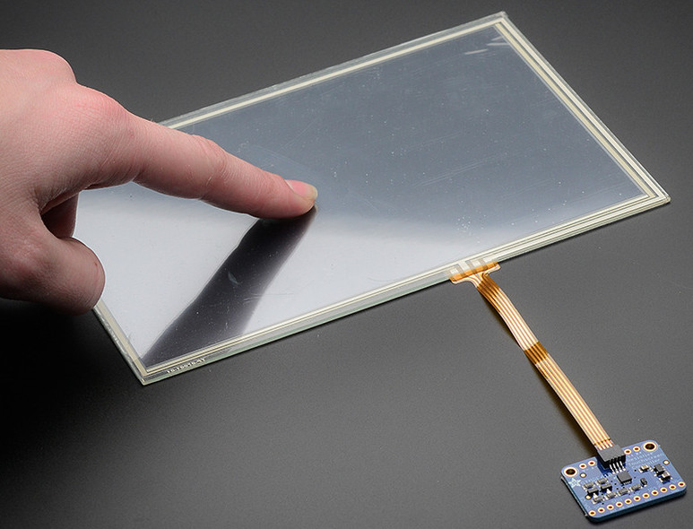
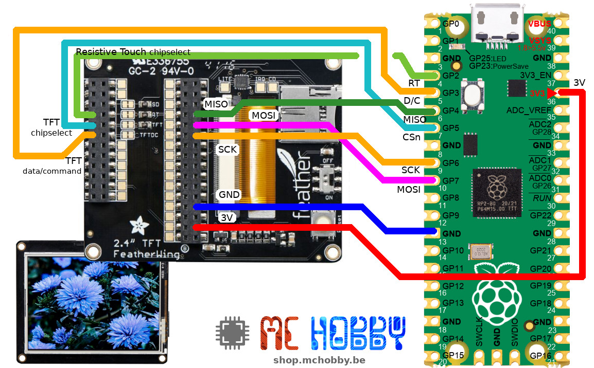

[This file also exists in ENGLISH](readme_ENG.md)

# STMPE610 - capteur tactile résistif  via SPI

Le STMPE610 est un périphérique SPI utilisé sur plusieurs produits TFT d'Adafruit (et également disponible en brealout).



Cette bibliothèque à été testée avec le [TFT FeatherWing 2.4"](https://shop.mchobby.be/fr/feather-adafruit/1050-tft-featherwing-24-touch-320x240-3232100010505-adafruit.html) d'Adafruit basé sur le [controleur ILI934x (voir le pilote MicroPython)](https://github.com/mchobby/esp8266-upy/tree/master/ili934x)

# Brancher

Les tests ont étés réalisé à l'aide d'un Raspberry-Pico comme décrit dans le raccordement ci-dessous. Voir le [pilote MicroPython ILI934x](https://github.com/mchobby/esp8266-upy/tree/master/ili934x) pour des branchements sur d'autres microcontroleurs.



Notez le branchement de la broche __RT__ (ResistiveTouch chip select) sur la broche __GP2__. Cela permet d'activer la communication SPI uniquement avec le STMPE610.

# Tester

L'exemple [test_touch.py](examples/test_touch.py) retourne les coordonnées absolues de l'interface tactile.

Pour un usage correct, ces valeurs doivent être calibrées par rapport à la largeur & la hauteur du TFT pour obtenir des informations exploitables.

``` python
from machine import SPI,Pin
from stmpe610 import *
import time

# Raspberry-Pi Pico
spi = SPI( 0, baudrate=1000000,  phase=1, polarity=0 ) # Mode 1
cs_pin = Pin(2) # GP2

stmp = STMPE610( spi, cs_pin )
# Valeur 0x811 attendue
print( "Version: 0x%x" % stmp.version )
while True:
	if stmp.touched:
		pt = stmp.point
		if pt:
			print('Touché (x,y,z) @ (%i, %i, %i)' % pt )
		else:
			print('Touché (sans données de points)' )
	time.sleep_ms( 100 )
```
