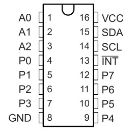
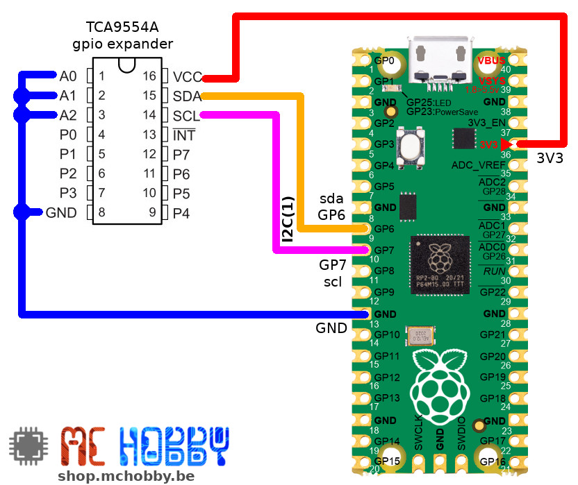
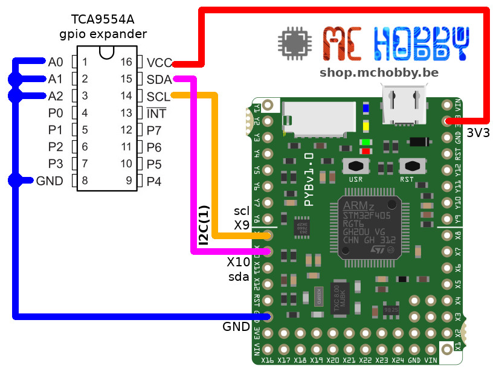

[This file also exists in ENGLISH](readme_ENG.md)

# TCA9554A - 8 bits GPIO Expander via I2C

Le TCA9554A de Texas Instrument permet d'ajouter 8 entrées/sorties avec une sortie d'interruption et registres de configuration.



Ce composant:
* fonctionne avec une tension logique de 1.65V à 5.5V.
* dispose de 3 bits d'adresse (0x38 par défaut).
* dispose d'une configuration "polarity" (pour inverser la polarité d'une broche d'entrée)
* active une résistance pull-up de 100 KOhms sur les broches en entrées.

Voir la [fiche technique du TCA9554A](https://www.ti.com/lit/gpn/tca9554a) pour plus d'information.

# Bibliothèque

Cette bibliothèque doit être copiée sur la carte MicroPython avant d'utiliser les exemples.

Sur une plateforme connectée:

```
>>> import mip
>>> mip.install("github:mchobby/esp8266-upy/tca9554a")
```

Ou via l'utilitaire mpremote :

```
mpremote mip install github:mchobby/esp8266-upy/tca9554a
```

# Brancher

# TCA9554A vers Raspberry-Pi Pico



# TCA9554A vers Pyboard



# Exemple

L'exemple [test_all_out.py](examples/test_all_out.py) indique comment utiliser la classe.

L'API du TCA9554A est identique à celle du MCP23017, vous pouvez donc utiliser les exemples du MCP23017 pour manipuler ce composant.

``` python
from machine import I2C, Pin
from tca9554a import TCA9554A
from time import sleep

# Pico, sda=GP6, scl=GP7
i2c = I2C(1)
# Pyboard, sda=X10, scl=X9
# i2c = I2C(1)

tca = TCA9554A( i2c )

for i in range(8):
	tca.setup( i, Pin.OUT )

print( "All output ON" )
for i in range(8):
	tca.output( i, True )

sleep(2)

print( "All output OFF" )
for i in range(8):
	tca.output( i, False )

print( "That s all Folks!")
```
