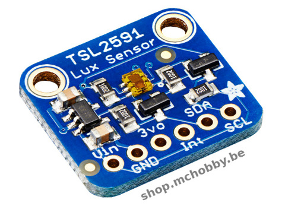
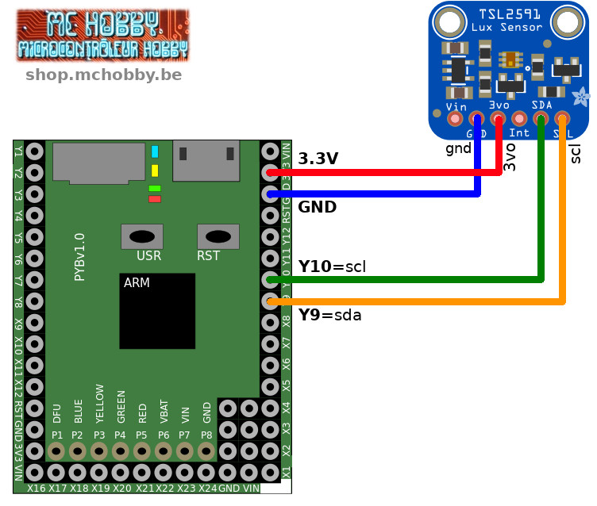
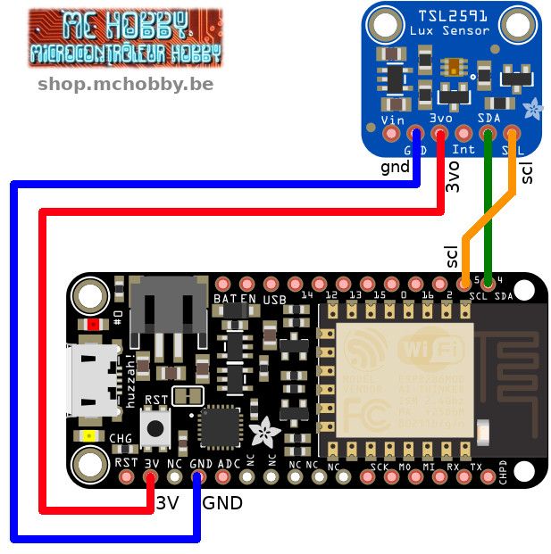

[This file also exists in ENGLISH](readme_ENG.md)

# Mesure de lumière avec Adafruit TSL2591 (ADA1980) et MicroPython

Ce senseur est capable de mesure une intensité lumineuse entre 188 µLux et 88000+ Lux.


Ce capteur contient deux diodes permettant de capter le spectre complet et le spectre infrarouge, ce qui permet de travailler sur le spectre entier ou en lumière visible (comme l'oeil humain).

Ce capteur est très proche du TSL2561 mais offre une gamme de de mesure plus large (et aussi une interface différente) avec une gamme dynamique de 600,000,000:1!

A la différence du TSL2561, il n'est pas possible de modifier l'adresse de ce breakout.

# Bibliothèque

Cette bibliothèque doit être copiée sur la carte MicroPython avant d'utiliser les exemples.

Sur une plateforme connectée:

```
>>> import mip
>>> mip.install("github:mchobby/esp8266-upy/tsl2591")
```

Ou via l'utilitaire mpremote :

```
mpremote mip install github:mchobby/esp8266-upy/tsl2591
```

# Brancher

## MicroPython Pyboard



## Feather ESP8266 sous MicroPython



# Tester

Pour pouvoir utiliser ce capteur, il est nécessaire d'installer la bibliothèque `tsl2591.py` sur la carte MicroPython.

Le code de test suivant effectue une lecture de la luminosité et retourne la valeur en Lux.

```
from machine import I2C
from tsl2591 import TSL2591

# Pyboard - SDA=Y10, SCL=Y9
i2c = I2C(2)
# ESP8266 sous MicroPython
# i2c = I2C(scl=Pin(5), sda=Pin(4))

tsl = TSL2591( i2c = i2c )
print( "%s lux" % tsl.lux )
```

Utiliser une temps d'intégration et un gain plus élevé permet d'obtenir un résultat plus précis, surtout si la lumière est ténue.

```
from machine import I2C
from tsl2591 import *

# Pyboard - SDA=Y10, SCL=Y9
i2c = I2C(2)
# ESP8266 sous MicroPython
# i2c = I2C(scl=Pin(5), sda=Pin(4))

# Attention: manipuler le gain et le temps d'intégration de façon
# inappropriée peut conduire à des résultats totalement erronés.
tsl = TSL2591( i2c = i2c )
# tsl.gain =  GAIN_HIGH # x428
# tsl.integration_time = INTEGRATIONTIME_400MS
print( "%s lux" % tsl.lux )
print( "Niveau Infrarouge (0-65535): %s" % tsl.infrared )
print( "Lumière visible (0-2147483647): %s" % tsl.visible )
print( "Spectre entier  (0-2147483647): %s (visible+IR)" % tsl.full_spectrum )

```

# Ressources et sources
* Source: [MicroPython-adafruit-bundle](https://github.com/adafruit/micropython-adafruit-bundle/tree/master/libraries/drivers) (Adafruit, GitHub)

## Luminosité vs Lux
* 0.002 lux : Nuit par temps clair sans lune.
* 0.2 lux : Minimum de lumière que doit produire un éclairage d'urgence (AS2293).
* 0.5 lux 	Pleine lune par temps clair.
* 3.4 lux : Limite crépusculaire (sombre) au couché du soleil en zone urbaine.
* 50 lux : Eclairage d'un living room
* 80 lux : Eclairage des toilette/Hall
* 100 lux : Journée très sombre/temps très couvert.
* 300 - 500 lux : Levé du soleil, luminosité par temps clair. Zone de bureau correctement éclairée.
* 1,000 lux : Temps couvert; Eclairage typique d'un studio TV
* 10,000 - 25,000 lux : Pleine journée (pas de soleil direct)
* 32,000 - 130,000 lux : Soleil direct

## Adresse I2C
__Les addresse par défaut sont 0x29 et 0x28__ (oui, les deux).

## La broche INT
La broche INT est une sortie du senseur utilisé lorsque vous avez configuré le senseur pour signaler une modification du niveau lumineux. Si vous désirez utiliser ce signal, vous devez utiliser une résistance pull-up de 10K-100K branchée entre INT et 3.3V

# Où acheter
* [Adafruit TSL2591 (ADA1980)](https://shop.mchobby.be/product.php?id_product=1599) @ MC Hobby
* [Adafruit TSL2591 (ADA1980)](https://www.adafruit.com/product/1980) @ Adafruit
