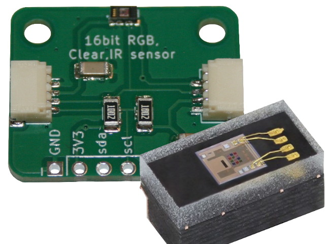
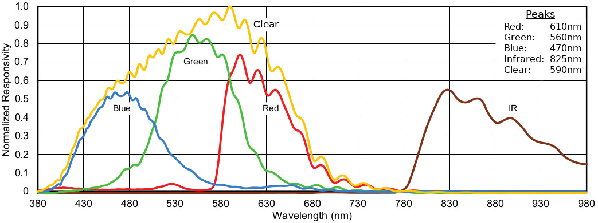
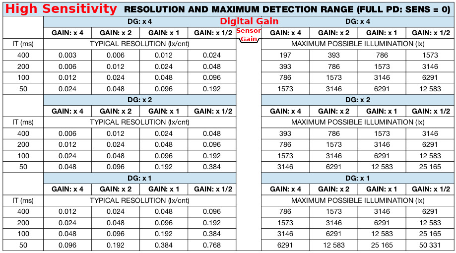
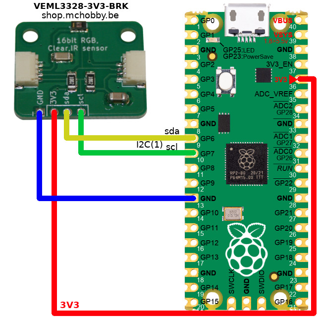

[Ce fichier existe également en FRANCAIS](readme.md)

# Using VEML3328 / VEML3328sl RGBCIR color sensor with MicroPython

This sensor can be used for light color measurement (R,G,B), Clear, IR measurement including Lux calculation.



The [VEML3328sl-3V3-BRK](https://shop.mchobby.be/fr/environnemental-press-temp-hrel-gaz/2877-veml3328sl-capteur-de-couleur-rgb-clair-infrarouge-3v3-i2c-3232100028777.html) breakout fits all the required components to use the VEML3328sl component on a easy to wire breakout.

It can measure and returns the R,G,B,Clear,Ir channel as 16bit unsigned integer (value in range 0..65535).

Thanks to ajustment of sensitivity, Gain (sensor gain), Digital Gain and Intregration time this sensor can be used in a wide variety of illumination.

The VEML3328sl component can be used for:

* white balancing application
* Evaluate and eliminate blue and orange color casts
* Adjust LCD backlight depending on ambiant light condition
* Active monitor and control of color output (EG: on LED)
* Detect indoor/outdoor light environment
* Evaluate color 
* Evaluate Correlated Color Temperature (see application notes)
* Evaluate Lux
* Detect presence near of sensor (because it modifies light condition near the sensor)



As the Spectral characteristic of the Green Channel is very close of the Human Eye response, the Green Channel can also be used to measure Lux.

Depending on the sensor configuration, the Lux measurement can reach up to 150.000 Lux (150 KLux).




The breakout expose the pins to power the board and connect the I2C bus. The breakout board also fits Qwiic/StemmaQt connectors to qwickly wire the component.

The datasheet offers useful information https://www.vishay.com/docs/84968/veml3328.pdf ([local copy here](docs/veml3328.pdf)).

The [VEML3328 Designing Application Note](docs/designingveml3328.pdf) (pdf) also offers great information about color calculation and monitoring.

# Library

The library must be copied on the MicroPython board before using the examples.

## Install with MPRemote

On a WiFi capable plateform:

```
>>> import mip
>>> mip.install("github:mchobby/esp8266-upy/veml3328")
```

Or via the mpremote utility :

```
mpremote mip install github:mchobby/esp8266-upy/veml3328
```

## Manual install

You can check the [package.json](package.json) file to locate the various libraries then copy the required files to your micropython board.

# Wiring 

Wiring this sensor is quite simple. Just connect the sensor on a valid I2C bus. You can also connect the sensor by using a Qwiic/StemmaQt cable



# Testing

## RGBCIr measurement

When running the sensor, the script can set 4 parameters:
* veml.sensitivity( high=True ) : The sensitivity is usually set to High. In very high luminosity environment, it suited to set sensitivity low with `high=False` (however, the result will be unprecise on low illumination environment).
* veml.gain( 4 ) : the sensor gain with a value from 0.5, 1, 2, 4.
* veml.digital_gain(4) : the digital gain can be set to 1, 2, 4.
* veml.integration( 50 ) : higher is the integration time, better will be the accuracy but higher will be the returned value. Possible values are 50, 100, 200, 400 ms.

The [test.py](examples/test.py) test script show how to setup and perform measurements. The collected values will be in the range 0..65535.

```
from machine import I2C, Pin
from veml3328 import *
import time

i2c = I2C(1, sda=Pin(6), scl=Pin(7) )
veml = VEML3328( i2c )

print( "Vishay VEML3328 RGBCIR color sensor" )
print( "  value [0..65535]" )
veml.enable()
veml.gain( 4 ) # 0.5, 1, 2, 4
veml.sensitivity( high=True )
veml.digital_gain(4 ) # 1, 2 , 4
veml.integration( 50 ) # 50, 100, 200, 400 ms

time.sleep( 1 )
while True:
	print( "Red  : %i" % veml.red )
	print( "Green: %i" % veml.green )
	print( "Blue : %i" % veml.blue )
	print( "Clear: %i" % veml.clear ) # Clear Channel
	print( "IR   : %i" % veml.ir )    # IR Channel
	print( "-"*40 )
	time.sleep_ms( 100 )
```

Here the sampled data with some additionnal information

```
==== direct sun light (setting sun) ====

  veml.gain( 4 )
  veml.sensitivity( high=True )
  veml.digital_gain(4)
  veml.integration( 50 )


Red  : 65535   <<< Saturated sensor! Decrease gain.
Green: 65535
Blue : 65535
Clear: 65535
IR   : 65535


  veml.gain( 4 )
  veml.sensitivity( high=True )
  veml.digital_gain(1)
  veml.integration( 50 )

Red  : 23884
Green: 36190
Blue : 16832
Clear: 65535  <<< Still satured in clear domain
IR   : 20597


  veml.gain( 1 )
  veml.sensitivity( high=True )
  veml.digital_gain(1)
  veml.integration( 50 )


Red  : 13799  <<< Proper result range
Green: 19451
Blue : 8744
Clear: 38222
IR   : 10801

==== Inside room oriented ====
==== No artificial light  ====

  veml.gain( 1 )
  veml.sensitivity( high=True )
  veml.digital_gain(1)
  veml.integration( 50 )


Red  : 88  <<< Very low results! Increase gains/integration
Green: 123
Blue : 58
Clear: 261
IR   : 121


  veml.gain( 4 )
  veml.sensitivity( high=True )
  veml.digital_gain(4 )
  veml.integration( 50 )


Red  : 963   <<< value quite low regarding the gains. The room is dark.
Green: 1388
Blue : 673
Clear: 2923
IR   : 1225

==== Inside room oriented ====
==== artificial LED light ====

  veml.gain( 1 )
  veml.sensitivity( high=True )
  veml.digital_gain(1)
  veml.integration( 50 )


Red  : 195
Green: 264
Blue : 105
Clear: 532
IR   : 122


  veml.gain( 4 )
  veml.sensitivity( high=True )
  veml.digital_gain(4 )
  veml.integration( 50 )


Red  : 2421
Green: 3292
Blue : 1307
Clear: 6594
IR   : 1245
```

## Lux measurement

The [test-lux.py](examples/test-lux.py) script shows how to perform lux measurements with this sensor.

Note that lux resolution is calculated automatically upon the VEML configuration. Changing the configuration will change the Lux resolution.

```
from machine import I2C, Pin
from veml3328 import *
import time

i2c = I2C(1, sda=Pin(6), scl=Pin(7) )
veml = VEML3328( i2c )

print( "Vishay VEML3328 Lux sensor" )
veml.enable()
veml.gain( 4 )
veml.sensitivity( high=True )
veml.digital_gain( 4 )
veml.integration( 50 )

print( "VEML3328 config: %r" % veml.config )
print( "Lux Resolution : %s lux/cnt" % veml.config.lux_res )

time.sleep( 1 )
while True:
	print( "Lux: %i" % veml.lux )
	time.sleep_ms( 200 )
```

## High luminosity measurement

The [test_high_luminosity.py](examples/test_high_luminosity.py) set the sensor configuration to low sensitivity.

That setting is reserved to high luminosity environment otherwise the result will not be reliable (under low luminosity).


# Shopping list

* The [VEML3328sl-3V3-BRK](https://shop.mchobby.be/fr/environnemental-press-temp-hrel-gaz/2877-veml3328sl-capteur-de-couleur-rgb-clair-infrarouge-3v3-i2c-3232100028777.html) is available at MC Hobby
