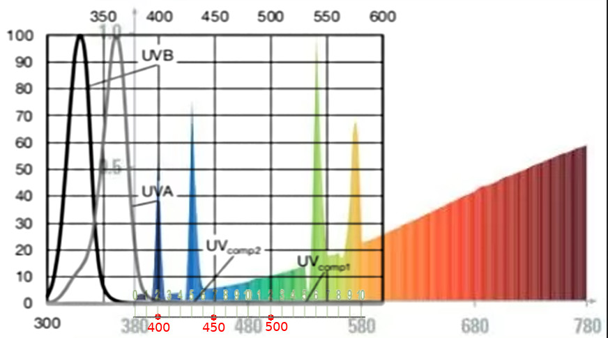

[This file also exists in ENGLISH HERE](readme_ENG.md)

# Utiliser le capteur UltraViolet VEML6075 avec MicroPython

Le capteur VEML6075 est conçu pour être utilisé dans des condition de luminosité naturelle (lumière solaire).

Son calcul avancé de l'UV-Index (UV-I) est utilisé pour identifier les conditions météo avec haut risque de brûlure cutané. C'est un capteur également utilisé dans les applications médicales.


Cette version de la carte breakout VEML6075 par DFRobot est équipé d'un connecteur Gravity. Il propose les caractéristiques suivantes:
* capteur VEML6075
* UVA (350 à 375nm)
* UVB (315 à 340nm)
* UV-I (Index UltraViolet) en lumière visible
* 3.3 à 5V
* interface I2C

Le calcul de UV-I est réalisé à partir de mesures réalisées sur des longueurs d'ondes spécifiques (rappelez vous que ce capteur est destiné à l'usage en lumière visible).

Le graphique ci-dessous montre les pics de sensibilité utilisés pour la mesure de l'UVA et l'UVB (il n'y a pas de mesure sur le spectre entier)


Utiliser ce capteur pour mesurer l'index-UV de lampes UV pourrait fort bien produire un résultat incorrect. En effet, ces lampes spécialisées produisent leur UV haute énergie dans longueurs d'ondes spécifiques (et hors des pics de sensibilités UVA & UVB utilisés par le capteur VEML6075).

## Capteur pour la lumière visible uniquement
L'exemple ci-dessous concerne l'usage incorrect du VEML6075 pour mesurer l'index-UV d'une lampe UV Raptor.



* En couleur: le spectre de la lampe Raptor ou les pics "haute energie" UV sont clairement identifiable
* En noir/gris: les pics de sensibilité du VELM6075 utilisés pour la mesure de l'Index UV

Il est possible de constater que les pics de sensibilités UV (lecture VEML6075) et pics d'émissions UV (la lampe) ne se recouvrent pas.
Le VEML6075 ne fournira pas de résultat fiable dans ce cas.

Pour rappel: le VEML6075 est conçu pour fonctionner en lumière visible (lumière du soleil) et non pour mesurer une lumière UV artificielle.

# Bibliothèque

La bibliothèque doit être copiée sur la carte MicroPython avant de pouvoir utiliser les exemples.

Sur une plateforme WiFi:

```
>>> import mip
>>> mip.install("github:mchobby/esp8266-upy/veml6075")
```

Ou en utilisant l'utilitaire mpremote:

```
mpremote mip install github:mchobby/esp8266-upy/veml6075
```

# Brancher
## Brancher sur un Raspberry-Pi Pico


# Tester

La bibliotèque `veml6075.py` doit être copié sur la carte avant d'exécuter le fichier d'exemple ci-dessous.

Le script [examples/test.py](examples/test.py) lit l'ensemble des données du capteur.
Les informations les plus utiles sont UVA, UVB et __UVIndex__. Le script compare
l'index UV avec des seuils standards pour déterminer la dangerosité des UV.

``` python
from veml6075 import *
from machine import I2C, Pin
import time

# === configuration ===============
# Raspberry-Pi Pico
i2c = I2C( 1, sda=Pin.board.GP6, scl=Pin.board.GP7, freq=100000 )
veml = VEML6075( i2c=i2c )
print( "UV_IT: %s " % veml.conf.UV_IT )
while True:
	uva_raw   = veml.read_uva_raw()       
	uvb_raw   = veml.read_uvb_raw()       
	comp1_raw = veml.read_uv_comp1_raw()  
	comp2_raw = veml.read_uv_comp2_raw()  

	uva = veml.uva           # lecture UVA (float)
	uvb = veml.uvb           # lecture UVB (float)
	uvi = veml.uvi(uva, uvb) # calcul index UV (float)

	print("")
	print("======== start print ========")
	print("UVA   raw: %s" % uva_raw )
	print("UVB   raw: %s" % uvb_raw )
	print("COMP1 raw: %s" % comp1_raw )
	print("COMP2 raw: %s" % comp2_raw )
	print("")
	print("UVA    : %s" % uva )
	print("UVB    : %s" % uvb )
	print("UVIndex: %.2f" % uvi )
	print("UVIndex:    ")
	if uvi < UVI_LOW:
		print("  UVI faible")
	elif uvi < UVI_MODERATE:
		print("  UVI modéré")
	elif uvi < UVI_HIGH:
		print("  UVI haut")
	elif Uvi < UVI_VERY_HIGH:
		print("  UVI très haut")
	else:
		print("  UVI extrême")

	print("mw/cm^2: %.2f" % uvi_to_mwpcm2(uvi) )

	print("======== end print ========")
	time.sleep(1)```
```
# Liste d'achat
* [VEML6075 UVA UVB UVIndex sensor (SEN0303)](https://shop.mchobby.be/fr/environnemental-press-temp-hrel-gaz/1881-mesure-ultraviolet-veml6075-gravity-i2c-3232100018815-dfrobot.html) @ MCHobby
* [VEML6075 UVA UVB UVIndex sensor (SEN0303)](https://www.dfrobot.com/product-1906.html) @ DFRobot
