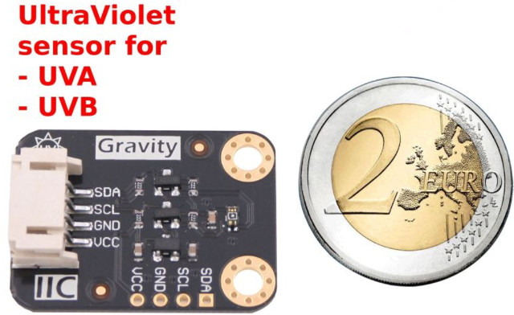
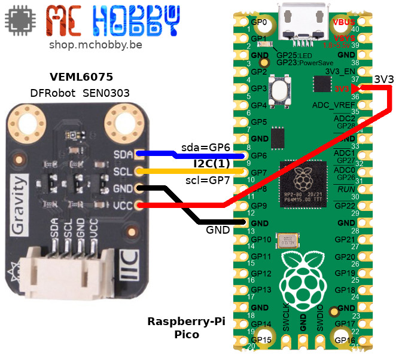

[Ce fichier existe également en Français ICI](readme.md)

# Using a VEML6075 Ultraviolet Sensor with MicroPython

The VEML6075 is designed to be used with natural light condition (solar light).

Its advanced UV-Index (UV-I) calculation of the VEML6075 is used to identifies weather
condition with higher risk of skin burning. This sensor is also used in medical application.



Here the DFRobot version of the Ultraviolet Sensor fitted with a Gravity Interface
* VEML6075 sensor
* UVA (350 to 375nm)
* UVB (315 to 340nm)
* UV-I (UltraViolet Index) in visible light
* 3.3 to 5V
* I2C interface

The calculation of UV-I is made with measurement at specific wavelength (remind that sensor should be exposed to solar light).

The graph here below shows the sensitivity peaks for UVA and UVB measurement.


Using this sensor to measure UV-Index of specific UV Lamps may/will not produce the expected results. Indeed, such lamps produce their high energy UV at specifics wavelength (that may be outside of the UVA & UVB sensitivity peak of the VEML6075).

## Visible light only sensor
Here below and example of VEML6075 misuse to measure UV-Index of a Raptor UV lamp.


* In color: the Raptor lamp spectrum where High power UV peak are clearly visible
* In blak/gray: the peak of sensitivity for the VEML6075

As you can see, peak of sensitivity (VEML6075 reading) and peak of emitting (the lamp) does not overlaps. The VEML6075 would not provide reliable measurement.

Reminder: the VEML6075 is designed to work with visible light (solar light) and not for measuring Artificial UV bulb.

# Library

The library must be copied on the MicroPython board before using the examples.

On a WiFi capable plateform:

```
>>> import mip
>>> mip.install("github:mchobby/esp8266-upy/veml6075")
```

Or via the mpremote utility :

```
mpremote mip install github:mchobby/esp8266-upy/veml6075
```

# Wiring
## Wiring to a Raspberry-Pi Pico



# Testing

The library `veml6075.py` must be copied to the board before executing the example file.

The script [examples/test.py](examples/test.py) read all the possible data read
the sensor. The most useful values are UVA, UVB and __UVIndex__. The script also
compares the UVIndex to usual thresold to determine the UV dangerousness.


``` python
from veml6075 import *
from machine import I2C, Pin
import time

# === Setup ===============
# Raspberry-Pi Pico
i2c = I2C( 1, sda=Pin.board.GP6, scl=Pin.board.GP7, freq=100000 )
veml = VEML6075( i2c=i2c )
print( "UV_IT: %s " % veml.conf.UV_IT )
while True:
	uva_raw   = veml.read_uva_raw()       
	uvb_raw   = veml.read_uvb_raw()       
	comp1_raw = veml.read_uv_comp1_raw()  
	comp2_raw = veml.read_uv_comp2_raw()  

	uva = veml.uva           # get UVA (float)
	uvb = veml.uvb           # get UVB (float)
	uvi = veml.uvi(uva, uvb) # get UV index (float)

	print("")
	print("======== start print ========")
	print("UVA   raw: %s" % uva_raw )
	print("UVB   raw: %s" % uvb_raw )
	print("COMP1 raw: %s" % comp1_raw )
	print("COMP2 raw: %s" % comp2_raw )
	print("")
	print("UVA    : %s" % uva )
	print("UVB    : %s" % uvb )
	print("UVIndex: %.2f" % uvi )
	print("UVIndex:    ")
	if uvi < UVI_LOW:
		print("  UVI low")
	elif uvi < UVI_MODERATE:
		print("  UVI moderate")
	elif uvi < UVI_HIGH:
		print("  UVI high")
	elif Uvi < UVI_VERY_HIGH:
		print("  UVI very high")
	else:
		print("  UVI extreme")

	print("mw/cm^2: %.2f" % uvi_to_mwpcm2(uvi) )

	print("======== end print ========")
	time.sleep(1)```
```
# Shopping list
* [VEML6075 UVA UVB UVIndex sensor (SEN0303)](https://shop.mchobby.be/fr/environnemental-press-temp-hrel-gaz/1881-mesure-ultraviolet-veml6075-gravity-i2c-3232100018815-dfrobot.html) @ MCHobby
* [VEML6075 UVA UVB UVIndex sensor (SEN0303)](https://www.dfrobot.com/product-1906.html) @ DFRobot
