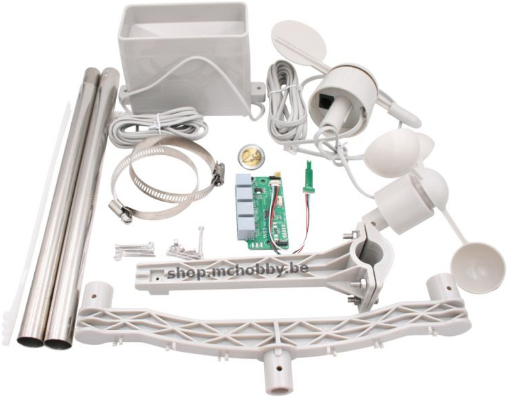
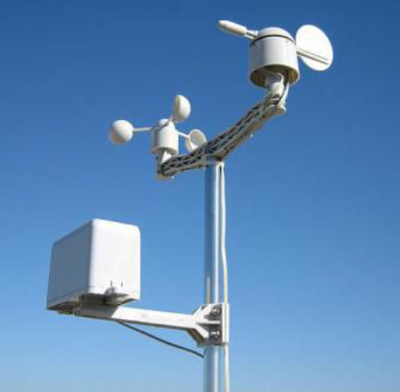
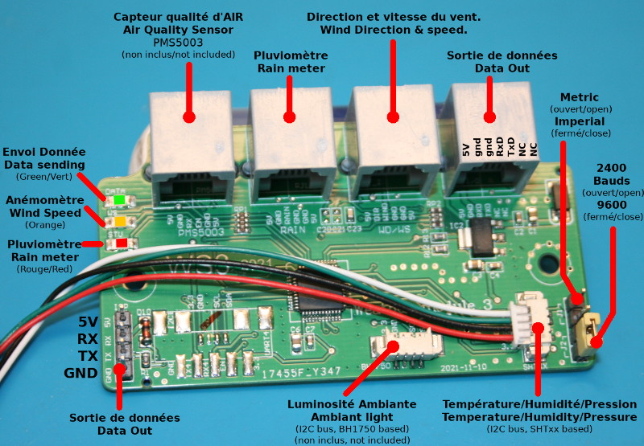
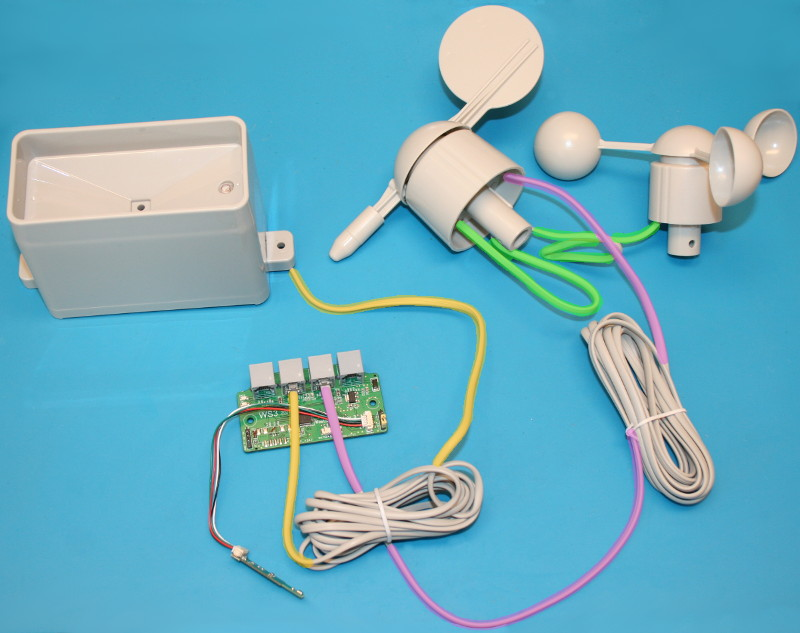
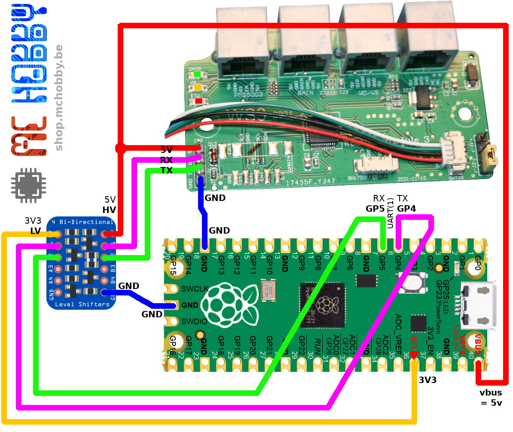

[Ce fichier existe également en FRANCAIS](readme.md)

# Receive and decode "Weather Station" data with MicroPython

The [Weather-Station (SEN0186)](https://shop.mchobby.be/fr/environnemental-press-temp-hrel-gaz/2385-station-meteo-kit-5-capteurs-anemometre-girouette-pluie-temperature-humidite-3232100023857.html) is a ready to build kit designed to create DIY weather station.





The kit is made around a microcontroler board receiving and processing sensor data. The board also emit output data flow over a serial/UART line (5V logic, 9600 bauds 8N1).



While inspecting the board, you can see connexion point for additionnal sensors like:
* Un capteur de [qualité d'air (PMS5003)](https://shop.mchobby.be/fr/environnemental-press-temp-hrel-gaz/1332-senseur-qualite-d-air-pm25-pm5003-et-adaptateur-breadboard-3232100013322-adafruit.html)
* Un capteur de [luminosité ambiante (BH1750)](https://shop.mchobby.be/fr/environnemental-press-temp-hrel-gaz/2444-m5stack-capteur-luminosite-ambiante-bh1750fvi-tr-grove-i2c-3232100024441-m5stack.html)

When fully connected, the kit wiring do look like this.



# Library

The library must be copied on the MicroPython board before using the examples.

On a WiFi capable plateform:

```
>>> import mip
>>> mip.install("github:mchobby/esp8266-upy/weather-station")
```

Or via the mpremote utility :

```
mpremote mip install github:mchobby/esp8266-upy/weather-station
```

# Wiring
## Wiring to a Raspberry-Pi Pico
The Pico is running under 3.3V system, so you will need to use a [level shifter](https://shop.mchobby.be/fr/cartes-breakout/131-convertisseur-logique-4-canaux-bi-directionnel-i2c-compatible-3232100001312-adafruit.html) that is UART/Serial communication compatible.



# Library
The [weather.py](lib/weather.py) library must be copied to the MicroPython board filesystem.

The library do rely on the so named "professionnal" protocol to process the data. The protocol is detailled on the [protocol.txt](docs/protocol.txt) specification (source: undefined).

# Testing

## Raw reading
To read the incoming data on the serial port, you just nned to open and `readline()` from the uart.

Data are received as array of bytes!

``` python
from machine import UART
import time
u = UART( 1, 9600 )
while True:
	print( u.readline() )
	time.sleep( 0.5 )
```

Which produce the following result on the REPL session.

Professionnal protocol can be identified thanks to the letters from A to N.

```
b'A3143B000C0000D0000E0000F0000G0020H0000I0000J0000K0060L0213M319N09982O.....*5E\r\n'
None
b'A3141B000C0000D0000E0000F0000G0020H0000I0000J0000K0060L0213M319N09982O.....*5C\r\n'
None
b'A3143B000C0000D0000E0000F0000G0020H0000I0000J0000K0060L0213M319N09982O.....*5E\r\n'
None
b'A3142B000C0000D0000E0000F0000G0020H0000I0000J0000K0060L0213M320N09983O.....*54\r\n'
None
b'A3143B000C0000D0000E0000F0000G0020H0000I0000J0000K0060L0213M320N09983O.....*55\r\n'
None
b'A3142B000C0000D0000E0000F0000G0020H0000I0000J0000K0060L0213M320N09983O.....*54\r\n'
None
b'A3143B000C0000D0000E0000F0000G0020H0000I0000J0000K0060L0213M320N09982O.....*54\r\n'
None
b'A3141B000C0000D0000E0000F0000G0020H0000I0000J0000K0060L0213M320N09982O.....*56\r\n'
None
b'A3143B000C0000D0000E0000F0000G0020H0000I0000J0000K0060L0213M320N09982O.....*54\r\n'
```

## Using the library
The following script is used to read the Weather Station data through the library.

The various values are clearly named and available as interger or float.

``` python
from machine import UART
from weather import WeatherStation

# Raspberry-Pi Pico, GP4=TX, GP5=RX
u = UART( 1, 9600, timeout=100 )

ws = WeatherStation( u )
iter = 0
while True:
	iter += 1
	print( '' )
	print( 'New data received: %s - iteration %i' % (ws.update(),iter) )
	print( '  Wind Direction: %i degrees' % ws.wind_dir ) # 0..33
	print( '  Wind speed    : %f m/s (instantaneous)' % ws.wind_speed_real )
	print( '  Wind speed    : %f m/s (mean last minute)' % ws.wind_speed )
	print( '  Wind speed    : %f m/s (max last 5 minutes)' % ws.wind_speed_max )
	print( '  Rain cycles   : %i bucket (counter, 0-9999)' % ws.rain_cycle_real )
	print( '  Rain cycles   : %i bucket (last minute)' % ws.rain_cycle )
	print( '  Rain          : %f mm (last minute)' % ws.rain_mm )
	print( '  Rain          : %f mm (last hour)' % ws.rain_mm_hour )
	print( '  Rain          : %f mm (last 24H)' % ws.rain_mm_day )
	print( '  Temperature   : %f Celcius' % ws.temp )
	print( '  Humidity      : %f %%Rel' % ws.hrel )
	print( '  Pressure      : %f hPa' % ws.pressure )
```

Script qui produit le résultat suivant dans la session REPL.

```
New data received: True - iteration 4746
  Wind Direction: 90 degrees
  Wind speed    : 0.000000 m/s (instantaneous)
  Wind speed    : 0.000000 m/s (mean last minute)
  Wind speed    : 0.000000 m/s (max last 5 minutes)
  Rain cycles   : 48 bucket (counter, 0-9999)
  Rain cycles   : 0 bucket (last minute)
  Rain          : 0.000000 mm (last minute)
  Rain          : 0.000000 mm (last hour)
  Rain          : 1.400000 mm (last 24H)
  Temperature   : 21.500001 Celcius
  Humidity      : 37.400002 %Rel
  Pressure      : 995.300007 hPa
```

# Où acheter
La [Weather-Station (SEN0186)](https://shop.mchobby.be/fr/environnemental-press-temp-hrel-gaz/2385-station-meteo-kit-5-capteurs-anemometre-girouette-pluie-temperature-humidite-3232100023857.html) est disponible chez MC Hobby.
* [Weather-Station](https://shop.mchobby.be/fr/environnemental-press-temp-hrel-gaz/2385-station-meteo-kit-5-capteurs-anemometre-girouette-pluie-temperature-humidite-3232100023857.html) @ MC Hobby
* [Weather-Station](https://www.dfrobot.com/product-1308.html) @ DFRobot
* [Convertisseur de Niveau logique 4bit](https://shop.mchobby.be/fr/cartes-breakout/131-convertisseur-logique-4-canaux-bi-directionnel-i2c-compatible-3232100001312-adafruit.html) @ MCHobby
* [Raspberry-Pi Pico](https://shop.mchobby.be/fr/pico-rp2040/2025-pico-rp2040-microcontroleur-2-coeurs-raspberry-pi-3232100020252.html) @ MCHobby
* [Raspberry-Pi Pico Wireless](https://shop.mchobby.be/fr/pico-rp2040/2434-pico-w-wireless-rp2040-2-coeurs-wifi-bluetooth-3232100024342.html) @ MCHobby
