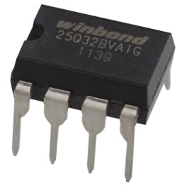
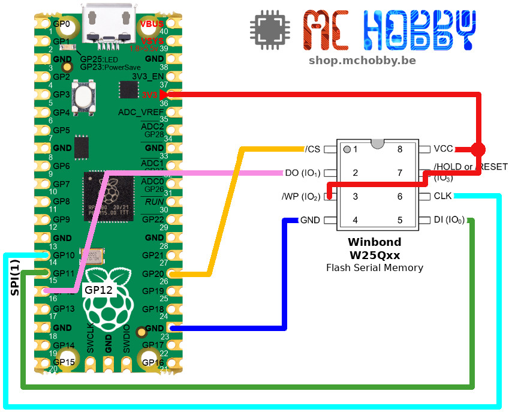

[This file also exists in ENGLISH](readme_ENG.md)

# Utiliser une mémoire Flash Winbond W25Q aevec MicroPython

Utiliser une mémoire Flash externe QSPI en mode simple SPI pour y stocker des fichiers.



La mémoire Flash utilise les paramètres suivants:
* SECTOR SIZE: 4096
* BLOCK SIZE: 512
* PAGE SIZE: 256
Ce qui permet à MicroPython VFS (Virtual File System) de monter la flash comme
un système de fichier VFat.

Le contenu de la mémoire flash sera accessible via un sous répertoire dans le
système de fichiers MicroPython.

## Avant de monter la Flash
Avant d'utiliser la Flash comme stockage de fichiers:
* La Flash __doit être effacé__ (tous les octets remis à 0xFF)
* La Flash __doit être formatée en VFat__.<br />La Flash ne peut pas être formatée en LittleFs.

Chacune de ces deux étapes peut prendre un temps plus ou moins long (> 1 minutes)
en fonction de la taille de la Flash (Ex: 4 Mo ou 16 Mo de Flash).

Lire l'exemple [test_usage.py](examples/test_usage.py) informe sur le détails
des ces différentes étapes.

Cette initialisation est nécessaire avant de pouvoir accéder au contenu de la
mémoire Flash!

## remarques:
* Cette bibliothèque est basée sur [brainelectronics's micropython-winbond](https://github.com/brainelectronics/micropython-winbond) !<br />J'ai fait quelques adaptation pour reduire la taille du fichier et faire en sorte qu'elle s'intègre à la suite des bibliothèque.
* La Flash ne peut pas être formatée en LittleFS (cela retourne systématiquement une erreur)

# Brancher

## Brancher sur un Raspberry-Pi Pico


# Bibliothèque

La bibliothèque doit être copiée sur la carte MicroPython avant de pouvoir utiliser les exemples.

Sur une plateforme de type WiFi:

```
>>> import mip
>>> mip.install("github:mchobby/esp8266-upy/winbond")
```

Ou à l'aide de l'utilitaire mpremote :

```
mpremote mip install github:mchobby/esp8266-upy/winbond
```

# Tester

L'exemple [test_usage.py](examples/test_usage.py) présente tous les éléments important au bon usage de la mémoire Flash.

L'exemple couvre les étapes d'effacement (_erase_) et formattage du système de fichiers (rapellez vous que cela peut prendre un certain temps).

Pour finir, la Flash est montée dans le système de fichiers MicroPython et des opérations fichiers sont réalisées sur ce nouveau lecteur.

``` python
from machine import SPI, Pin
import os
import winbond

# SPI doit être en phase=1, polarity=1 bmais il fonctionne parfaitement avec phase=0, polarity=0
spi = SPI(1, mosi=Pin.board.GP11, miso=Pin.board.GP12, sck=Pin.board.GP10, baudrate=20000000 )
flash_cs = Pin( Pin.board.GP20, Pin.OUT, value=1 )

flash = winbond.W25QFlash(spi=spi, cs=flash_cs, software_reset=True)

# !!! Nécessaire la première fois seulement. Ecrit la valeur 0xFF dans toute la
# Flash. Cette opération peu prendre jusqu'à une minute!
flash.format()

# !!! Nécessaire uniquement la première fois. Cette opération peut prendre
# jusqu'à une minute/.
# PA noter que os.VfsLfs2.mkfs(flash) ne peut pas être utilisé
os.VfsFat.mkfs(flash)

# Monter la flash externe comme répertoire /flash
os.mount(flash, '/flash')

# Lister les fichiers et répertoires de la racine
print(os.listdir('/'))
# ['flash', 'boot.py', 'main.py', 'winbond.py']

# Sauver (ou étendre) un fichier nommé 'some-file.txt' sur la flash externe
with open('/flash/some-file.txt', 'a+') as file:
    file.write('Hello World')

# démonter (unmount) la mémoire Flash
os.umount('/flash')

# Présente tous les fichiers et répertoires présent dans la racine du système
# de fichiers. Le répertoire "flash" n'y apparaît plus!
print(os.listdir('/'))
# ['boot.py', 'main.py', 'winbond.py']

# Remonter une nouvelle fois la mémoire Flash
os.mount(flash, '/flash')

# Présenter tous les fichiers et répertoires contenu dans la mémoire Flash
os.listdir('/flash')
# ['some-file.txt']

# Relire le contenu du fichier stoché dans la mémoire flash externe
with open('/flash/some-file.txt', 'r') as file:
    print(file.readlines())

```

Lire également l'exemple [test_automount.py](examples/test_automount.py) pour
voir comment réaliser un mount automatiquement (ou formatage initial + mount)
de la mémoire Flash.

# Liste d'achat
* [Raspberry-Pi Pico](https://shop.mchobby.be/fr/pico-rp2040/2025-pico-rp2040-microcontroleur-2-coeurs-raspberry-pi-3232100020252.html) @ MCHobby
* [Raspberry-Pi Pico Wireless](https://shop.mchobby.be/fr/pico-rp2040/2434-pico-w-wireless-rp2040-2-coeurs-wifi-bluetooth-3232100024342.html) @ MCHobby
