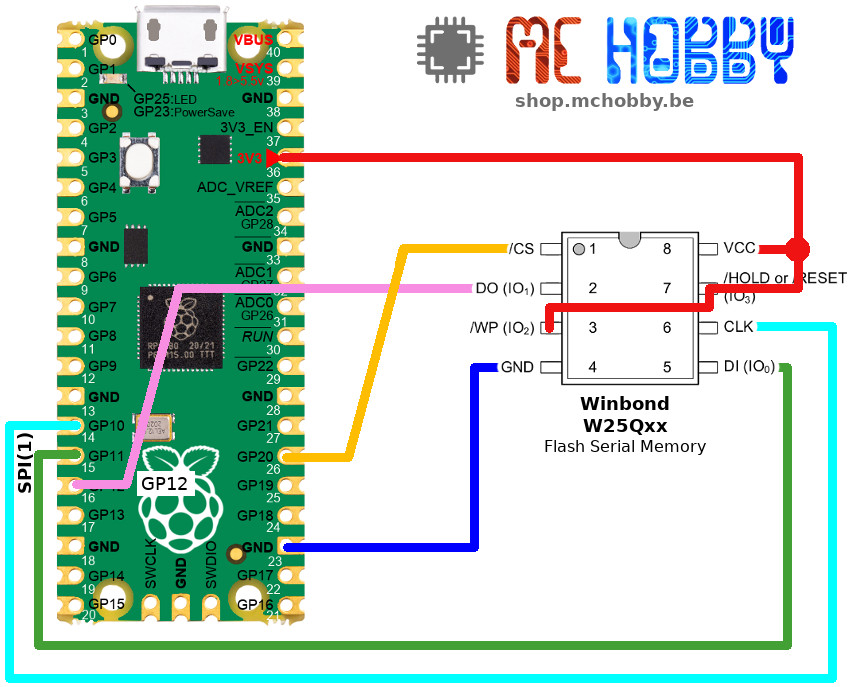

[Ce fichier existe également en FRANCAIS](readme.md)

# Using a W25Q Winbond Flash module with MicroPython

Using an external Winbond QSPI flash in single SPI mode for doing file storage.


The Flash memory use the parameters:
* SECTOR SIZE: 4096
* BLOCK SIZE: 512
* PAGE SIZE: 256
Allowing the MicroPython VFS (Virtual File System) to mount it as VFat filesystem.

Content of the Flash will be accessible via a sub-folder in the micropython file system.

## Prior to mount the Flash
Before using the Flash as a file-storage:
* the flash chip __must be erased__ (all bytes reset to 0xFF)
* the flash must be __formated as VFat__.<br />Flash cannot be formatted with LittleFs.

Each of the steps may takes up to one minute or more depending
on the flash size (Eg: 4 MB or 16 MB Flash).

Read the [test_usage.py](examples/test_usage.py) examples for more details about those steps.

This prior initialisation is mandatory to be able to accès the content of the flash!

## remark:
* This library is heavily based on the great ressource [brainelectronics's micropython-winbond](https://github.com/brainelectronics/micropython-winbond) !<br />I just rework the content a bit to accomodate this library suite and reduce the file size.
* The Flash cannot be formated with LittleFS (it consistantly returns an error)

# wiring

## Wiring to a Raspberry-Pi Pico


# Library

The library must be copied on the MicroPython board before using the examples.

On a WiFi capable plateform:

```
>>> import mip
>>> mip.install("github:mchobby/esp8266-upy/winbond")
```

Or via the mpremote utility :

```
mpremote mip install github:mchobby/esp8266-upy/winbond
```

# Testing

The [test_usage.py](examples/test_usage.py) shows all you need to know about this library.

It steps the erase and format operation (remember this may be quite long).

Then it mount the Flash into the MicroPython filesystem and perform files operations in this new drive.

``` python
from machine import SPI, Pin
import os
import winbond

# SPI must have phase=1, polarity=1 but it also operate nicely with phase=0, polarity=0
spi = SPI(1, mosi=Pin.board.GP11, miso=Pin.board.GP12, sck=Pin.board.GP10, baudrate=20000000 )
flash_cs = Pin( Pin.board.GP20, Pin.OUT, value=1 )

flash = winbond.W25QFlash(spi=spi, cs=flash_cs, software_reset=True)

# !!! only required on the very first start (will write 0xFF everywhere)
# takes some seconds/minutes!
flash.format()

# !!! only required on first setup and after formatting takes some seconds to minutes
# Please note that os.VfsLfs2.mkfs(flash) doesn't work
os.VfsFat.mkfs(flash)

# mount the external flash to /flash folder
os.mount(flash, '/flash')

# show all files and folders on the boards root directory
print(os.listdir('/'))
# ['flash', 'boot.py', 'main.py', 'winbond.py']

# Save (or extend) a file named 'some-file.txt' to the external flash
with open('/flash/some-file.txt', 'a+') as file:
    file.write('Hello World')

# unmount flash
os.umount('/flash')

# show all files and folders on the boards root directory
# the "flash" folder won't be shown anymore
print(os.listdir('/'))
# ['boot.py', 'main.py', 'winbond.py']

# mount the external flash again
os.mount(flash, '/flash')

# show all files and folders on the external flash
os.listdir('/flash')
# ['some-file.txt']

# Read back the file from the external flash
with open('/flash/some-file.txt', 'r') as file:
    print(file.readlines())

```

Read also the [test_automount.py](examples/test_automount.py) exemple script to see how to automagically mount (or first format + mount) a flash drive.

# Shopping list
* [Raspberry-Pi Pico](https://shop.mchobby.be/fr/pico-rp2040/2025-pico-rp2040-microcontroleur-2-coeurs-raspberry-pi-3232100020252.html) @ MCHobby
* [Raspberry-Pi Pico Wireless](https://shop.mchobby.be/fr/pico-rp2040/2434-pico-w-wireless-rp2040-2-coeurs-wifi-bluetooth-3232100024342.html) @ MCHobby
